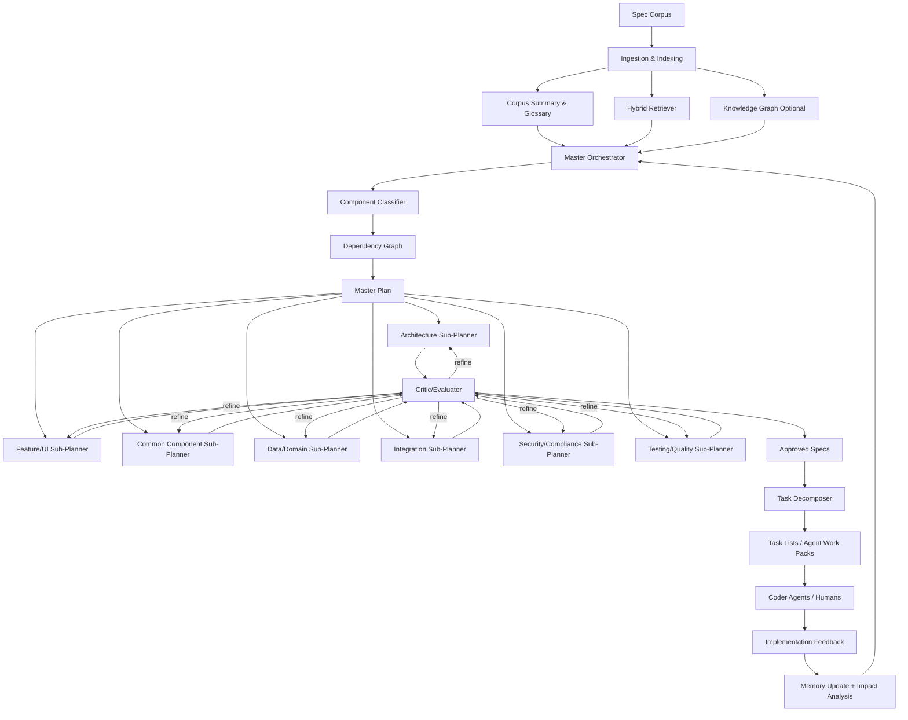

# SIPA — Software Implementation Planner Agent

## Complete Research-Hardened Specification & Design Document

**Version:** 2.1 — Research-Hardened, Security-Operationalized  
**Date:** 2026-06-03  
**Status:** Production-Ready Design Spec  
**Primary Goal:** Convert very large software-specification corpora into high-fidelity, traceable, component-type-adaptive implementation plans and granular tasks for AI coding agents and human developers.

---

## Change Summary — v2.0 → v2.1

This revision is a deep-research pass and adversarial “100x rethink” consolidation. It does **not** merely expand the previous document; it tightens the system into an implementable, governable, security-aware planner.

### Major Improvements

1. **Research verification and correction**
   - Verified MAAD as arXiv:2606.01385, submitted May 31, 2026, and preserved it as the core architecture-planning influence. ([arxiv.org](https://arxiv.org/abs/2606.01385))
   - Updated AgentOrchestra reference: current arXiv title emphasizes the Tool-Environment-Agent, or TEA, protocol and lifecycle-aware orchestration rather than only “general-purpose task solving.” ([arxiv.org](https://arxiv.org/abs/2506.12508))
   - Updated GitHub Spec Kit alignment to include the current Spec → Plan → Tasks → Implement flow plus newer practical commands such as constitution, clarify, analyze, checklist, and task-to-issues. ([github.github.com](https://github.github.com/spec-kit/))
   - Qualified xAI/Grok Build claims: official xAI pages verify plan mode, parallel subagents, skills/plugins/hooks/MCP, headless mode, and API availability; this spec no longer depends on unofficial “Arena Mode” claims and instead defines SIPA’s own optional local “Arena Evaluator.” ([x.ai](https://x.ai/news/grok-build-cli))

2. **Added security and trust model**
   - Added prompt-injection, memory-poisoning, MCP/tool safety, least-privilege execution, untrusted-context boundaries, and human approval controls.
   - Integrated NCSC guidance that LLMs do not enforce a hard data/instruction boundary and should be treated as “inherently confusable” components. ([ncsc.gov.uk](https://www.ncsc.gov.uk/blog-post/prompt-injection-is-not-sql-injection))
   - Integrated MCP security principles around user consent, tool safety, data privacy, and untrusted tool descriptions. ([modelcontextprotocol.io](https://modelcontextprotocol.io/specification/2025-03-26/index))
   - Added OWASP GenAI/agentic risk alignment and operational monitoring requirements. ([genai.owasp.org](https://genai.owasp.org/2026/04/14/owasp-genai-exploit-round-up-report-q1-2026/))

3. **Strengthened context engineering**
   - Formalized SIPA’s context pipeline around **write, select, compress, isolate**, matching current agent context-engineering practice. ([langchain.com](https://www.langchain.com/blog/context-engineering))
   - Added retrieval budgets, evidence ledgers, source confidence levels, retrieval evaluation, and stale-source detection.
   - Added optional GraphRAG-style global/local retrieval for corpus-wide sensemaking and dependency impact analysis. ([microsoft.com](https://www.microsoft.com/en-us/research/project/graphrag/?msockid=334382bc6c746f231ca6946e6d716e0a))

4. **Expanded component taxonomy**
   - Added Security/Compliance, Testing/Quality, Migration/Legacy, AI/Agent Workflow, and Documentation/Developer Experience component types.
   - Added secondary risk tags that directly change retrieval depth, critic rubrics, and human-review requirements.

5. **Made outputs more machine-consumable**
   - Added artifact manifests, evidence ledgers, decision logs, task execution contracts, and canonical schemas.
   - Added stable IDs for requirements, claims, decisions, interfaces, tasks, risks, and open questions.

6. **Added evaluation science**
   - Added retrieval metrics, plan-quality metrics, artifact-level critic thresholds, and downstream coder-agent success metrics.
   - Integrated RAG evaluation dimensions such as context relevance, answer faithfulness, answer relevance, context precision, and context recall. ([aclanthology.org](https://aclanthology.org/2024.naacl-long.20/?utm_source=openai))

7. **Improved implementation roadmap**
   - Split MVP into a safer vertical slice.
   - Added CLI/API/MCP deployment model, observability, cache strategy, sandbox strategy, and governance gates.

---

## Table of Contents

1. Executive Summary
2. Core Problem
3. Research Foundation
4. Design Principles
5. Component Taxonomy
6. System Architecture
7. Agent Roles
8. End-to-End Workflow
9. Context Engineering, RAG, and Memory
10. Critic/Evaluator Subsystem
11. Security and Trust Model
12. Data Models and Schemas
13. Output Artifacts
14. Implementation Roadmap
15. Tool and Harness Integration
16. Metrics and Success Criteria
17. Risks and Mitigations
18. Future Roadmap
19. References

---

## 1. Executive Summary

SIPA is a hierarchical, context-engineered, multi-agent planning system for turning large software specification corpora into implementation-ready plans and tasks.

It is designed for projects where the source material may include:

- Markdown specs
- PRDs
- architecture notes
- API contracts
- user stories
- domain models
- UI descriptions
- ADRs
- implementation notes
- test plans
- legacy migration notes
- operational constraints

The key idea is simple but powerful:

> **Different software components require different levels and types of detail.**

A strategic architecture plan should not be generated with the same retrieval scope, summarization style, or output format as a UI screen, a shared library, a data model, or a migration adapter.

SIPA therefore uses:

- **Component-type classification**
- **Scoped retrieval**
- **Evidence-based synthesis**
- **Hierarchical memory**
- **Embedded critic loops**
- **Traceability-first artifacts**
- **Granular task generation**
- **Security-aware agent execution**

The result is a planner that reduces context size for downstream coding agents while improving fidelity, traceability, and implementation success.

---

## 2. Core Problem

Large software specs break AI coding workflows in predictable ways:

1. **Context overload**
   - Too much raw documentation causes distraction, contradiction, and missed details.

2. **Uniform summarization failure**
   - Architecture needs synthesis.
   - UI features need exhaustive local detail.
   - Shared components need contracts.
   - Data models need invariants.
   - Integrations need error semantics and compatibility rules.

3. **Loss of traceability**
   - Coding agents often implement plausible behavior that is not grounded in the source spec.

4. **Weak plan-to-task translation**
   - Large plans often become vague tasks.
   - Vague tasks create bad code, rework, and hidden assumptions.

5. **Security and tool-risk amplification**
   - Agentic coding tools can read files, run commands, call APIs, and modify repos.
   - Prompt injection, over-permissioned tools, and memory poisoning become architectural risks, not just prompt risks.

SIPA exists to solve these problems before coding begins.

---

## 3. Research Foundation

### 3.1 Spec-Driven Development

GitHub Spec Kit treats specifications as the center of AI-assisted development and ships a core flow of **Spec → Plan → Tasks → Implement**. It also provides Markdown artifacts, quality checklists, and cross-artifact analysis, making it a strong workflow model for SIPA’s output structure. ([github.github.com](https://github.github.com/spec-kit/))

SIPA extends this model for **pre-existing massive corpora**, not just greenfield features. It adds corpus indexing, type-aware planning, traceability enforcement, and critic loops.

### 3.2 MAAD and Requirements-to-Architecture Planning

MAAD proposes four specialized agents — Analyst, Modeler, Designer, and Evaluator — to convert requirements into multi-view architectural blueprints with quality assessments. It uses RAG for architecture standards and patterns, hierarchical memory for design history, and an evaluator for structured quality reports. ([arxiv.org](https://arxiv.org/abs/2606.01385))

SIPA adopts MAAD most directly for the Architecture Sub-Planner, then generalizes the same analyst/designer/evaluator structure across other component types.

### 3.3 Hierarchical Multi-Agent Orchestration

AgentOrchestra’s current formulation introduces TEA, a Tool-Environment-Agent protocol that treats agents, tools, environments, prompts, memory, and outputs as versioned lifecycle-managed resources. It also uses a central planner coordinating specialized sub-agents. ([arxiv.org](https://arxiv.org/abs/2506.12508))

SIPA adopts the practical lesson: orchestration should not be “agents chatting.” It should be explicit state, typed handoffs, versioned artifacts, and lifecycle-aware execution.

### 3.4 Multi-Agent Software Engineering Patterns

The LLM-based multi-agent systems survey identifies role specialization, SDLC coverage, agent synergy, and trustworthy autonomous software engineering as major research directions. ([arxiv.org](https://arxiv.org/abs/2404.04834))

MASAI shows the value of modular sub-agents with separate objectives and strategies for software-engineering tasks, including avoiding unnecessarily long trajectories and excessive context. ([arxiv.org](https://arxiv.org/abs/2406.11638?utm_source=openai))

SWE-agent demonstrates that the interface between agent and computer materially affects coding-agent performance, motivating SIPA’s emphasis on harness-native task packaging. ([arxiv.org](https://arxiv.org/abs/2405.15793?utm_source=openai))

SWE-Search supports the value of self-evaluation and iterative refinement for repository-level software tasks. ([proceedings.iclr.cc](https://proceedings.iclr.cc/paper_files/paper/2025/hash/a1e6783e4d739196cad3336f12d402bf-Abstract-Conference.html?utm_source=openai))

### 3.5 Context Engineering

Modern agent design increasingly treats context engineering as a first-class discipline. LangChain’s current framework groups context strategies into **write, select, compress, and isolate**, which SIPA adopts as its core context model. ([langchain.com](https://www.langchain.com/blog/context-engineering))

SIPA applies this as follows:

- **Write:** Persist plans, decisions, summaries, memory, and evidence outside the prompt.
- **Select:** Retrieve only the task-relevant source chunks, patterns, and memories.
- **Compress:** Summarize and extract with source-preserving compression.
- **Isolate:** Give each sub-planner a scoped context window rather than the entire corpus.

### 3.6 GraphRAG and Corpus Sensemaking

GraphRAG combines text extraction, network analysis, LLM prompting, and summarization to understand text datasets. Microsoft’s GraphRAG project is especially relevant for corpus-wide themes and dependency discovery. ([microsoft.com](https://www.microsoft.com/en-us/research/project/graphrag/?msockid=334382bc6c746f231ca6946e6d716e0a))

SIPA uses graph retrieval optionally, but the architecture is designed so a simpler hybrid vector/BM25 retriever can be used first.

### 3.7 Architecture Standards

SIPA’s architecture outputs are aligned with:

- **ISO/IEC/IEEE 42010** concepts of stakeholders, concerns, viewpoints, and views. ([iso-architecture.org](https://www.iso-architecture.org/ieee-1471/cm/?utm_source=openai))
- **C4 model** levels: system context, container, component, and code, with an emphasis on only producing diagrams that add value. ([c4model.com](https://c4model.com/diagrams?utm_source=openai))
- **ATAM** for reasoning about quality-attribute tradeoffs and architectural risks. ([sei.cmu.edu](https://www.sei.cmu.edu/library/the-architecture-tradeoff-analysis-method/?utm_source=openai))
- **Kruchten 4+1 views** for multi-perspective architecture description. ([scirp.org](https://www.scirp.org/reference/referencespapers?referenceid=2072965&utm_source=openai))

### 3.8 Security Research and Agentic Risk

NCSC warns that current LLMs do not enforce a true boundary between data and instructions, so prompt injection should be treated as an inherent residual risk that must be reduced through system design and impact limitation. ([ncsc.gov.uk](https://www.ncsc.gov.uk/blog-post/prompt-injection-is-not-sql-injection))

OWASP’s GenAI exploit reporting shows AI security incidents are increasingly targeting agent identities, orchestration layers, supply chains, permissions, and validation controls rather than only model outputs. ([genai.owasp.org](https://genai.owasp.org/2026/04/14/owasp-genai-exploit-round-up-report-q1-2026/))

The MCP specification explicitly notes that MCP enables arbitrary data access and code execution paths, requiring user consent, data privacy controls, and caution around tool behavior descriptions. ([modelcontextprotocol.io](https://modelcontextprotocol.io/specification/2025-03-26/index))

SIPA therefore treats security as a core subsystem, not a postscript.

---

## 4. Design Principles

1. **Type-aware planning**
   - Every component gets the planning style it actually needs.

2. **Traceability before creativity**
   - SIPA may synthesize, but every major claim must be grounded in source evidence or explicitly marked as an assumption.

3. **Small context, high signal**
   - Never feed the full corpus to a sub-planner unless the task is corpus-level analysis.

4. **Critic-first quality culture**
   - Drafts are not final until they pass structured quality gates.

5. **Living specifications**
   - Plans are versioned, diffable, and updated as implementation changes.

6. **Harness-native outputs**
   - Outputs must be directly useful to Cursor, Claude Code, Kiro, Grok Build, OpenWebUI, custom CLI agents, or human developers.

7. **Security by architecture**
   - Tool access, memory, retrieval, source trust, and approval flows must be explicitly governed.

8. **Human gates where risk is high**
   - Human review is required for strategic, security-critical, destructive, or high-cost decisions.

9. **Evaluation built in**
   - Retrieval quality, traceability, consistency, implementability, and downstream success are measured.

10. **Composable implementation**
   - SIPA can start as a CLI and later expose MCP/API integrations.

---

## 5. Component Taxonomy

The taxonomy controls:

- Retrieval strategy
- Context budget
- Planner selection
- Output template
- Critic rubric
- Human-review requirement
- Task decomposition style

### 5.1 Primary Component Types

| Type | Detail Level | Retrieval Strategy | Output Emphasis | Example |
|---|---:|---|---|---|
| Architecture / Strategic | High-level synthesis | Broad cross-corpus retrieval + ASRs/NFRs + patterns | Views, ADRs, tradeoffs, quality attributes | System architecture, service topology |
| Feature / UI / Tactical | Deep scoped detail | Narrow feature retrieval + full local excerpts | User stories, acceptance criteria, flows, state, validation | Dashboard, onboarding flow |
| Common / Shared Component | Contract-focused | Cross-module references + interface mentions | APIs, types, invariants, extension points | Auth service, notification library |
| Data / Domain Model | Medium | Entities, relationships, invariants, lifecycle rules | Schemas, aggregates, constraints, migrations | User, Order, Course, ExamAttempt |
| Integration / External | Medium | API contracts, event schemas, third-party docs | Mapping, retry, idempotency, compatibility | Stripe adapter, LMS sync |
| Infrastructure / DevOps | High-operational | NFRs, deployment docs, runtime constraints | IaC, CI/CD, observability, scaling | Kubernetes, GitHub Actions |
| Security / Compliance | High-rigor | Security reqs, policies, threat models, data flows | Threat model, controls, audit evidence | PII handling, RBAC, encryption |
| Testing / Quality | Medium | Acceptance criteria, test notes, defect history | Test matrix, fixtures, validation strategy | E2E suite, contract tests |
| Migration / Legacy | Medium-high | Legacy docs, current behavior, target constraints | Strangler plan, compatibility, rollback | COBOL replacement, DB migration |
| AI / Agent Workflow | High-rigor | Agent instructions, tools, memory, data access | Agent state machine, tool policy, eval harness | Coding agent, RAG assistant |
| Documentation / DevEx | Medium | Onboarding docs, workflows, developer feedback | Quickstarts, AGENTS.md, conventions | Contributor guide, module README |

### 5.2 Secondary Tags

Secondary tags modify critic gates and output sections:

- `security-critical`
- `privacy-sensitive`
- `performance-sensitive`
- `high-availability`
- `user-facing`
- `internal-only`
- `regulated`
- `legacy-modernization`
- `agentic-tool-use`
- `destructive-actions`
- `requires-human-review`
- `experimental`
- `mvp-critical`

### 5.3 Classification Rules

SIPA classifies components using:

1. Explicit metadata if present.
2. Requirement IDs and section names.
3. Keyword heuristics.
4. LLM classifier with structured output.
5. Human override.
6. Critic validation.

Classification output must include:

```yaml
component_id: CMP-auth-service
name: Auth Service
primary_type: common_component
secondary_tags:
  - security-critical
  - privacy-sensitive
confidence: 0.91
evidence:
  - specs/auth.md#overview
  - specs/security.md#session-management
needs_human_review: true
```

---

## 6. System Architecture



---

## 7. Agent Roles

### 7.1 Master Orchestrator

**Purpose:** Own the global plan, decomposition, dependencies, and coordination.

**Responsibilities:**

- Build corpus-level project understanding.
- Identify epics, modules, components, and phases.
- Classify components.
- Generate `master_plan.md`.
- Maintain dependency graph.
- Trigger sub-planners.
- Coordinate critic feedback and refinements.
- Escalate high-risk ambiguity to humans.

**Outputs:**

- `master_plan.md`
- `component_inventory.yml`
- `dependency_graph.mmd`
- `traceability_index.yml`
- `planning_run_manifest.json`

---

### 7.2 Architecture Sub-Planner

**Purpose:** Produce strategic architecture plans.

**Pattern:** MAAD-inspired Analyst → Modeler → Designer → Evaluator.

**Responsibilities:**

- Extract functional requirements, NFRs, and ASRs.
- Produce C4 and/or 4+1 views where useful.
- Generate ADRs.
- Identify tradeoffs.
- Define interface boundaries.
- Produce deployment and runtime views.
- Run ATAM-lite quality analysis.

**Outputs:**

- `architecture_<component>.md`
- `adr_<decision>.md`
- `architecture_views/*.mmd`
- `quality_attribute_scenarios.yml`

---

### 7.3 Feature/UI Sub-Planner

**Purpose:** Produce detailed, scoped implementation specs for user-facing behavior.

**Responsibilities:**

- Extract user stories.
- Expand acceptance criteria.
- Define UI states.
- Define user flows.
- Identify validations and errors.
- Link APIs and data dependencies.
- Generate implementation-sized tasks.

**Outputs:**

- `feature_spec_<name>.md`
- `flow_<name>.mmd`
- `acceptance_criteria_<name>.yml`
- `tasks_<name>.md`

---

### 7.4 Common Component Sub-Planner

**Purpose:** Produce contract-first shared component specs.

**Responsibilities:**

- Aggregate scattered mentions.
- Define public interfaces.
- Define invariants.
- Define extension points.
- Document configuration.
- Document failure modes.
- Provide usage examples.

**Outputs:**

- `component_spec_<name>.md`
- `interface_contract_<name>.yml`
- `usage_examples_<name>.md`

---

### 7.5 Data/Domain Sub-Planner

**Purpose:** Produce domain model and data lifecycle specifications.

**Responsibilities:**

- Identify entities, aggregates, value objects, and relationships.
- Define lifecycle states.
- Capture invariants and constraints.
- Identify migration and versioning needs.
- Define query patterns.
- Link domain objects to features and APIs.

**Outputs:**

- `domain_model_<bounded_context>.md`
- `schema_conceptual_<bounded_context>.mmd`
- `invariants_<bounded_context>.yml`

---

### 7.6 Integration Sub-Planner

**Purpose:** Produce robust integration and adapter specs.

**Responsibilities:**

- Define external contracts.
- Map source and target data.
- Define retry, timeout, idempotency, and backoff.
- Define auth and secret handling.
- Define version compatibility.
- Define observability and reconciliation.

**Outputs:**

- `integration_spec_<name>.md`
- `contract_mapping_<name>.yml`
- `integration_test_plan_<name>.md`

---

### 7.7 Security/Compliance Sub-Planner

**Purpose:** Produce security-sensitive plans and controls.

**Responsibilities:**

- Identify assets, trust boundaries, actors, and data flows.
- Threat-model agent/tool/data paths.
- Map requirements to controls.
- Define least-privilege policies.
- Define audit evidence.
- Require human approval for high-risk actions.

**Outputs:**

- `security_spec_<scope>.md`
- `threat_model_<scope>.md`
- `control_matrix_<scope>.yml`
- `approval_policy_<scope>.yml`

---

### 7.8 Critic/Evaluator

**Purpose:** Prevent bad plans from becoming implementation tasks.

**Critic dimensions:**

- Traceability
- Source fidelity
- Completeness
- Consistency
- Implementability
- Testability
- Security
- Risk
- Sizing
- Downstream agent usability

**Outputs:**

- `critique_<artifact>.json`
- `patch_instructions_<artifact>.md`
- `quality_gate_report_<artifact>.md`

---

### 7.9 Task Decomposer

**Purpose:** Convert approved specs into small, executable tasks.

**Task properties:**

- One logical change.
- Clear acceptance criteria.
- Source links.
- Relevant context excerpt.
- Dependencies.
- Suggested files.
- Test expectations.
- Rollback notes if needed.

**Outputs:**

- `tasks_<component>.md`
- optional issue exports
- optional agent work-pack JSON

---

## 8. End-to-End Workflow

### Phase 0 — Project Constitution

Before planning, SIPA should establish or ingest project principles.

Inputs may include:

- architecture principles
- coding standards
- testing standards
- security rules
- stack preferences
- UX rules
- naming conventions
- human review policy

Output:

```text
constitution.md
```

This aligns with current Spec Kit practice, where a constitution can govern subsequent specification, planning, and implementation artifacts. ([github.com](https://github.com/github/spec-kit))

---

### Phase 1 — Ingestion and Indexing

Steps:

1. Scan source directories.
2. Respect include/exclude rules.
3. Parse Markdown heading hierarchy.
4. Extract requirement IDs.
5. Detect components, entities, APIs, screens, and decisions.
6. Chunk semantically.
7. Generate embeddings.
8. Build keyword index.
9. Optionally build graph index.
10. Generate corpus summary and glossary.

Outputs:

- `corpus_index.md`
- `glossary.md`
- `chunks.parquet`
- `embeddings.db`
- `knowledge_graph.graphml`
- `ingestion_manifest.json`

---

### Phase 2 — Master Plan

The Master Orchestrator:

1. Reads corpus summaries.
2. Retrieves global cross-cutting requirements.
3. Builds initial component inventory.
4. Classifies components.
5. Generates dependency graph.
6. Creates implementation phases.
7. Identifies MVP slice.
8. Flags risks and unknowns.
9. Runs master-plan critic.

Output:

```text
plans/master_plan.md
```

Required sections:

- project summary
- scope
- non-goals
- component inventory
- phases
- dependency graph
- risk register
- traceability skeleton
- open questions
- human approval checklist

---

### Phase 3 — Type-Aware Sub-Planning

For each component:

1. Confirm component type.
2. Assemble context package.
3. Run relevant sub-planner.
4. Generate draft artifact.
5. Run critic.
6. Patch only failing sections.
7. Re-run critic.
8. Persist approved artifact.

Output examples:

```text
plans/architecture_core_platform.md
plans/feature_spec_student_dashboard.md
plans/component_spec_auth_service.md
plans/domain_model_user_progress.md
plans/integration_spec_lms_sync.md
plans/security_spec_auth_and_sessions.md
```

---

### Phase 4 — Task Generation

The Task Decomposer creates implementation tasks from approved plans.

Task format:

```markdown
- [ ] T042 [P] Build StudentDashboardHeader
  - **Component:** Student Dashboard
  - **Source:** feature_spec_student_dashboard.md#ui-header
  - **Depends on:** T011, T018
  - **Acceptance:**
    - Renders avatar, name, role, and notification state.
    - Handles loading and empty-avatar states.
    - Meets responsive behavior defined in section 4.2.
  - **Tests:**
    - Unit render states.
    - E2E dropdown interaction.
  - **Context excerpt:** See linked source section.
```

---

### Phase 5 — Implementation Feedback

After coder agents or humans execute tasks, SIPA ingests:

- diffs
- test results
- review comments
- implementation blockers
- changed assumptions
- failed tasks
- new requirements

SIPA then:

1. Updates episodic memory.
2. Performs impact analysis.
3. Updates affected plans.
4. Re-runs critic gates.
5. Regenerates affected tasks.

---

## 9. Context Engineering, RAG, and Memory

### 9.1 Context Package Structure

Every sub-planner receives a context package:

```yaml
context_package_id: CTX-feature-student-dashboard-v1
component_id: CMP-student-dashboard
planner_type: feature_ui
token_budget:
  max_total: 45000
  source_evidence: 25000
  memory: 5000
  master_context: 5000
  template_and_instructions: 5000
retrievals:
  - chunk_id: CHK-00123
    source: specs/student.md#dashboard
    relevance: 0.94
    trust_level: canonical
  - chunk_id: CHK-00418
    source: specs/ui.md#notifications
    relevance: 0.87
    trust_level: canonical
compression:
  method: extractive_then_abstractive
  preserve_quotes: true
  preserve_requirement_ids: true
```

### 9.2 Retrieval Modes

| Mode | Purpose |
|---|---|
| Exact ID lookup | Requirement IDs, ADR IDs, API names |
| BM25 keyword | Exact technical terms |
| Vector search | Semantic similarity |
| Graph traversal | Dependencies and trace links |
| Global summarization | Corpus-wide themes |
| Local neighborhood | Closely related chunks |
| Reranked hybrid | Default production mode |

### 9.3 Memory Types

| Memory | Scope | Examples |
|---|---|---|
| Working | Current run | draft, active critic notes |
| Episodic | Past runs | refinements, implementation feedback |
| Semantic | Generalized knowledge | patterns, glossary, conventions |
| Procedural | Agent behavior | prompts, rubrics, templates |
| Evidence | Source-grounding | chunk IDs, citations, excerpts |
| Security | Trust and permissions | approved tools, blocked actions |

### 9.4 Evidence Ledger

Every major output claim should map to evidence:

```yaml
claim_id: CLM-architecture-012
claim: "Auth Service owns session creation and refresh-token rotation."
artifact: component_spec_auth_service.md
evidence:
  - source: specs/auth.md#session-lifecycle
    quote: "..."
  - source: specs/security.md#refresh-token-policy
    quote: "..."
confidence: 0.93
status: supported
```

---

## 10. Critic/Evaluator Subsystem

### 10.1 Quality Gates

| Gate | Required For | Pass Threshold |
|---|---|---:|
| Traceability | all artifacts | ≥ 0.90 |
| Source fidelity | all artifacts | ≥ 0.92 |
| Internal consistency | all artifacts | ≥ 0.90 |
| Cross-artifact consistency | multi-component plans | ≥ 0.88 |
| Implementability | task lists | ≥ 0.90 |
| Testability | features/components | ≥ 0.90 |
| Security review | tagged artifacts | no high findings |
| Human approval | strategic/high-risk | explicit approval |

### 10.2 Critique Schema

```json
{
  "artifact_id": "feature_spec_student_dashboard",
  "overall_verdict": "refine",
  "scores": {
    "traceability": 0.86,
    "source_fidelity": 0.93,
    "consistency": 0.91,
    "implementability": 0.88,
    "testability": 0.84,
    "security": 0.90
  },
  "issues": [
    {
      "severity": "high",
      "category": "traceability",
      "location": "section 4.3",
      "description": "Notification polling interval is asserted without source evidence.",
      "suggested_patch": "Either link to source requirement or mark as assumption requiring human approval."
    }
  ],
  "recommended_next_action": "targeted_refinement"
}
```

### 10.3 Optional SIPA Arena Evaluator

SIPA can run multiple competing planner outputs and evaluate them using the same rubric.

Arena mode should compare:

- traceability
- clarity
- completeness
- risk handling
- taskability
- security posture
- source fidelity

This is independent of any external vendor feature. Official xAI documentation verifies Grok Build plan mode and parallel subagents, but SIPA’s evaluator must remain vendor-neutral. ([x.ai](https://x.ai/news/grok-build-cli))

---

## 11. Security and Trust Model

### 11.1 Core Security Assumptions

1. Retrieved documents may contain malicious instructions.
2. Tool descriptions may be untrusted.
3. Memory can be poisoned.
4. Agent outputs can be wrong even when confident.
5. Human approval is only useful if the UI shows the actual action, not merely the agent’s summary.
6. High-impact operations require deterministic controls outside the LLM.

### 11.2 Trust Levels

| Trust Level | Meaning | Example |
|---|---|---|
| canonical | approved source of truth | reviewed spec |
| trusted-derived | generated from canonical and approved | approved plan |
| unreviewed-derived | generated but not approved | draft plan |
| external | outside corpus | web docs |
| untrusted | user/tool/retrieved content with possible injection | arbitrary webpage |
| hostile-test | adversarial fixture | red-team prompt |

### 11.3 Tool Permission Policy

| Action | Default |
|---|---|
| Read project specs | allowed |
| Write generated plans | allowed in output directory |
| Modify source code | blocked by SIPA planner |
| Run shell commands | blocked unless explicit tool mode |
| Delete files | human approval required |
| Access secrets | prohibited |
| Call external APIs | human approval required |
| Install packages | human approval required |
| Update memory | allowed only through memory sanitizer |

### 11.4 Prompt-Injection Controls

SIPA must:

- Wrap retrieved content as untrusted evidence.
- Never let retrieved content override system/developer instructions.
- Strip or flag suspicious instructions in source chunks.
- Separate source evidence from planner instructions.
- Use deterministic policy checks for tool calls.
- Log source-to-claim mappings.
- Require human approval for high-impact actions.

### 11.5 MCP Controls

If SIPA exposes MCP tools:

- Every tool must have a narrow schema.
- Destructive tools must require explicit approval.
- Tool descriptions must be treated as untrusted unless from trusted servers.
- MCP resources must not be forwarded without consent.
- Tool calls must be logged with inputs, outputs, requester, and artifact ID.

These requirements follow MCP’s own security posture around user consent, tool safety, data privacy, and arbitrary code execution risks. ([modelcontextprotocol.io](https://modelcontextprotocol.io/specification/2025-03-26/index))

---

## 12. Data Models and Schemas

### 12.1 Core Artifact Frontmatter

```yaml
---
artifact_id: string
type: master_plan | architecture | feature_ui | common_component | domain_model | integration | security | task_list | critique
component_id: string
component_name: string
primary_type: string
secondary_tags: []
version: string
status: draft | in_review | approved | implemented | superseded
created_at: ISO-8601
updated_at: ISO-8601
source_corpus_version: string
traceability_score: number
critic_score: number
dependencies: []
review_required: boolean
approved_by: string | null
---
```

### 12.2 Requirement Record

```yaml
requirement_id: REQ-001
text: "Users must be able to reset their password by email."
source:
  file: specs/auth.md
  section: password-reset
type: functional
priority: must
component_refs:
  - CMP-auth-service
  - CMP-email-service
status: active
```

### 12.3 Decision Record

```yaml
decision_id: ADR-004
title: "Use refresh-token rotation"
status: proposed
context: "Session persistence requires secure long-lived authentication."
decision: "Use short-lived access tokens and rotating refresh tokens."
alternatives:
  - server-side sessions
  - static refresh tokens
consequences:
  positive:
    - limits replay window
  negative:
    - requires token-family invalidation logic
evidence:
  - specs/security.md#token-policy
```

### 12.4 Task Record

```yaml
task_id: T042
title: "Implement refresh-token rotation"
component_id: CMP-auth-service
source_artifacts:
  - component_spec_auth_service.md#refresh-token-rotation
dependencies:
  - T038
parallelizable: false
risk: high
acceptance_criteria:
  - "Refresh token is rotated on every successful refresh."
  - "Reuse of old refresh token invalidates token family."
tests:
  - "unit"
  - "integration"
human_review_required: true
```

---

## 13. Output Artifacts

### 13.1 `master_plan.md`

Required sections:

1. Executive summary
2. Scope and non-goals
3. Corpus summary
4. Component inventory
5. Component classification table
6. Dependency graph
7. Implementation phases
8. MVP slice
9. Risk register
10. Traceability skeleton
11. Open questions
12. Approval checklist
13. Changelog

### 13.2 Architecture Spec

Required sections:

1. Architecture scope
2. Stakeholders and concerns
3. ASRs and NFRs
4. C4 context/container/component views
5. Runtime scenarios
6. Deployment view
7. ADRs
8. Interface catalog
9. Quality attribute scenarios
10. Tradeoff analysis
11. Risks
12. Traceability matrix

### 13.3 Feature/UI Spec

Required sections:

1. Feature summary
2. User stories
3. User flows
4. UI states
5. Acceptance criteria
6. Validation matrix
7. Error and edge cases
8. API/data dependencies
9. Accessibility notes
10. Analytics/events
11. Test scenarios
12. Traceability matrix

### 13.4 Common Component Spec

Required sections:

1. Purpose
2. Scope
3. Public interface
4. Data contracts
5. Invariants
6. Configuration
7. Extension points
8. Error handling
9. Performance expectations
10. Security considerations
11. Usage examples
12. Test strategy
13. Traceability matrix

### 13.5 Security Spec

Required sections:

1. Assets
2. Actors
3. Trust boundaries
4. Data flows
5. Threats
6. Controls
7. Residual risks
8. Approval requirements
9. Monitoring
10. Audit evidence
11. Traceability matrix

### 13.6 Task List

Required sections:

1. Task overview
2. Execution order
3. Parallelizable tasks
4. Critical path
5. Task checklist
6. Test checklist
7. Review checklist
8. Rollback notes
9. Source links

---

## 14. Implementation Roadmap

### Phase 1 — Safe MVP

Build a vertical slice:

- Corpus loader
- Markdown chunker
- Hybrid search
- Component classifier
- Master planner
- One sub-planner
- Basic critic
- Markdown renderer
- Task decomposer
- CLI command

Recommended first sub-planner: **Feature/UI** if validating implementation handoff, or **Architecture** if validating strategic planning.

### Phase 2 — Core System

Add:

- All primary sub-planners
- Knowledge graph
- Evidence ledger
- Hierarchical memory
- Multi-stage critic
- Human approval gates
- Incremental re-planning
- Evaluation metrics
- Template library

### Phase 3 — Production Hardening

Add:

- Observability dashboard
- Cost/token tracking
- Model routing
- Prompt/version registry
- MCP server
- Sandboxed tool mode
- Security red-team suite
- CI validation
- Plan drift detection
- Issue tracker export

### Phase 4 — Self-Improvement

Add:

- Planner performance analytics
- Failed-task learning
- Retrieval strategy optimization
- Prompt/template evolution
- Domain-specific taxonomies
- Automatic benchmark generation

---

## 15. Tool and Harness Integration

### 15.1 Cursor / Claude Code / Kiro / Similar Tools

SIPA should write:

```text
plans/
tasks/
AGENTS.md
.cursor/rules/
.claude/commands/
```

Generated `AGENTS.md` should include:

- module conventions
- relevant plan links
- forbidden actions
- test expectations
- source-of-truth order

### 15.2 Grok Build

Official xAI docs verify that Grok Build supports plan mode, headless scripting, custom models, skills/plugins, MCP servers, and parallel subagents. ([x.ai](https://x.ai/cli))

SIPA integration pattern:

1. SIPA generates approved plan and task pack.
2. Grok Build runs in plan mode.
3. Human compares Grok’s execution plan to SIPA task criteria.
4. Implementation proceeds only after approval.
5. SIPA ingests diffs and test results.

### 15.3 MCP/API Mode

SIPA can expose:

- `sipa.index_corpus`
- `sipa.get_master_plan`
- `sipa.plan_component`
- `sipa.critique_artifact`
- `sipa.generate_tasks`
- `sipa.trace_requirement`
- `sipa.impact_analysis`

All write or destructive operations require authorization.

---

## 16. Metrics and Success Criteria

### 16.1 Retrieval Metrics

- Context precision
- Context recall
- Source coverage
- Duplicate chunk rate
- Stale source rate
- Evidence sufficiency
- Unsupported claim rate

### 16.2 Artifact Metrics

- Traceability score
- Source-fidelity score
- Consistency score
- Completeness score
- Testability score
- Implementability score
- Security score
- Human review time

### 16.3 Downstream Metrics

- Task completion rate
- Rework rate
- Test pass rate
- Spec deviation rate
- Clarification count
- Average task context size
- Time from spec change to updated tasks

### 16.4 MVP Success Thresholds

- Traceability ≥ 0.85 for MVP, ≥ 0.90 for production.
- No high-severity critic findings on approved artifacts.
- Average refinement loops < 3.
- At least 30% reduction in downstream task clarification.
- At least 50% reduction in context passed to coder agents compared with raw-spec prompting.

---

## 17. Risks and Mitigations

| Risk | Mitigation |
|---|---|
| Bad retrieval | Hybrid search, reranking, evidence ledger, retrieval eval |
| Hallucinated plans | Source-fidelity critic, unsupported-claim detector |
| Over-decomposition | Task sizing critic |
| Under-decomposition | Dependency and acceptance-criteria checks |
| Conflicting specs | Conflict detector and human resolution |
| Prompt injection | Untrusted-source boundaries, deterministic controls |
| Memory poisoning | Memory sanitizer and trust levels |
| Tool abuse | Least privilege and approval gates |
| Stale plans | Incremental indexing and impact analysis |
| High token cost | Compression, caching, model routing |
| Human bottleneck | Risk-based approvals |
| Vendor lock-in | Markdown-first artifacts and MCP-compatible API |

---

## 18. Future Roadmap

1. Full GraphRAG impact analysis.
2. Multimodal ingestion for UI mocks and architecture diagrams.
3. Automatic test generation from acceptance criteria.
4. Formal-methods bridge for critical invariants.
5. Domain packs for edtech, finance, embedded systems, and legacy modernization.
6. Jira/GitHub issue export.
7. Continuous plan-code drift detection.
8. Multi-model evaluator arena.
9. Self-optimizing prompt/template registry.
10. Secure enterprise deployment bundle.

---

## 19. References

- MAAD — requirements-to-architecture multi-agent design with Analyst, Modeler, Designer, Evaluator, RAG, hierarchical memory, and quality evaluation. ([arxiv.org](https://arxiv.org/abs/2606.01385))
- AgentOrchestra / TEA Protocol — lifecycle-aware hierarchical multi-agent orchestration. ([arxiv.org](https://arxiv.org/abs/2506.12508))
- LLM-Based Multi-Agent Systems for Software Engineering survey. ([arxiv.org](https://arxiv.org/abs/2404.04834))
- Designing LLM-based Multi-Agent Systems for SE Tasks — quality attributes, design patterns, and rationale. ([arxiv.org](https://arxiv.org/abs/2511.08475))
- GitHub Spec Kit documentation and repository. ([github.github.com](https://github.github.com/spec-kit/))
- LangChain context engineering: write, select, compress, isolate. ([langchain.com](https://www.langchain.com/blog/context-engineering))
- Microsoft GraphRAG project. ([microsoft.com](https://www.microsoft.com/en-us/research/project/graphrag/?msockid=334382bc6c746f231ca6946e6d716e0a))
- MASAI modular software-engineering agents. ([arxiv.org](https://arxiv.org/abs/2406.11638?utm_source=openai))
- SWE-agent agent-computer interface research. ([arxiv.org](https://arxiv.org/abs/2405.15793?utm_source=openai))
- SWE-Search iterative refinement and MCTS for software agents. ([proceedings.iclr.cc](https://proceedings.iclr.cc/paper_files/paper/2025/hash/a1e6783e4d739196cad3336f12d402bf-Abstract-Conference.html?utm_source=openai))
- ARES and RAGAS-style RAG evaluation dimensions. ([aclanthology.org](https://aclanthology.org/2024.naacl-long.20/?utm_source=openai))
- ISO/IEC/IEEE 42010 architecture description concepts. ([iso-architecture.org](https://www.iso-architecture.org/ieee-1471/cm/?utm_source=openai))
- C4 model diagrams. ([c4model.com](https://c4model.com/diagrams?utm_source=openai))
- ATAM architecture tradeoff analysis. ([sei.cmu.edu](https://www.sei.cmu.edu/library/the-architecture-tradeoff-analysis-method/?utm_source=openai))
- NCSC prompt-injection guidance. ([ncsc.gov.uk](https://www.ncsc.gov.uk/blog-post/prompt-injection-is-not-sql-injection))
- OWASP GenAI exploit reporting and agentic risk framing. ([genai.owasp.org](https://genai.owasp.org/2026/04/14/owasp-genai-exploit-round-up-report-q1-2026/))
- Model Context Protocol specification and security principles. ([modelcontextprotocol.io](https://modelcontextprotocol.io/specification/2025-03-26/index))
- xAI Grok Build official CLI and documentation pages. ([x.ai](https://x.ai/news/grok-build-cli))

---
Learn more:
1. [\[2606.01385\] Bridging Requirements and Architecture: Multi-Agent Orchestration with External Knowledge and Hierarchical Memory](https://arxiv.org/abs/2606.01385)
2. [\[2506.12508\] AgentOrchestra: Orchestrating Multi-Agent Intelligence with the Tool-Environment-Agent(TEA) Protocol](https://arxiv.org/abs/2506.12508)
3. [GitHub Spec Kit | Spec Kit Documentation](https://github.github.com/spec-kit/)
4. [Introducing Grok Build | xAI](https://x.ai/news/grok-build-cli)
5. [Prompt injection is not SQL injection (it may be worse) | National Cyber Security Centre](https://www.ncsc.gov.uk/blog-post/prompt-injection-is-not-sql-injection)
6. [Specification - Model Context Protocol](https://modelcontextprotocol.io/specification/2025-03-26/index)
7. [OWASP GenAI Exploit Round-up Report Q1 2026 - OWASP Gen AI Security Project](https://genai.owasp.org/2026/04/14/owasp-genai-exploit-round-up-report-q1-2026/)
8. [Context Engineering](https://www.langchain.com/blog/context-engineering)
9. [Project GraphRAG - Microsoft Research](https://www.microsoft.com/en-us/research/project/graphrag/?msockid=334382bc6c746f231ca6946e6d716e0a)
10. [ARES: An Automated Evaluation Framework for Retrieval-Augmented Generation Systems - ACL Anthology](https://aclanthology.org/2024.naacl-long.20/?utm_source=openai)
11. [\[2404.04834\] LLM-Based Multi-Agent Systems for Software Engineering: Literature Review, Vision and the Road Ahead](https://arxiv.org/abs/2404.04834)
12. [MASAI: Modular Architecture for Software-engineering AI Agents](https://arxiv.org/abs/2406.11638?utm_source=openai)
13. [SWE-agent: Agent-Computer Interfaces Enable Automated Software Engineering](https://arxiv.org/abs/2405.15793?utm_source=openai)
14. [SWE-Search: Enhancing Software Agents with Monte Carlo Tree Search and Iterative Refinement](https://proceedings.iclr.cc/paper_files/paper/2025/hash/a1e6783e4d739196cad3336f12d402bf-Abstract-Conference.html?utm_source=openai)
15. [ISO/IEC/IEEE 42010: Conceptual Model](https://www.iso-architecture.org/ieee-1471/cm/?utm_source=openai)
16. [Diagrams | C4 model](https://c4model.com/diagrams?utm_source=openai)
17. [The Architecture Tradeoff Analysis Method | CMU Software Engineering Institute](https://www.sei.cmu.edu/library/the-architecture-tradeoff-analysis-method/?utm_source=openai)
18. [Kruchten, P. (1995) Architectural Blueprints—The “4+1” View Model of Software Architecture. IEEE Software, 12, 42-50. - References - Scientific Research Publishing](https://www.scirp.org/reference/referencespapers?referenceid=2072965&utm_source=openai)
19. [GitHub - github/spec-kit:  Toolkit to help you get started with Spec-Driven Development · GitHub](https://github.com/github/spec-kit)
20. [Grok Build Beta | xAI](https://x.ai/cli)
21. [\[2511.08475\] Designing LLM-based Multi-Agent Systems for Software Engineering Tasks: Quality Attributes, Design Patterns and Rationale](https://arxiv.org/abs/2511.08475)