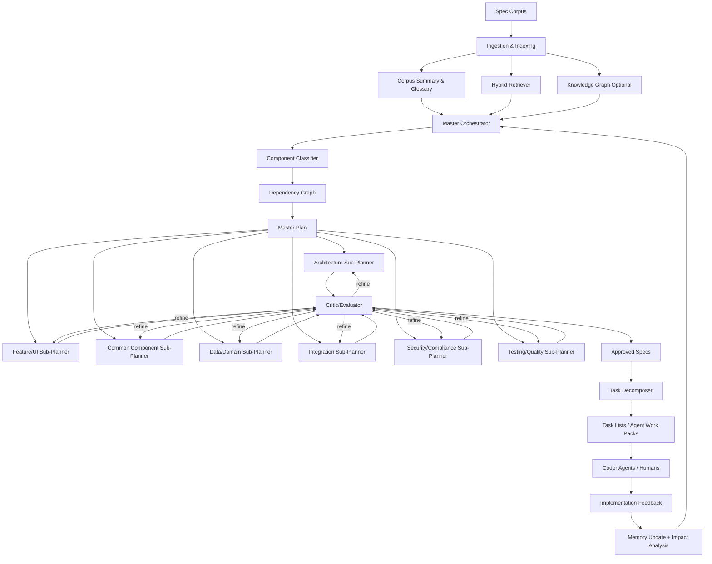

# SIPA — 軟件實作規劃代理

## 完整的研究強化規格與設計文件

**版本：** 2.1 — 研究強化、已操作化安全能力  
**日期：** 2026-06-03  
**狀態：** 可投入生產的設計規格  
**主要目標：** 將非常大型的軟件規格語料轉換為高保真、可追溯、可按組件類型自適應的實作計劃與細粒度任務，供 AI 編碼代理與人類開發者使用。

---

## 變更摘要 — v2.0 → v2.1

此版本是一次深度研究校驗與對抗式「100 倍重思」整合。它**不只是**擴充前一版文件；而是將整個系統收緊為一個可實作、可治理、具安全意識的規劃器。

### 主要改進

1. **研究驗證與修正**
   - 已驗證 MAAD 為 arXiv:2606.01385，提交日期為 2026 年 5 月 31 日，並保留其作為核心架構規劃影響來源。([arxiv.org](https://arxiv.org/abs/2606.01385))
   - 已更新 AgentOrchestra 參考：目前 arXiv 標題強調 Tool-Environment-Agent，即 TEA 協議與具生命週期感知的編排，而不僅僅是「通用任務求解」。([arxiv.org](https://arxiv.org/abs/2506.12508))
   - 已更新 GitHub Spec Kit 對齊方式，以納入當前的 Spec → Plan → Tasks → Implement 流程，以及較新的實務命令，例如 constitution、clarify、analyze、checklist 與 task-to-issues。([github.github.com](https://github.github.com/spec-kit/))
   - 已校正 xAI/Grok Build 相關宣稱：xAI 官方頁面已驗證 plan mode、parallel subagents、skills/plugins/hooks/MCP、headless mode 與 API 可用性；本規格不再依賴非官方的「Arena Mode」說法，而是改為定義 SIPA 自身可選的本地「Arena Evaluator」。([x.ai](https://x.ai/news/grok-build-cli))

2. **新增安全與信任模型**
   - 新增 prompt injection、memory poisoning、MCP/工具安全、最小權限執行、不受信任上下文邊界，以及人類批准控制。
   - 整合 NCSC 指引：LLM 不會強制執行硬性的資料／指令邊界，因此應被視為「天生容易混淆」的元件。([ncsc.gov.uk](https://www.ncsc.gov.uk/blog-post/prompt-injection-is-not-sql-injection))
   - 整合 MCP 的安全原則，涵蓋用戶同意、工具安全、資料私隱，以及不受信任的工具描述。([modelcontextprotocol.io](https://modelcontextprotocol.io/specification/2025-03-26/index))
   - 新增與 OWASP GenAI／agentic 風險對齊的操作監控要求。([genai.owasp.org](https://genai.owasp.org/2026/04/14/owasp-genai-exploit-round-up-report-q1-2026/))

3. **強化上下文工程**
   - 正式將 SIPA 的上下文流程定義為 **write、select、compress、isolate**，以對齊目前代理上下文工程實務。([langchain.com](https://www.langchain.com/blog/context-engineering))
   - 新增檢索預算、證據分類帳、來源信心水平、檢索評估，以及陳舊來源偵測。
   - 新增可選的 GraphRAG 風格全域／局部檢索，用於整個語料範圍的整體理解與依賴影響分析。([microsoft.com](https://www.microsoft.com/en-us/research/project/graphrag/?msockid=334382bc6c746f231ca6946e6d716e0a))

4. **擴展組件分類法**
   - 新增 Security/Compliance、Testing/Quality、Migration/Legacy、AI/Agent Workflow，以及 Documentation/Developer Experience 組件類型。
   - 新增次級風險標籤，可直接改變檢索深度、評論者評分規則，以及人類審核要求。

5. **使輸出更易於機器消費**
   - 新增 artifact manifests、evidence ledgers、decision logs、task execution contracts，以及 canonical schemas。
   - 為 requirements、claims、decisions、interfaces、tasks、risks 與 open questions 新增穩定 ID。

6. **加入評估科學**
   - 新增檢索指標、規劃質量指標、工件層級評論者閾值，以及下游 coder-agent 成功指標。
   - 整合 RAG 評估維度，例如 context relevance、answer faithfulness、answer relevance、context precision 與 context recall。([aclanthology.org](https://aclanthology.org/2024.naacl-long.20/?utm_source=openai))

7. **改進實作路線圖**
   - 將 MVP 拆分為更安全的垂直切片。
   - 新增 CLI/API/MCP 部署模型、可觀測性、快取策略、sandbox 策略，以及治理閘門。

---

## 目錄

1. 執行摘要
2. 核心問題
3. 研究基礎
4. 設計原則
5. 組件分類法
6. 系統架構
7. 代理角色
8. 端到端工作流程
9. 上下文工程、RAG 與記憶
10. 評論者／評估器子系統
11. 安全與信任模型
12. 資料模型與綱要
13. 輸出工件
14. 實作路線圖
15. 工具與執行框架整合
16. 指標與成功準則
17. 風險與緩解措施
18. 未來路線圖
19. 參考資料

---

## 1. 執行摘要

SIPA 是一個分層式、經上下文工程設計的多代理規劃系統，用於將大型軟件規格語料轉換為可直接進入實作的計劃與任務。

它專為以下類型的源材料而設計，這些材料可能包括：

- Markdown 規格
- PRD
- 架構說明筆記
- API 合約
- 使用者故事
- 領域模型
- UI 描述
- ADR
- 實作筆記
- 測試計劃
- 舊系統遷移筆記
- 營運限制

核心想法很簡單，但很強大：

> **不同軟件組件需要不同層次與不同類型的細節。**

戰略性架構計劃，不應該用與 UI 畫面、共享函式庫、資料模型或遷移適配器相同的檢索範圍、摘要風格或輸出格式來生成。

因此，SIPA 使用：

- **組件類型分類**
- **範圍化檢索**
- **基於證據的綜合**
- **分層記憶**
- **內嵌評論循環**
- **以可追溯性為先的工件**
- **細粒度任務生成**
- **具安全意識的代理執行**

結果是一個規劃器，能為下游編碼代理減少上下文體積，同時提升保真度、可追溯性與實作成功率。

---

## 2. 核心問題

大型軟件規格會以可預測的方式破壞 AI 編碼工作流程：

1. **上下文過載**
   - 過多原始文件會造成分心、矛盾與遺漏細節。

2. **統一摘要失效**
   - 架構需要綜合。
   - UI 功能需要完整的局部細節。
   - 共用組件需要合約。
   - 資料模型需要不變量。
   - 整合需要錯誤語義與相容性規則。

3. **可追溯性流失**
   - 編碼代理常常會實作出看似合理、但其實沒有根據源規格的行為。

4. **計劃到任務的轉換薄弱**
   - 大型計劃常常會變成含糊的任務。
   - 含糊任務會造成劣質代碼、重工與隱含假設。

5. **安全與工具風險放大**
   - 代理式編碼工具可以讀檔、執行命令、呼叫 API，以及修改代碼庫。
   - Prompt injection、權限過大的工具，以及記憶污染會變成架構性風險，而不只是 prompt 風險。

SIPA 的存在，就是為了解決這些在編碼開始前就應處理的問題。

---

## 3. 研究基礎

### 3.1 規格驅動開發

GitHub Spec Kit 將規格視為 AI 輔助開發的核心，並提供 **Spec → Plan → Tasks → Implement** 的核心流程。它亦提供 Markdown 工件、質量檢查清單與跨工件分析，令其成為 SIPA 輸出結構的一個強工作流程模型。([github.github.com](https://github.github.com/spec-kit/))

SIPA 將此模型擴展至**既有的大型語料庫**，而不只是綠地功能開發。它加入語料索引、類型感知規劃、可追溯性強制，以及評論循環。

### 3.2 MAAD 與從需求到架構的規劃

MAAD 提出四個專門代理 —— Analyst、Modeler、Designer 與 Evaluator —— 以將需求轉換為多視角架構藍圖並進行質量評估。它使用 RAG 來檢索架構標準與模式、使用分層記憶來保存設計歷史，並使用評估器產生結構化質量報告。([arxiv.org](https://arxiv.org/abs/2606.01385))

SIPA 最直接地採納 MAAD 作為 Architecture Sub-Planner 的基礎，然後將同樣的 analyst/designer/evaluator 結構一般化到其他組件類型。

### 3.3 分層多代理編排

AgentOrchestra 當前的表述引入了 TEA，一種 Tool-Environment-Agent 協議，將代理、工具、環境、提示、記憶與輸出視為具版本與受生命週期管理的資源。它也使用中央規劃器來協調各個專門子代理。([arxiv.org](https://arxiv.org/abs/2506.12508))

SIPA 採納其中的實務教訓：編排不應該只是「代理之間聊天」。它應該是明確狀態、類型化交接、版本化工件，以及具生命週期意識的執行。

### 3.4 多代理軟件工程模式

LLM-based multi-agent systems survey 指出，角色專業化、SDLC 覆蓋、代理協同，以及可信的自主軟件工程，是主要研究方向。([arxiv.org](https://arxiv.org/abs/2404.04834))

MASAI 展示了模組化子代理對軟件工程任務的價值，這些子代理擁有分離的目標與策略，包括避免不必要的長軌跡與過度上下文。([arxiv.org](https://arxiv.org/abs/2406.11638?utm_source=openai))

SWE-agent 證明了代理與電腦之間的介面，會實質影響編碼代理的表現，這也是 SIPA 強調原生對接執行框架的任務封裝的原因。([arxiv.org](https://arxiv.org/abs/2405.15793?utm_source=openai))

SWE-Search 支持在倉庫層級軟件任務中，自我評估與迭代精修的價值。([proceedings.iclr.cc](https://proceedings.iclr.cc/paper_files/paper/2025/hash/a1e6783e4d739196cad3336f12d402bf-Abstract-Conference.html?utm_source=openai))

### 3.5 上下文工程

現代代理設計愈來愈將上下文工程視為一級學科。LangChain 當前框架將上下文策略歸納為 **write、select、compress、isolate**，而 SIPA 將其採納為核心上下文模型。([langchain.com](https://www.langchain.com/blog/context-engineering))

SIPA 具體應用如下：

- **Write：** 在提示之外持久化保存計劃、決策、摘要、記憶與證據。
- **Select：** 只檢索與任務相關的源片段、模式與記憶。
- **Compress：** 在保留來源的前提下，做摘要與提取式壓縮。
- **Isolate：** 為每個子規劃器提供範圍受限的上下文視窗，而不是整份語料。

### 3.6 GraphRAG 與語料整體理解

GraphRAG 結合文字抽取、網絡分析、LLM 提示與摘要，以理解文字資料集。Microsoft 的 GraphRAG 專案尤其適合用於語料級主題與依賴發現。([microsoft.com](https://www.microsoft.com/en-us/research/project/graphrag/?msockid=334382bc6c746f231ca6946e6d716e0a))

SIPA 可選地使用圖式檢索，但架構的設計也允許先採用較簡單的 hybrid vector/BM25 retriever。

### 3.7 架構標準

SIPA 的架構輸出與以下標準對齊：

- **ISO/IEC/IEEE 42010** 中關於 stakeholders、concerns、viewpoints 與 views 的概念。([iso-architecture.org](https://www.iso-architecture.org/ieee-1471/cm/?utm_source=openai))
- **C4 model** 的層級：system context、container、component 與 code，並強調只產出真正有價值的圖。([c4model.com](https://c4model.com/diagrams?utm_source=openai))
- **ATAM**，用於推理質量屬性權衡與架構風險。([sei.cmu.edu](https://www.sei.cmu.edu/library/the-architecture-tradeoff-analysis-method/?utm_source=openai))
- **Kruchten 4+1 views**，用於多視角架構描述。([scirp.org](https://www.scirp.org/reference/referencespapers?referenceid=2072965&utm_source=openai))

### 3.8 安全研究與代理式風險

NCSC 警告，當前 LLM 並不會強制執行資料與指令之間的真實邊界，因此 prompt injection 應被視為一種固有殘餘風險，必須透過系統設計與影響限制來降低。([ncsc.gov.uk](https://www.ncsc.gov.uk/blog-post/prompt-injection-is-not-sql-injection))

OWASP 的 GenAI exploit reporting 顯示，AI 安全事件正愈來愈多地針對代理身份、編排層、供應鏈、權限與驗證控制，而不只是模型輸出。([genai.owasp.org](https://genai.owasp.org/2026/04/14/owasp-genai-exploit-round-up-report-q1-2026/))

MCP 規格明確指出，MCP 允許任意資料存取與代碼執行路徑，因此需要用戶同意、資料私隱控制，以及對工具行為描述保持謹慎。([modelcontextprotocol.io](https://modelcontextprotocol.io/specification/2025-03-26/index))

因此，SIPA 將安全視為核心子系統，而不是附錄。

---

## 4. 設計原則

1. **類型感知規劃**
   - 每個組件都應獲得其真正需要的規劃方式。

2. **先可追溯，再創造**
   - SIPA 可以綜合，但每個主要主張都必須有源證據支撐，或明確標示為假設。

3. **小上下文，高訊號**
   - 除非任務本身是語料級分析，否則絕不把整份語料餵給子規劃器。

4. **評論優先的質量文化**
   - 草稿在通過結構化質量閘門前，都不算最終版本。

5. **活的規格**
   - 計劃必須可版本化、可 diff，並隨實作變更而更新。

6. **原生對接執行框架的輸出**
   - 輸出必須能直接對 Cursor、Claude Code、Kiro、Grok Build、OpenWebUI、自訂 CLI 代理，或人類開發者有用。

7. **以架構實現安全**
   - 工具存取、記憶、檢索、來源信任與批准流程，都必須有明確治理。

8. **高風險場景設人類閘門**
   - 對戰略性、安全關鍵、具破壞性或高成本的決策，必須要求人類審核。

9. **內建評估**
   - 需衡量檢索質量、可追溯性、一致性、可實作性與下游成功。

10. **可組合實作**
   - SIPA 可以先從 CLI 開始，之後再暴露 MCP/API 整合。

---

## 5. 組件分類法

此分類法控制：

- 檢索策略
- 上下文預算
- 規劃器選擇
- 輸出模板
- 評論者評分規則
- 人類審核要求
- 任務分解風格

### 5.1 主要組件類型

| Type | Detail Level | Retrieval Strategy | Output Emphasis | Example |
|---|---:|---|---|---|
| Architecture / Strategic | 高層綜合 | 廣域跨語料檢索 + ASRs/NFRs + patterns | 視圖、ADR、權衡、質量屬性 | 系統架構、服務拓撲 |
| Feature / UI / Tactical | 深度範圍細節 | 窄範圍功能檢索 + 完整局部摘錄 | 使用者故事、驗收標準、流程、狀態、驗證 | 儀表板、註冊流程 |
| Common / Shared Component | 以合約為中心 | 跨模組參考 + 介面提及 | API、類型、不變量、擴展點 | 認證服務、通知函式庫 |
| Data / Domain Model | 中等 | 實體、關係、不變量、生命週期規則 | 綱要、聚合、約束、遷移 | User、Order、Course、ExamAttempt |
| Integration / External | 中等 | API 合約、事件綱要、第三方文件 | 映射、重試、冪等性、相容性 | Stripe adapter、LMS sync |
| Infrastructure / DevOps | 高營運導向 | NFR、部署文件、執行期限制 | IaC、CI/CD、可觀測性、擴展性 | Kubernetes、GitHub Actions |
| Security / Compliance | 高嚴謹度 | 安全需求、政策、威脅模型、資料流 | 威脅模型、控制項、稽核證據 | PII 處理、RBAC、加密 |
| Testing / Quality | 中等 | 驗收標準、測試筆記、缺陷歷史 | 測試矩陣、fixtures、驗證策略 | E2E suite、contract tests |
| Migration / Legacy | 中高 | 舊系統文件、現行行為、目標限制 | Strangler 計劃、相容性、回滾 | COBOL replacement、DB migration |
| AI / Agent Workflow | 高嚴謹度 | 代理指令、工具、記憶、資料存取 | 代理狀態機、工具政策、評估執行框架 | Coding agent、RAG assistant |
| Documentation / DevEx | 中等 | Onboarding 文件、流程、開發者回饋 | Quickstarts、AGENTS.md、慣例 | Contributor guide、module README |

### 5.2 次級標籤

次級標籤會修改評論閘門與輸出章節：

- `security-critical`
- `privacy-sensitive`
- `performance-sensitive`
- `high-availability`
- `user-facing`
- `internal-only`
- `regulated`
- `legacy-modernization`
- `agentic-tool-use`
- `destructive-actions`
- `requires-human-review`
- `experimental`
- `mvp-critical`

### 5.3 分類規則

SIPA 使用以下方式對組件分類：

1. 如有明確 metadata，優先使用。
2. Requirement IDs 與章節名稱。
3. 關鍵字啟發式。
4. 使用結構化輸出的 LLM 分類器。
5. 人工覆寫。
6. 評論者驗證。

分類輸出必須包括：

```yaml
component_id: CMP-auth-service
name: Auth Service
primary_type: common_component
secondary_tags:
  - security-critical
  - privacy-sensitive
confidence: 0.91
evidence:
  - specs/auth.md#overview
  - specs/security.md#session-management
needs_human_review: true
```

---

## 6. 系統架構



---

## 7. 代理角色

### 7.1 Master Orchestrator

**目的：** 負責全局計劃、分解、依賴與協調。

**職責：**

- 建立語料層級的專案理解。
- 識別 epic、module、component 與 phase。
- 對組件分類。
- 生成 `master_plan.md`。
- 維護 dependency graph。
- 觸發各個 sub-planner。
- 協調評論回饋與精修。
- 將高風險歧義升級交由人類處理。

**輸出：**

- `master_plan.md`
- `component_inventory.yml`
- `dependency_graph.mmd`
- `traceability_index.yml`
- `planning_run_manifest.json`

---

### 7.2 Architecture Sub-Planner

**目的：** 產生戰略性架構計劃。

**模式：** 受 MAAD 啟發的 Analyst → Modeler → Designer → Evaluator。

**職責：**

- 提取 functional requirements、NFR 與 ASR。
- 在有價值時產出 C4 及／或 4+1 views。
- 生成 ADR。
- 識別權衡。
- 定義介面邊界。
- 產出部署與執行時視圖。
- 執行 ATAM-lite 質量分析。

**輸出：**

- `architecture_<component>.md`
- `adr_<decision>.md`
- `architecture_views/*.mmd`
- `quality_attribute_scenarios.yml`

---

### 7.3 Feature/UI Sub-Planner

**目的：** 為面向用戶的行為產出具體、範圍清晰的實作規格。

**職責：**

- 提取使用者故事。
- 展開驗收標準。
- 定義 UI 狀態。
- 定義使用者流程。
- 識別驗證與錯誤。
- 連結 API 與資料依賴。
- 生成適合實作粒度的任務。

**輸出：**

- `feature_spec_<name>.md`
- `flow_<name>.mmd`
- `acceptance_criteria_<name>.yml`
- `tasks_<name>.md`

---

### 7.4 Common Component Sub-Planner

**目的：** 產出以合約為先的共用組件規格。

**職責：**

- 聚合分散的提及內容。
- 定義公開介面。
- 定義不變量。
- 定義擴展點。
- 文件化設定方式。
- 文件化失敗模式。
- 提供使用範例。

**輸出：**

- `component_spec_<name>.md`
- `interface_contract_<name>.yml`
- `usage_examples_<name>.md`

---

### 7.5 Data/Domain Sub-Planner

**目的：** 產生領域模型與資料生命週期規格。

**職責：**

- 識別實體、聚合、值物件與關係。
- 定義生命週期狀態。
- 捕捉不變量與約束。
- 識別遷移與版本化需求。
- 定義查詢模式。
- 將領域物件連結至功能與 API。

**輸出：**

- `domain_model_<bounded_context>.md`
- `schema_conceptual_<bounded_context>.mmd`
- `invariants_<bounded_context>.yml`

---

### 7.6 Integration Sub-Planner

**目的：** 產出穩健的整合與適配器規格。

**職責：**

- 定義外部合約。
- 映射來源與目標資料。
- 定義 retry、timeout、idempotency 與 backoff。
- 定義認證與 secret 處理。
- 定義版本相容性。
- 定義可觀測性與 reconciliation。

**輸出：**

- `integration_spec_<name>.md`
- `contract_mapping_<name>.yml`
- `integration_test_plan_<name>.md`

---

### 7.7 Security/Compliance Sub-Planner

**目的：** 產生安全敏感型的計劃與控制措施。

**職責：**

- 識別資產、信任邊界、行為者與資料流。
- 對 agent/tool/data 路徑進行威脅建模。
- 將需求映射到控制項。
- 定義最小權限策略。
- 定義稽核證據。
- 對高風險操作要求人類批准。

**輸出：**

- `security_spec_<scope>.md`
- `threat_model_<scope>.md`
- `control_matrix_<scope>.yml`
- `approval_policy_<scope>.yml`

---

### 7.8 Critic/Evaluator

**目的：** 防止劣質計劃變成實作任務。

**評論維度：**

- 可追溯性
- 來源保真度
- 完整性
- 一致性
- 可實作性
- 可測試性
- 安全性
- 風險
- 任務尺寸
- 下游代理可用性

**輸出：**

- `critique_<artifact>.json`
- `patch_instructions_<artifact>.md`
- `quality_gate_report_<artifact>.md`

---

### 7.9 Task Decomposer

**目的：** 將已批准規格轉換為小型、可執行任務。

**任務屬性：**

- 一個邏輯變更。
- 明確的驗收標準。
- 來源連結。
- 相關上下文摘錄。
- 依賴項。
- 建議檔案。
- 測試期望。
- 如有需要，附帶回滾說明。

**輸出：**

- `tasks_<component>.md`
- 可選 issue 匯出
- 可選 agent work-pack JSON

---

## 8. 端到端工作流程

### Phase 0 — 專案憲章

在規劃之前，SIPA 應建立或吸收專案原則。

輸入可能包括：

- 架構原則
- 編碼標準
- 測試標準
- 安全規則
- 技術棧偏好
- UX 規則
- 命名慣例
- 人類審核政策

輸出：

```text
constitution.md
```

這與目前 Spec Kit 的實務一致，其中 constitution 可用來治理後續的規格、規劃與實作工件。([github.com](https://github.com/github/spec-kit))

---

### Phase 1 — 吸收與索引

步驟：

1. 掃描來源目錄。
2. 遵守 include/exclude 規則。
3. 解析 Markdown 標題層級。
4. 提取 requirement IDs。
5. 偵測 components、entities、APIs、screens 與 decisions。
6. 做語義分塊。
7. 生成 embeddings。
8. 建立關鍵字索引。
9. 可選地建立圖索引。
10. 生成語料摘要與詞彙表。

輸出：

- `corpus_index.md`
- `glossary.md`
- `chunks.parquet`
- `embeddings.db`
- `knowledge_graph.graphml`
- `ingestion_manifest.json`

---

### Phase 2 — Master Plan

Master Orchestrator：

1. 讀取語料摘要。
2. 檢索全域性的跨切面需求。
3. 建立初始組件清單。
4. 對組件分類。
5. 生成依賴圖。
6. 建立實作階段。
7. 識別 MVP 切片。
8. 標記風險與未知項。
9. 執行 master-plan critic。

輸出：

```text
plans/master_plan.md
```

必要章節：

- 專案摘要
- 範圍
- 非目標
- 組件清單
- 階段
- 依賴圖
- 風險登記冊
- 可追溯性骨架
- 開放問題
- 人類批准檢查清單

---

### Phase 3 — 類型感知子規劃

對每個組件：

1. 確認組件類型。
2. 組裝上下文封包。
3. 執行相關 sub-planner。
4. 生成草稿工件。
5. 執行 critic。
6. 只修補未通過的章節。
7. 重新執行 critic。
8. 持久化已批准工件。

輸出示例：

```text
plans/architecture_core_platform.md
plans/feature_spec_student_dashboard.md
plans/component_spec_auth_service.md
plans/domain_model_user_progress.md
plans/integration_spec_lms_sync.md
plans/security_spec_auth_and_sessions.md
```

---

### Phase 4 — 任務生成

Task Decomposer 從已批准計劃中建立實作任務。

任務格式：

```markdown
- [ ] T042 [P] Build StudentDashboardHeader
  - **Component:** Student Dashboard
  - **Source:** feature_spec_student_dashboard.md#ui-header
  - **Depends on:** T011, T018
  - **Acceptance:**
    - Renders avatar, name, role, and notification state.
    - Handles loading and empty-avatar states.
    - Meets responsive behavior defined in section 4.2.
  - **Tests:**
    - Unit render states.
    - E2E dropdown interaction.
  - **Context excerpt:** See linked source section.
```

---

### Phase 5 — 實作回饋

當 coder agents 或人類執行任務後，SIPA 會吸收：

- diff
- 測試結果
- 審查意見
- 實作阻塞項
- 已變更的假設
- 失敗任務
- 新需求

之後 SIPA 會：

1. 更新情節記憶。
2. 執行影響分析。
3. 更新受影響計劃。
4. 重新執行評論閘門。
5. 重新生成受影響任務。

---

## 9. 上下文工程、RAG 與記憶

### 9.1 上下文封包結構

每個 sub-planner 都會收到一個 context package：

```yaml
context_package_id: CTX-feature-student-dashboard-v1
component_id: CMP-student-dashboard
planner_type: feature_ui
token_budget:
  max_total: 45000
  source_evidence: 25000
  memory: 5000
  master_context: 5000
  template_and_instructions: 5000
retrievals:
  - chunk_id: CHK-00123
    source: specs/student.md#dashboard
    relevance: 0.94
    trust_level: canonical
  - chunk_id: CHK-00418
    source: specs/ui.md#notifications
    relevance: 0.87
    trust_level: canonical
compression:
  method: extractive_then_abstractive
  preserve_quotes: true
  preserve_requirement_ids: true
```

### 9.2 檢索模式

| Mode | Purpose |
|---|---|
| Exact ID lookup | Requirement IDs、ADR IDs、API names |
| BM25 keyword | 精確技術術語 |
| Vector search | 語義相似度 |
| Graph traversal | 依賴與追蹤連結 |
| Global summarization | 語料級主題 |
| Local neighborhood | 緊密相關片段 |
| Reranked hybrid | 預設生產模式 |

### 9.3 記憶類型

| Memory | Scope | Examples |
|---|---|---|
| Working | 當前執行 | draft、active critic notes |
| Episodic | 過往執行 | refinements、implementation feedback |
| Semantic | 一般化知識 | patterns、glossary、conventions |
| Procedural | 代理行為 | prompts、rubrics、templates |
| Evidence | 來源錨定 | chunk IDs、citations、excerpts |
| Security | 信任與權限 | approved tools、blocked actions |

### 9.4 證據分類帳

每個主要輸出主張都應映射到證據：

```yaml
claim_id: CLM-architecture-012
claim: "Auth Service owns session creation and refresh-token rotation."
artifact: component_spec_auth_service.md
evidence:
  - source: specs/auth.md#session-lifecycle
    quote: "..."
  - source: specs/security.md#refresh-token-policy
    quote: "..."
confidence: 0.93
status: supported
```

---

## 10. 評論者／評估器子系統

### 10.1 質量閘門

| Gate | Required For | Pass Threshold |
|---|---|---:|
| Traceability | 所有工件 | ≥ 0.90 |
| Source fidelity | 所有工件 | ≥ 0.92 |
| Internal consistency | 所有工件 | ≥ 0.90 |
| Cross-artifact consistency | 多組件計劃 | ≥ 0.88 |
| Implementability | 任務清單 | ≥ 0.90 |
| Testability | 功能／組件 | ≥ 0.90 |
| Security review | 帶標籤工件 | 無高風險發現 |
| Human approval | 戰略性／高風險 | 明確批准 |

### 10.2 評論綱要

```json
{
  "artifact_id": "feature_spec_student_dashboard",
  "overall_verdict": "refine",
  "scores": {
    "traceability": 0.86,
    "source_fidelity": 0.93,
    "consistency": 0.91,
    "implementability": 0.88,
    "testability": 0.84,
    "security": 0.90
  },
  "issues": [
    {
      "severity": "high",
      "category": "traceability",
      "location": "section 4.3",
      "description": "Notification polling interval is asserted without source evidence.",
      "suggested_patch": "Either link to source requirement or mark as assumption requiring human approval."
    }
  ],
  "recommended_next_action": "targeted_refinement"
}
```

### 10.3 可選 SIPA Arena Evaluator

SIPA 可以執行多個彼此競爭的規劃器輸出，並用同一套評分規則來評估它們。

Arena mode 應比較：

- 可追溯性
- 清晰度
- 完整性
- 風險處理
- 可任務化程度
- 安全姿態
- 來源保真度

這與任何外部供應商功能無關。xAI 官方文件驗證了 Grok Build 的 plan mode 與 parallel subagents，但 SIPA 的 evaluator 必須保持供應商中立。([x.ai](https://x.ai/news/grok-build-cli))

---

## 11. 安全與信任模型

### 11.1 核心安全假設

1. 被檢索到的文件可能包含惡意指令。
2. 工具描述可能不可信。
3. 記憶可能被污染。
4. 代理輸出即使很有把握也可能是錯的。
5. 只有當 UI 顯示實際操作，而不只是代理摘要時，人類批准才真正有用。
6. 高影響操作需要 LLM 之外的確定性控制。

### 11.2 信任等級

| Trust Level | Meaning | Example |
|---|---|---|
| canonical | 經批准的事實來源 | 已審核規格 |
| trusted-derived | 從 canonical 生成並已批准 | 已批准計劃 |
| unreviewed-derived | 已生成但未批准 | 草稿計劃 |
| external | 語料外部 | 網頁文件 |
| untrusted | 可能含注入的 user/tool/retrieved content | 任意網頁 |
| hostile-test | 對抗性測試樣本 | red-team prompt |

### 11.3 工具權限政策

| Action | Default |
|---|---|
| 讀取專案規格 | 允許 |
| 寫入生成計劃 | 允許，但僅限輸出目錄 |
| 修改源代碼 | 由 SIPA planner 阻止 |
| 執行 shell commands | 阻止，除非明確工具模式 |
| 刪除檔案 | 需要人類批准 |
| 存取 secrets | 禁止 |
| 呼叫外部 API | 需要人類批准 |
| 安裝套件 | 需要人類批准 |
| 更新記憶 | 僅允許透過 memory sanitizer |

### 11.4 Prompt-Injection 控制

SIPA 必須：

- 將檢索內容包裝為不受信任證據。
- 絕不允許檢索內容覆蓋 system/developer instructions。
- 移除或標記來源片段中的可疑指令。
- 分離 source evidence 與 planner instructions。
- 對工具呼叫使用確定性政策檢查。
- 記錄 source-to-claim mappings。
- 對高影響行動要求人類批准。

### 11.5 MCP 控制

如果 SIPA 暴露 MCP 工具：

- 每個工具都必須有狹窄綱要。
- 破壞性工具必須要求明確批准。
- 除非來自可信伺服器，否則工具描述必須被視為不可信。
- 未經同意，不得轉發 MCP resources。
- 工具呼叫必須記錄 inputs、outputs、requester 與 artifact ID。

這些要求遵循 MCP 對用戶同意、工具安全、資料私隱及任意代碼執行風險的自身安全立場。([modelcontextprotocol.io](https://modelcontextprotocol.io/specification/2025-03-26/index))

---

## 12. 資料模型與綱要

### 12.1 核心工件 Frontmatter

```yaml
---
artifact_id: string
type: master_plan | architecture | feature_ui | common_component | domain_model | integration | security | task_list | critique
component_id: string
component_name: string
primary_type: string
secondary_tags: []
version: string
status: draft | in_review | approved | implemented | superseded
created_at: ISO-8601
updated_at: ISO-8601
source_corpus_version: string
traceability_score: number
critic_score: number
dependencies: []
review_required: boolean
approved_by: string | null
---
```

### 12.2 Requirement Record

```yaml
requirement_id: REQ-001
text: "Users must be able to reset their password by email."
source:
  file: specs/auth.md
  section: password-reset
type: functional
priority: must
component_refs:
  - CMP-auth-service
  - CMP-email-service
status: active
```

### 12.3 Decision Record

```yaml
decision_id: ADR-004
title: "Use refresh-token rotation"
status: proposed
context: "Session persistence requires secure long-lived authentication."
decision: "Use short-lived access tokens and rotating refresh tokens."
alternatives:
  - server-side sessions
  - static refresh tokens
consequences:
  positive:
    - limits replay window
  negative:
    - requires token-family invalidation logic
evidence:
  - specs/security.md#token-policy
```

### 12.4 Task Record

```yaml
task_id: T042
title: "Implement refresh-token rotation"
component_id: CMP-auth-service
source_artifacts:
  - component_spec_auth_service.md#refresh-token-rotation
dependencies:
  - T038
parallelizable: false
risk: high
acceptance_criteria:
  - "Refresh token is rotated on every successful refresh."
  - "Reuse of old refresh token invalidates token family."
tests:
  - "unit"
  - "integration"
human_review_required: true
```

---

## 13. 輸出工件

### 13.1 `master_plan.md`

必要章節：

1. 執行摘要
2. 範圍與非目標
3. 語料摘要
4. 組件清單
5. 組件分類表
6. 依賴圖
7. 實作階段
8. MVP 切片
9. 風險登記冊
10. 可追溯性骨架
11. 開放問題
12. 批准檢查清單
13. 變更日誌

### 13.2 架構規格

必要章節：

1. 架構範圍
2. 利害關係人與關注點
3. ASR 與 NFR
4. C4 context/container/component views
5. 執行時情境
6. 部署視圖
7. ADR
8. 介面目錄
9. 質量屬性情境
10. 權衡分析
11. 風險
12. 可追溯性矩陣

### 13.3 Feature/UI 規格

必要章節：

1. 功能摘要
2. 使用者故事
3. 使用者流程
4. UI 狀態
5. 驗收標準
6. 驗證矩陣
7. 錯誤與邊界案例
8. API／資料依賴
9. 可及性備註
10. Analytics／events
11. 測試情境
12. 可追溯性矩陣

### 13.4 Common Component 規格

必要章節：

1. 目的
2. 範圍
3. 公開介面
4. 資料合約
5. 不變量
6. 設定
7. 擴展點
8. 錯誤處理
9. 效能期望
10. 安全考量
11. 使用範例
12. 測試策略
13. 可追溯性矩陣

### 13.5 安全規格

必要章節：

1. 資產
2. 行為者
3. 信任邊界
4. 資料流
5. 威脅
6. 控制項
7. 殘餘風險
8. 批准要求
9. 監控
10. 稽核證據
11. 可追溯性矩陣

### 13.6 任務清單

必要章節：

1. 任務總覽
2. 執行順序
3. 可平行化任務
4. 關鍵路徑
5. 任務檢查清單
6. 測試檢查清單
7. 審查檢查清單
8. 回滾備註
9. 來源連結

---

## 14. 實作路線圖

### Phase 1 — 安全 MVP

建立一個垂直切片：

- 語料載入器
- Markdown 分塊器
- 混合搜尋
- 組件分類器
- 主規劃器
- 一個子規劃器
- 基礎評論器
- Markdown 渲染器
- 任務分解器
- CLI 命令

建議的第一個子規劃器：若要驗證實作交接，選 **Feature/UI**；若要驗證戰略規劃，選 **Architecture**。

### Phase 2 — 核心系統

加入：

- 所有主要子規劃器
- 知識圖譜
- 證據分類帳
- 分層記憶
- 多階段評論器
- 人類批准閘門
- 增量式重規劃
- 評估指標
- 模板函式庫

### Phase 3 — 生產強化

加入：

- 可觀測性儀表板
- 成本／token 追蹤
- 模型路由
- 提示／版本登錄
- MCP server
- Sandbox 工具模式
- 安全 red-team 套件
- CI 驗證
- 計劃漂移偵測
- issue tracker 匯出

### Phase 4 — 自我改進

加入：

- 規劃器效能分析
- 失敗任務學習
- 檢索策略最佳化
- Prompt／template 演化
- 領域專用分類法
- 自動基準生成

---

## 15. 工具與執行框架整合

### 15.1 Cursor / Claude Code / Kiro / 類似工具

SIPA 應寫出：

```text
plans/
tasks/
AGENTS.md
.cursor/rules/
.claude/commands/
```

生成的 `AGENTS.md` 應包含：

- 模組慣例
- 相關計劃連結
- 禁止操作
- 測試期望
- source-of-truth 順序

### 15.2 Grok Build

xAI 官方文件已驗證 Grok Build 支援 plan mode、headless scripting、custom models、skills/plugins、MCP servers，以及 parallel subagents。([x.ai](https://x.ai/cli))

SIPA 整合模式：

1. SIPA 生成已批准的計劃與 task pack。
2. Grok Build 以 plan mode 執行。
3. 人類將 Grok 的執行計劃與 SIPA 任務準則比對。
4. 只有在批准之後才進行實作。
5. SIPA 吸收 diff 與測試結果。

### 15.3 MCP/API 模式

SIPA 可暴露：

- `sipa.index_corpus`
- `sipa.get_master_plan`
- `sipa.plan_component`
- `sipa.critique_artifact`
- `sipa.generate_tasks`
- `sipa.trace_requirement`
- `sipa.impact_analysis`

所有寫入或具破壞性的操作都需要授權。

---

## 16. 指標與成功準則

### 16.1 檢索指標

- Context precision
- Context recall
- Source coverage
- Duplicate chunk rate
- Stale source rate
- Evidence sufficiency
- Unsupported claim rate

### 16.2 工件指標

- Traceability score
- Source-fidelity score
- Consistency score
- Completeness score
- Testability score
- Implementability score
- Security score
- Human review time

### 16.3 下游指標

- Task completion rate
- Rework rate
- Test pass rate
- Spec deviation rate
- Clarification count
- Average task context size
- Time from spec change to updated tasks

### 16.4 MVP 成功閾值

- MVP 的 Traceability ≥ 0.85，生產環境 ≥ 0.90。
- 已批准工件不得存在高嚴重度評論發現。
- 平均 refinement loops < 3。
- 下游任務澄清數量至少減少 30%。
- 與原始規格直接提示相比，傳給 coder agents 的上下文至少減少 50%。

---

## 17. 風險與緩解措施

| Risk | Mitigation |
|---|---|
| 不良檢索 | Hybrid search、reranking、evidence ledger、retrieval eval |
| 幻覺式計劃 | Source-fidelity critic、unsupported-claim detector |
| 過度分解 | Task sizing critic |
| 分解不足 | Dependency 與 acceptance-criteria 檢查 |
| 規格衝突 | Conflict detector 與人類裁決 |
| Prompt injection | 不受信任來源邊界、確定性控制 |
| Memory poisoning | Memory sanitizer 與 trust levels |
| Tool abuse | 最小權限與批准閘門 |
| 計劃過時 | 增量索引與 impact analysis |
| 高 token 成本 | 壓縮、快取、模型路由 |
| 人類瓶頸 | 依風險分級批准 |
| Vendor lock-in | 以 Markdown 為先的工件與 MCP 相容 API |

---

## 18. 未來路線圖

1. 完整的 GraphRAG impact analysis。
2. 支援 UI mocks 與 architecture diagrams 的多模態吸收。
3. 從 acceptance criteria 自動生成測試。
4. 為關鍵不變量建立 formal-methods bridge。
5. 為 edtech、finance、embedded systems 與 legacy modernization 提供領域套件。
6. Jira/GitHub issue 匯出。
7. 持續性 plan-code drift detection。
8. 多模型 evaluator arena。
9. 自我優化的 prompt/template registry。
10. 安全的企業部署套件。

---

## 19. 參考資料

- MAAD — 以 Analyst、Modeler、Designer、Evaluator、RAG、hierarchical memory 與 quality evaluation 為核心的需求到架構多代理設計。([arxiv.org](https://arxiv.org/abs/2606.01385))
- AgentOrchestra / TEA Protocol — 具生命週期感知的分層多代理編排。([arxiv.org](https://arxiv.org/abs/2506.12508))
- LLM-Based Multi-Agent Systems for Software Engineering survey。([arxiv.org](https://arxiv.org/abs/2404.04834))
- Designing LLM-based Multi-Agent Systems for SE Tasks — quality attributes、design patterns 與 rationale。([arxiv.org](https://arxiv.org/abs/2511.08475))
- GitHub Spec Kit 文件與代碼庫。([github.github.com](https://github.github.com/spec-kit/))
- LangChain 上下文工程：write、select、compress、isolate。([langchain.com](https://www.langchain.com/blog/context-engineering))
- Microsoft GraphRAG project。([microsoft.com](https://www.microsoft.com/en-us/research/project/graphrag/?msockid=334382bc6c746f231ca6946e6d716e0a))
- MASAI 模組化軟件工程代理。([arxiv.org](https://arxiv.org/abs/2406.11638?utm_source=openai))
- SWE-agent agent-computer interface research。([arxiv.org](https://arxiv.org/abs/2405.15793?utm_source=openai))
- SWE-Search 的迭代精修與 MCTS 軟件代理研究。([proceedings.iclr.cc](https://proceedings.iclr.cc/paper_files/paper/2025/hash/a1e6783e4d739196cad3336f12d402bf-Abstract-Conference.html?utm_source=openai))
- ARES 與 RAGAS 風格的 RAG 評估維度。([aclanthology.org](https://aclanthology.org/2024.naacl-long.20/?utm_source=openai))
- ISO/IEC/IEEE 42010 架構描述概念。([iso-architecture.org](https://www.iso-architecture.org/ieee-1471/cm/?utm_source=openai))
- C4 model diagrams。([c4model.com](https://c4model.com/diagrams?utm_source=openai))
- ATAM 架構權衡分析。([sei.cmu.edu](https://www.sei.cmu.edu/library/the-architecture-tradeoff-analysis-method/?utm_source=openai))
- NCSC prompt-injection 指引。([ncsc.gov.uk](https://www.ncsc.gov.uk/blog-post/prompt-injection-is-not-sql-injection))
- OWASP GenAI exploit reporting 與 agentic risk framing。([genai.owasp.org](https://genai.owasp.org/2026/04/14/owasp-genai-exploit-round-up-report-q1-2026/))
- Model Context Protocol 規格與安全原則。([modelcontextprotocol.io](https://modelcontextprotocol.io/specification/2025-03-26/index))
- xAI Grok Build 官方 CLI 與文件頁面。([x.ai](https://x.ai/news/grok-build-cli))

---
了解更多：
1. [\[2606.01385\] Bridging Requirements and Architecture: Multi-Agent Orchestration with External Knowledge and Hierarchical Memory](https://arxiv.org/abs/2606.01385)
2. [\[2506.12508\] AgentOrchestra: Orchestrating Multi-Agent Intelligence with the Tool-Environment-Agent(TEA) Protocol](https://arxiv.org/abs/2506.12508)
3. [GitHub Spec Kit | Spec Kit Documentation](https://github.github.com/spec-kit/)
4. [Introducing Grok Build | xAI](https://x.ai/news/grok-build-cli)
5. [Prompt injection is not SQL injection (it may be worse) | National Cyber Security Centre](https://www.ncsc.gov.uk/blog-post/prompt-injection-is-not-sql-injection)
6. [Specification - Model Context Protocol](https://modelcontextprotocol.io/specification/2025-03-26/index)
7. [OWASP GenAI Exploit Round-up Report Q1 2026 - OWASP Gen AI Security Project](https://genai.owasp.org/2026/04/14/owasp-genai-exploit-round-up-report-q1-2026/)
8. [Context Engineering](https://www.langchain.com/blog/context-engineering)
9. [Project GraphRAG - Microsoft Research](https://www.microsoft.com/en-us/research/project/graphrag/?msockid=334382bc6c746f231ca6946e6d716e0a)
10. [ARES: An Automated Evaluation Framework for Retrieval-Augmented Generation Systems - ACL Anthology](https://aclanthology.org/2024.naacl-long.20/?utm_source=openai)
11. [\[2404.04834\] LLM-Based Multi-Agent Systems for Software Engineering: Literature Review, Vision and the Road Ahead](https://arxiv.org/abs/2404.04834)
12. [MASAI: Modular Architecture for Software-engineering AI Agents](https://arxiv.org/abs/2406.11638?utm_source=openai)
13. [SWE-agent: Agent-Computer Interfaces Enable Automated Software Engineering](https://arxiv.org/abs/2405.15793?utm_source=openai)
14. [SWE-Search: Enhancing Software Agents with Monte Carlo Tree Search and Iterative Refinement](https://proceedings.iclr.cc/paper_files/paper/2025/hash/a1e6783e4d739196cad3336f12d402bf-Abstract-Conference.html?utm_source=openai)
15. [ISO/IEC/IEEE 42010: Conceptual Model](https://www.iso-architecture.org/ieee-1471/cm/?utm_source=openai)
16. [Diagrams | C4 model](https://c4model.com/diagrams?utm_source=openai)
17. [The Architecture Tradeoff Analysis Method | CMU Software Engineering Institute](https://www.sei.cmu.edu/library/the-architecture-tradeoff-analysis-method/?utm_source=openai)
18. [Kruchten, P. (1995) Architectural Blueprints—The “4+1” View Model of Software Architecture. IEEE Software, 12, 42-50. - References - Scientific Research Publishing](https://www.scirp.org/reference/referencespapers?referenceid=2072965&utm_source=openai)
19. [GitHub - github/spec-kit:  Toolkit to help you get started with Spec-Driven Development · GitHub](https://github.com/github/spec-kit)
20. [Grok Build Beta | xAI](https://x.ai/cli)
21. [\[2511.08475\] Designing LLM-based Multi-Agent Systems for Software Engineering Tasks: Quality Attributes, Design Patterns and Rationale](https://arxiv.org/abs/2511.08475)
