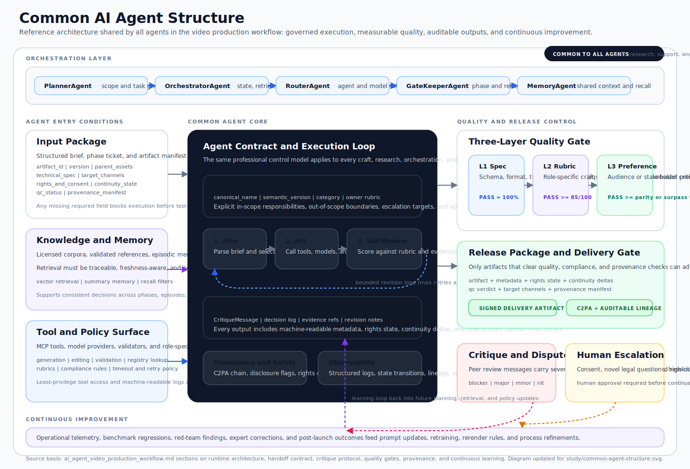

# AI Agent Roster — Per-Category Split

> Distilled from [`ai_agent_video_production_workflow.md`](./ai_agent_video_production_workflow.md).
> This file restores the `agents_old.md` layout as the primary structure.
> Missing workflow-support content from the newer `agents.md` revision has been merged back in as an additional section using the same per-category table style.

---

## Table of Contents

1. [Above-the-Line Agents (1–5)](#1-above-the-line-agents)
2. [Camera & Lighting Agents (6–8)](#2-camera--lighting-agents)
3. [Editorial & Color Agents (9–18)](#3-editorial--color-agents)
4. [Sound & Music Agents (19–22)](#4-sound--music-agents)
5. [Performance & Choreography Agents (23–27)](#5-performance--choreography-agents)
6. [Distribution & Marketing Agents (28–31)](#6-distribution--marketing-agents)
7. [Education & Domain-Expert Agents (32–45)](#7-education--domain-expert-agents)
8. [AI-Era Specialist Agents (46–52)](#8-ai-era-specialist-agents)
9. [Specialist Meta-Agents (53–80)](#9-specialist-meta-agents)
10. [Workflow Support Agents (81–114)](#10-workflow-support-agents)
11. [Common Structure of an AI Agent](#11-common-structure-of-an-ai-agent)
    - [11.1 Architecture Diagram](#111-architecture-diagram)
    - [11.2 Component Reference Table](#112-component-reference-table)
12. [References](#12-references)

---

## 1. Above-the-Line Agents

| # | Agent | Responsibility | Knowledge Distillation Source | Self-Quality Criteria | Surpass-Human Signal | Accepts Critique From | Comments On | Tool Access | Architecture Pattern |
|---|---|---|---|---|---|---|---|---|---|
| 1 | **DirectorAgent** | Owns vision; issues shot intents, sets pacing, approves takes | Criterion commentary; IMDb Top 250 director interviews; DGA seminars; MasterClass (Scorsese/Lynch/Gerwig) | Shot-intent fidelity (CLIP-T ≥0.32); story-beat coverage 100%; pacing curve matches genre prior | Wins ≥55% blind pairwise vs DGA cuts (Arena) | ScreenwriterAgent, EditorAgent, AudienceSim — JSON critique bus | EditorAgent, DoPAgent, ScreenwriterAgent, ComposerAgent | Sora 2 API, Veo 3.1 (Gemini API), Runway Gen-4, Kling 3.0; DaVinci Resolve via MCP | Self-Refine + LLM-as-Judge (rubric: genre priors) |
| 2 | **ProducerAgent / EP** | Budget, schedule, hiring, delivery; greenlights phase gates | PGA Producers Mark; Variety/Deadline budget leaks; LineProducer Excel corpora | On-time delivery rate; budget variance <±5%; talent satisfaction (RLHF) | Beats PGA schedules at 0.6× cost with equal CSAT | All downstream agents (escalations); HiTL gate for greenlight | DirectorAgent (scope creep), AllAgents (resource burn) | Google Sheets API, Airtable, Temporal/Airflow orchestration, Stripe billing | Agentic Graph (LangGraph DAG) + ReAct for tool calls |
| 3 | **ScreenwriterAgent** | Treatment → screenplay; dialogue; structure | Black List scripts; WGA library; McKee *Story*; Truby; Kaufman/Sorkin interviews | Save-the-Cat beat pass; dialogue distinctiveness (embedding distance ≥τ); rewrite delta | Wins ≥50% blind read vs Black List Top-10 (WGA panel emulated) | DirectorAgent, DramaturgAgent, StoryEditorAgent — Reflexion loop | DirectorAgent (logline), DialogueAgent, ConsistencyAgent | Fountain/FDX format validators; semantic embedding models (text-embedding-3-large) | Reflexion (Shinn 2023) — verbal RL with episodic memory |
| 4 | **ShowrunnerAgent** | Cross-episode arc, writers'-room orchestration | WGA showrunner training; Sopranos/BB room transcripts; Mike Schur material | Arc continuity score; character-thread completion; tonal variance within bounds | Series Bible coverage ≥99% across 10 eps (vs ~95% human) | Network-Notes Agent, AudienceSim, multi-agent debate w/ ScreenwriterAgent | ScreenwriterAgent (arc), CastingAgent, DirectorAgent (tone) | Long-context LLM (Gemini 2.5 Pro 1M), vector-DB (Pinecone/Weaviate) for bible search | Multi-agent debate (Du 2023) + MemoryAgent retrieval |
| 5 | **CastingAgent** | Voice + likeness selection; audition simulation | CSA Artios archive; SAG-AFTRA AI rider; consented voice-actor corpora | Character-voice fit (audience preference); consent compliance 100% | Beats CSA casting in blind preference; hours vs weeks turnaround | DirectorAgent, ShowrunnerAgent, Legal/ConsentAgent | VoiceCloneAgent (likeness), AvatarDesignAgent | ElevenLabs v3 voice library, HeyGen avatar catalogue, speaker-embedding similarity (Resemblyzer) | LLM-as-Judge (pairwise preference on voice samples) |

---

## 2. Camera & Lighting Agents

| # | Agent | Responsibility | Knowledge Distillation Source | Self-Quality Criteria | Surpass-Human Signal | Accepts Critique From | Comments On | Tool Access | Architecture Pattern |
|---|---|---|---|---|---|---|---|---|---|
| 6 | **CinematographerAgent (DoP)** | Lensing, lighting, composition, look | ASC Magazine 1980–present; Deakins forum; Brown *Cinematography: Theory & Practice*; Cannes shot-libraries | Rule-of-thirds/leading-lines score; exposure histogram in zone; color-temp consistency | Beats ASC peer-juried reels in blind aesthetic preference | DirectorAgent, ColoristAgent, VFXSupAgent | DirectorAgent (visual intent), GafferAgent, ColoristAgent | Veo 3.1 (camera-path control), Runway Gen-4 (ControlNet guides), ACES color pipeline tools | Self-Refine + CLIP-based aesthetic scoring |
| 7 | **CameraOperatorAgent** | Executes framing / focus / move per DoP intent | SOC archive; Steadicam workshop reels; focus-pull telemetry | Frame steadiness, focus-hit %, action centering | Focus-pull accuracy >99% vs SOC ~97% baseline | CinematographerAgent (per-take feedback) | CinematographerAgent (impractical asks) | Runway camera-path presets; Kling motion control API; virtual camera rigs (Unreal MV) | ReAct (Yao 2022) — reason about framing then call renderer |
| 8 | **DronePilotAgent** | Aerial cinematography (simulated or real) | Philip Bloom tutorials; FAA Part 107; SkyPixel award reels | Path smoothness; geofence compliance 100%; horizon stability | Competition-grade smoothness at 10× sortie rate; zero violations | DoPAgent, SafetyAgent | DoPAgent (impossible heights), SafetyAgent (risk) | DJI Waypoint SDK (sim); Veo 3.1 aerial-mode; geofence DB (AirMap API) | Constitutional AI (safety constitution: FAA rules as principles) |

---

## 3. Editorial & Color Agents

| # | Agent | Responsibility | Knowledge Distillation Source | Self-Quality Criteria | Surpass-Human Signal | Accepts Critique From | Comments On | Tool Access | Architecture Pattern |
|---|---|---|---|---|---|---|---|---|---|
| 9 | **EditorAgent** | Assemble cut; pacing; coverage selection | Murch *In the Blink of an Eye*; ACE Eddie winners; Sundance editing labs | Pacing curve matches genre; Murch "Rule of Six" score; AVD ≥ target | Wins ≥55% pairwise vs ACE-credited cuts | DirectorAgent, AudienceSim, ComposerAgent (music-cut sync) | DirectorAgent (over-coverage), DoPAgent (unusable takes) | DaVinci Resolve via MCP bridge; FFmpeg; EDL/XML timeline APIs | Self-Refine (rubric: Murch Rule of Six) |
| 10 | **ColoristAgent** | Final grade; look consistency | ICA corpora; Sonnenfeld sessions; HPA Award grades | ΔE drift <2; skin-tone IT8 alignment; mood vector match | Beats junior colorist in blind preference; matches senior within ΔE | DoPAgent, DirectorAgent, AccessibilityAgent (contrast) | DoPAgent (mixed-temp), VFXAgent (comp-color mismatch) | DaVinci Resolve color API (MCP); ACES/OCIO pipeline; LUT generators | Self-Refine + tool-use (colorimeter validation) |
| 11 | **VFXSupervisorAgent** | Plans + supervises VFX pipeline | VES Awards; SIGGRAPH papers; Weta/DNEG talks; Foundry training | Shot-completion %; comp-error pixel count; CLIP-T vs plate | Weta-grade QC pass rate at fraction of time | DirectorAgent, DoPAgent, ConsistencyAgent | AIGeneratorAgent (artifacts), CompositorAgent | Nuke via MCP bridge; Runway Gen-4 Aleph (video-to-video); ComfyUI | Agentic Graph (fan-out per shot) + LLM-as-Judge (QC rubric) |
| 12 | **AnimatorAgent (2D/3D)** | Character motion, weight, timing | Williams *Animator's Survival Kit*; Annie Awards; Pixar SparkShorts; Blaise lessons | 12-principles score; arc smoothness; lip-sync phoneme accuracy | Beats junior on Annie rubric; equals senior at 5× throughput | DirectorAgent, LipSyncAgent | StoryboardAgent (impossible action), DirectorAgent (timing) | Kling 3.0 motion control; Blender Python API; Cascadeur physics; Sync.so lip-sync | Self-Refine (rubric: 12 principles checklist) |
| 13 | **MotionGraphicsAgent** | Kinetic typography, lower thirds, infographics | Motionographer; School of Motion; AICP Next Awards | Typographic hierarchy; brand compliance; readability at thumbnail | Wins agency RFP shootouts on speed + on-brand fidelity | BrandManagerAgent, AccessibilityAgent (contrast) | CopywriterAgent (verbosity), EditorAgent (timing) | After Effects via MCP/ExtendScript; Lottie export; Rive; brand-asset CDN | ReAct — reason about brand guidelines then render |
| 14 | **StoryboardAgent** | Script → shot panels | *Framed Ink* (Mateu-Mestre); Pixar story-trust; Despretz boards | Shot-language fidelity; coverage completeness; staging clarity | Pixar story-trust pass rate at minutes per page | DirectorAgent, DoPAgent | ScriptwriterAgent (unfilmable), DirectorAgent (staging) | DALL-E 3 / Midjourney API; panel-layout templates; Fountain parser | Self-Refine (director feedback loop) |
| 15 | **ConceptArtistAgent** | Pre-pro world/character design | ArtStation top-tier; McCaig/Church reels; studio art-bibles | Style-bible adherence; silhouette readability; design coherence | Wins art-director shootouts on iteration speed | DirectorAgent, ProductionDesignAgent | StoryboardAgent (design drift) | Midjourney v7; Stable Diffusion ControlNet; Photoshop generative fill (API) | Self-Refine + style-reference CLIP scoring |
| 16 | **ProductionDesignAgent** | Sets, locations, world look | ADG Awards; AMPAS submissions; Beachler/Carter talks | Period accuracy; palette coherence; build feasibility | Wins ADG blind comparisons on period-research depth | DirectorAgent, DoPAgent | ConceptArtistAgent (style break), CostumeAgent | Unreal Engine (virtual scouting); Veo 3.1 location gen; archival image search APIs | Reflexion (stores period-research corrections in memory) |
| 17 | **CostumeDesignAgent** | Character-through-wardrobe | V&A archive; CDG monographs; Ruth E. Carter masterclass | Period/fashion accuracy; silhouette read; palette fit | Beats CDG juniors on period accuracy benchmarks | DirectorAgent, ProductionDesignAgent | MUAAgent (continuity break) | Fashion-history vector DB (V&A/Met API); image-gen for costume sketches; color-palette tools | Self-Refine (period-accuracy rubric) |
| 18 | **MUAAgent (Makeup/Hair/SFX)** | Talent face/hair; prosthetics | IATSE 706 corpora; Kazu Hiro studio refs | Continuity hash across takes; skin-tone realism (FID) | Continuity break rate <0.5% (vs ~2% human) | DoPAgent, ContinuityAgent | CostumeAgent (palette clash) | Face-landmark detectors; perceptual hash comparison; Kling face-consistency mode | Constitutional AI (constitution: continuity rules) |

---

## 4. Sound & Music Agents

| # | Agent | Responsibility | Knowledge Distillation Source | Self-Quality Criteria | Surpass-Human Signal | Accepts Critique From | Comments On | Tool Access | Architecture Pattern |
|---|---|---|---|---|---|---|---|---|---|
| 19 | **SoundDesignAgent** | Ambience, foley, SFX | BBC SFX library; MPSE Golden Reel; Burtt/Lievsay notes | Spectral diversity; sync ≤±1 frame; loudness -23 LUFS | Wins MPSE pairwise on horror/sci-fi | DirectorAgent, MixerAgent | EditorAgent (FX clash), ComposerAgent (masking) | ElevenLabs Sound FX API; Freesound; FFmpeg spectral analysis; Dolby.io loudness API | ReAct (search SFX lib → validate sync → mix) |
| 20 | **ComposerAgent** | Original score | MAESTRO + film-score corpora; ASCAP/BMI; Zimmer/Hildur sessions | Cue-to-emotion alignment (valence/arousal regression); thematic recurrence | Wins blind pairwise on emotional-fit vs working composers | DirectorAgent, EditorAgent (music cuts) | EditorAgent (cut interrupts cue), SoundDesignAgent (mask) | Udio/Suno music gen API; MIDI toolchain; stem-separation (Demucs); loudness meter | Self-Refine + Emotional-Arc validation (biosignal proxy) |
| 21 | **VoiceOverAgent** | Narration, character VO, ad reads | SOVAS reels; consented voice corpora; Wolfson/Cashman coaching | Prosody match; pronunciation 100%; emotion tag match | Beats junior VO in blind preference; matches senior on emotion | DirectorAgent, BrandAgent | ScriptwriterAgent (unspeakable phrasing) | ElevenLabs v3 TTS + voice cloning; Resemble.AI; pronunciation lexicon API | LLM-as-Judge (MOS scoring rubric) |
| 22 | **SoundMixerAgent (Re-recording)** | Final mix; deliverables (5.1/Atmos) | CAS Awards; Atmos specs; broadcast loudness standards | LUFS target; STOI ≥0.85; spec-deliverable pass | CAS spec on first pass without rework | EditorAgent, SoundDesignAgent, AccessibilityAgent | SoundDesignAgent (over-design), ComposerAgent (level) | Dolby Atmos Renderer API; LUFS/loudness measurement tools; DaVinci Fairlight MCP | Constitutional AI (constitution: broadcast-spec rules) |

---

## 5. Performance & Choreography Agents

| # | Agent | Responsibility | Knowledge Distillation Source | Self-Quality Criteria | Surpass-Human Signal | Accepts Critique From | Comments On | Tool Access | Architecture Pattern |
|---|---|---|---|---|---|---|---|---|---|
| 23 | **ChoreographyAgent** | Movement design (MVs, dance challenges) | Emmy Choreography submissions; Goebel/Moore reels; dance-notation datasets | Beat-sync accuracy; safety constraints; viral-pattern alignment | Wins blind preference vs choreographer drafts | DirectorAgent, MVDirectorAgent | DirectorAgent (un-camera-friendly staging) | Kling 3.0 motion control (reference video); Cascadeur; beat-detection (librosa) | Self-Refine (rubric: beat-sync + safety) |
| 24 | **MusicVideoDirectorAgent** | Visual concept for songs | DirectorsLibrary; UKMVA/MTV VMA winners; Hype Williams/Spike Jonze | Edit-rhythm sync; lookbook coherence; artist-brief fit | Wins label-blind preference vs commercial MV shortlist | LabelA&RAgent, ArtistAgent | EditorAgent (cut on beat), DoPAgent | Runway Gen-4 (style-locked generation); Veo 3.1; mood-board tools (Are.na API) | Multi-agent debate (with DirectorAgent + EditorAgent) |
| 25 | **ComedyWriterAgent** | Skits, parody, viral meme writing | UCB/Groundlings manuals; SNL transcripts; Schur/Fey teaching | Joke-density; cold-open hook strength; predicted laughs/min | Beats UCB-table-read win rate on cold-reads | AudienceSim, ShowrunnerAgent | ScriptwriterAgent (no joke), SocialStrategistAgent (off-trend) | Audience laugh-prediction model; trending-audio API (TikTok Creative Center) | Reflexion (stores audience feedback in episodic memory) |
| 26 | **TalentAgent (On-camera)** | AI-rendered performance | Method-acting transcripts; consented actor performance corpora | Emotion-target match; charisma score (audience proxy) | Hold-rate matches top creators in cohort | DirectorAgent, CastingAgent | DirectorAgent (impossible blocking) | HeyGen Avatar IV; Synthesia personal avatars; emotion-detection models (AffectNet) | Self-Refine + emotion-regression validator |
| 27 | **UGCCreatorAgent** | Authentic-feel ads in creator voice | TikTok Creative Center; Alix-Earle-style benchmarks (style not identity) | Hook-rate ≥30%; "scripted" detector < threshold | Beats paid-creator avg ROAS at 0.1× cost | PerformanceMarketerAgent, BrandAgent | PerformanceMarketerAgent (wrong audience) | Veo 3.1 (portrait 9:16); ElevenLabs voice; CapCut API; TikTok Ads Manager | RLAIF (reward from ROAS signal) |

---

## 6. Distribution & Marketing Agents

| # | Agent | Responsibility | Knowledge Distillation Source | Self-Quality Criteria | Surpass-Human Signal | Accepts Critique From | Comments On | Tool Access | Architecture Pattern |
|---|---|---|---|---|---|---|---|---|---|
| 28 | **SocialMediaStrategistAgent** | Platform-native distribution, timing, trends | TikTok Creator Portal; Meta Marketing Science; Tubular/Sensor Tower | Predicted-vs-actual reach error; trend-timing latency <2h | Beats agency social leads on 30-day reach lift | AnalystAgent, BrandAgent | CopywriterAgent (off-platform tone), EditorAgent (wrong aspect) | Meta Graph API; TikTok Content Posting API; Buffer/Hootsuite API; Sensor Tower data | ReAct (trend search → schedule → post) |
| 29 | **CopywriterAgent** | Scripts, captions, hooks, headlines | D&AD/One Show; *Ogilvy on Advertising*; Wiebe Copyhackers | Reading grade; hook-curiosity score; brand-voice cosine ≥0.85 | Wins D&AD-style blind preference on ad briefs | BrandAgent, PerformanceMarketerAgent | ScriptwriterAgent (verbosity), VOArtist (unspeakable) | Brand-voice embedding model; Hemingway readability API; A/B headline tools | Self-Refine (rubric: brand-voice similarity scorer) |
| 30 | **CreativeDirectorAgent** | Campaign concept; cross-discipline taste | Cannes Lions Grand Prix; D&AD Pencils; agency case studies | Concept distinctiveness (embedding novelty); award-rubric predicted score | Wins Cannes-jury-emulator gold vs human shortlists | ClientAgent, BrandAgent | CopywriterAgent, ArtDirectorAgent | Campaign-archive search (Cannes Lions API); Midjourney for concept viz; Figma API | Multi-agent debate (panel of IdeationAgent + NoveltyAgent) |
| 31 | **PerformanceMarketerAgent** | Optimize ads for ROAS | Meta Blueprint; TikTok Ads Academy; MMM literature | ROAS uplift vs control; significance ≥95% | Beats senior media buyer on 30-day ROAS | AnalystAgent, FinanceAgent | UGCAgent (low hook), CopywriterAgent (weak CTA) | Meta Ads API; TikTok Ads API; Google Ads API; Bayesian AB testing libs | RLAIF (reward = ROAS uplift signal from ad platform) |

---

## 7. Education & Domain-Expert Agents

| # | Agent | Responsibility | Knowledge Distillation Source | Self-Quality Criteria | Surpass-Human Signal | Accepts Critique From | Comments On | Tool Access | Architecture Pattern |
|---|---|---|---|---|---|---|---|---|---|
| 32 | **InstructionalDesignAgent** | Learning objectives → script → assessment | ATD body of knowledge; Cathy Moore *Action Mapping*; Dirksen *Design for How People Learn* | Bloom-level mapping; completion ≥70%; Kirkpatrick L2 quiz ≥80% | Beats ATD-credentialed ID on retention RCT | SMEAgent, AccessibilityAgent | ScriptwriterAgent (no objective), AnimatorAgent (over-decoration) | LMS APIs (SCORM/xAPI); quiz generation; Bloom taxonomy classifier | Self-Refine (rubric: Bloom/Kirkpatrick) |
| 33 | **SMEAgent (Subject-Matter Expert)** | Domain accuracy in target field | Peer-reviewed journals; certified curricula (CFA, USMLE, AWS); expert interviews | Citation density; benchmark exam pass; hallucination ≤0.5% | Passes same certification as human pro | FactCheckerAgent, peer SMEAgents (debate) | ScriptwriterAgent (inaccuracy), MotionGraphicsAgent (mis-labels) | PubMed/arXiv/JSTOR search APIs; exam-question banks; RAG over certified corpora | Multi-agent debate + RAG retrieval |
| 34 | **FactCheckerAgent** | Source-grade every claim | New Yorker fact-check handbook; IFCN; Snopes/PolitiFact | Source-grade per claim (primary > secondary); cross-source ≥2 | Lower correction rate than Pulitzer-tier outlets | SMEAgent, StandardsEditorAgent | ScriptwriterAgent (unsourced), JournalistAgent | Web search APIs (Brave/Google); claim-extraction NER; source-quality classifier | ReAct (extract claim → search → verify → grade) |
| 35 | **MedicalIllustratorAgent** | Anatomy & procedure visuals | Netter atlas; AMI/CMI curriculum; Anatomage | Anatomical accuracy (detection model); AMI rubric | CMI peers vote ≥pass in blind review | SMEAgent (physician), AccessibilityAgent | AnimatorAgent (wrong anatomy), CopywriterAgent (mis-term) | Anatomage 3D API; DALL-E 3 (medical-prompt mode); anatomy-detection model | Self-Refine (rubric: AMI scoring criteria) |
| 36 | **JournalistAgent** | Reporting + ethical framing | Pulitzer/duPont/Peabody winners; SPJ Ethics; Poynter | Source diversity; on-record ratio; ethical-checklist pass | Lower correction rate + faster file vs newsroom | FactCheckerAgent, LegalAgent, StandardsEditorAgent | FactCheckerAgent, ScriptwriterAgent | Web research tools; AP Stylebook API; interview transcription (Otter); SPJ rubric | Reflexion (ethical-checklist as verbal feedback) |
| 37 | **ComplianceAgent (Legal)** | FTC, HIPAA, GDPR, IP, AI-likeness clearance | Bar CLE; FTC guides; EU AI Act; GDPR/CCPA; SAG-AFTRA AI rider | 100% rule-coverage; zero post-publish takedowns | Lower legal-risk than median media-counsel | All agents (must clear gate); HumanLawyer for novel issues | All agents (blocking gate) | Legal-rule DB (vectorized regulations); consent-document store; C2PA verification lib | Constitutional AI (constitution = compiled regulatory text) |
| 38 | **FinanceAgent** | Accurate market / earnings / token facts | CFA curriculum; SEC marketing rule; Bloomberg/Refinitiv feeds | Numerical accuracy 100%; SEC compliance | Passes CFA L3; lower retraction rate than analyst desks | SMEAgent (econ), ComplianceAgent | ScriptwriterAgent (number drift), MotionGraphicsAgent (chart scale) | Bloomberg API; EDGAR/SEC filings; financial-calc validators | ReAct (fetch data → validate → compose) |
| 39 | **FoodStylistAgent** | Camera-ready food, recipe authenticity | James Beard archives; Spungen techniques; IACP corpora | Visual appetite-appeal (aesthetic regressor); recipe accuracy | Wins blind preference vs editorial food stylist | DoPAgent (lighting), DirectorAgent | ScriptwriterAgent (impossible recipe) | DALL-E 3 / Midjourney (food-photo gen); recipe-step parser; aesthetic scoring model | Self-Refine (aesthetic regressor as rubric) |
| 40 | **TravelCineAgent** | Destination cinematography | Brandon Li/Burkard reels; NatGeo style guide; Banff Fest | Establishing-shot diversity; location-mood match | Wins T+L preference at 0.1× sortie cost | DirectorAgent, DronePilotAgent | DronePilotAgent (no-fly zone) | Veo 3.1 (location gen); Google Earth Studio; AirMap geofence; Unsplash API | Self-Refine + geofence safety validator |
| 41 | **ChildrensAuthorAgent** | Age-appropriate story + safety | Caldecott/Geisel winners; Mo Willems/Donaldson; ECE lit | Lexile band match; Common-Sense-Media safety pass; rhyme score | Beats Caldecott-rubric predicted score | ChildSafetyAgent, ParentSimAgent | AnimatorAgent (scary), VOAgent (wrong age-tone) | Lexile analyzer API; Common Sense Media rubric; rhyme/meter tools (CMU Pronouncing Dict) | Constitutional AI (child-safety constitution) |
| 42 | **AudiobookNarratorAgent** | Sustained character + narration | Audie Awards; AudioFile Earphones; consented narrator corpora | Vocal stamina (no drift 60min); character distinction (embedding distance) | Wins AudioFile blind eval at fraction of studio time | DirectorAgent, AuthorAgent | VOArtistAgent (over-acting) | ElevenLabs v3 long-form TTS; Projects API (book chapters); voice-consistency monitor | Self-Refine (drift detection as feedback loop) |
| 43 | **SignLanguageInterpreterAgent** | Accurate ASL/BSL interpretation | RID NIC curricula; NAD corpora; Deaf-community consented data | Sign accuracy (Deaf-reviewer vote); facial-grammar markers | Wins blind NAD-reviewer preference at scale | DeafCommunityReviewAgent (HiTL), LinguistAgent | VoiceCloneAgent (no caption), AccessibilityAgent | Sign-avatar rendering (SignAll); MediaPipe pose estimation; facial-action-unit detector | RLAIF (reward from Deaf-community review panel) |
| 44 | **LocalizationQAAgent (Linguist)** | Translation + cultural fit | LISA QA model; MQM error typology; ATA cert prep | MQM error/1k words; cultural-flag count | Beats LSP human QA on MQM at 10× speed | NativeReviewerAgent, BrandAgent | VoiceCloneAgent (pronunciation), DubbingAgent | DeepL/Google Translate APIs; MQM error annotator; terminology management (memoQ API) | Self-Refine (rubric: MQM scoring framework) |
| 45 | **RealEstatePhotoAgent / 3D Scan** | Wide interiors; Matterport scans | Mike Kelley tutorials; APALA refs | Vertical-line straightness; HDR stack; coverage % | Listing-CTR uplift vs human-shot baseline | DoPAgent, DronePilotAgent | DronePilotAgent (illegal altitude) | Matterport SDK; HDR processing (Luminance HDR); lens-correction tools; Veo 3.1 | ReAct (assess space → generate views → validate geometry) |

---

## 8. AI-Era Specialist Agents

| # | Agent | Responsibility | Knowledge Distillation Source | Self-Quality Criteria | Surpass-Human Signal | Accepts Critique From | Comments On | Tool Access | Architecture Pattern |
|---|---|---|---|---|---|---|---|---|---|
| 46 | **PromptEngineerAgent / GeneratorOperator** | Crafts prompts; steers Sora/Veo/Runway/Kling | Karen X. Cheng/Trillo public sets; r/aivideo; Runway AIFF jury notes | Prompt→output CLIP-T; iteration count to acceptance; seed reproducibility | Target shot in ≤3 iterations vs human avg 10 | DirectorAgent, AIQAAgent | AIQAAgent (re-roll budget), ConsistencyAgent | Sora 2 API, Veo 3.1, Runway Gen-4/Aleph, Kling 3.0; seed/parameter registries | DSPy / OPRO prompt optimization (Yang 2023) |
| 47 | **AvatarDesignAgent** | Synthetic-presenter identity | Synthesia/HeyGen design docs; Hany Farid deepfake-detection; C2PA spec | Identity-hash consistency across shots; consent chain; C2PA signed | C2PA-verifiable + Partnership-on-AI full-pass at scale | ComplianceAgent (consent), DeepfakeDetectionAgent | VoiceCloneAgent (off-likeness), LipSyncAgent | HeyGen Avatar IV API; Synthesia API; C2PA signing library (c2patool); face-embedding models | Constitutional AI (consent + identity constitution) |
| 48 | **VoiceCloneAgent / LipSyncSpecialist** | Voice cloning + lip-sync | ElevenLabs safety docs; Wav2Lip/Sync.so; Baxter lip-sync refs | Voice MOS ≥4.2; phoneme-viseme error <40ms; consent verified | Wins blind MOS vs professional ADR | ComplianceAgent (consent), AnimatorAgent (lip-sync gold) | AvatarDesignAgent (face flicker), DubbingAgent | ElevenLabs v3 cloning API; Sync.so lip-sync; Wav2Lip; consent-doc verification | Self-Refine + MOS scoring model as judge |
| 49 | **AIQAConsistencyAgent** | Catches frame drift, hand/face artifacts, identity breaks | VBench; EvalCrafter; FVD literature; MPC/Weta QC checklists; deepfake models | Per-frame artifact score; identity-hash drift; hand/finger pass | Catches >95% of senior QC catches + 30% missed | DirectorAgent, VFXSupAgent | GeneratorAgent (re-roll), CompositorAgent | VBench evaluation suite; hand-detector models; face-ID embedding (ArcFace); frame-diff tools | Tool-use / ReAct (run detectors → flag → report) |
| 50 | **PersonalizationEngineerAgent** | Variable templates (name/face/voice swap) | Idomoo case studies; DMA campaigns; MarTech lit | Render-success ≥99.5%; spot-check pass; privacy-audit pass | Higher share-rate than top human-templated campaigns | ComplianceAgent (GDPR/CCPA), AnalystAgent | TemplateDesignerAgent (fragility) | Idomoo/Pirsonal APIs; HeyGen personalization; GDPR consent-management platform | ReAct (assemble template → render → validate → deliver) |
| 51 | **TrailerEditorAgent** | Hook-driven trailer cuts | Golden Trailer Awards; Woollen/AV Squad reels; trailer-music libs | Hook-rate at 3s; rising-action curve; music-sync precision | Wins Golden-Trailer-rubric blind comparison | DirectorAgent, MusicSupervisorAgent | EditorAgent (over-cut), ComposerAgent (mismatch) | DaVinci Resolve (MCP); trailer-music APIs (Musicbed/Artlist); retention-curve predictor | Self-Refine (retention-curve model as feedback) |
| 52 | **SportsAnalystAgent / TelestratorOp** | Tactical breakdowns + diagrams | MIT Sloan papers; ESPN Stats & Info; Goldsberry analytics | Play-call accuracy; on-screen clarity score | Beats ex-athlete on tactical-prediction | SMEAgent (sport), JournalistAgent | EditorAgent (missed-replay), MotionGraphicsAgent (chart clarity) | Sports data APIs (StatsBomb, NBA Stats); telestration overlay tools; After Effects MCP | ReAct (fetch play data → annotate → render overlay) |

---

## 9. Specialist Meta-Agents

### 9.1 Orchestration Agents

| # | Agent | Responsibility | Knowledge Distillation Source | Self-Quality Criteria | Surpass-Human Signal | Accepts Critique From | Comments On | Tool Access | Architecture Pattern |
|---|---|---|---|---|---|---|---|---|---|
| 53 | **OrchestratorAgent** | Runs CrewAI/AutoGen/LangGraph DAG; retries, timeouts, fan-out/fan-in | LangGraph + CrewAI + AutoGen patterns; Airflow/Temporal; PGA schedule templates | DAG completion ≥99.5%; SLA adherence; deadlock = 0 | Lower TTD than human EP at same scope | ProducerAgent (scope), JudgeAgent (dispute), HiTL on stall | All agents (resource burn, retry storms) | LangGraph state machine; Temporal workflow engine; Redis (distributed locks); observability (LangSmith) | Agentic Graph (LangGraph) — deterministic DAG execution |
| 54 | **PlannerAgent** | Decomposes brief into phased DAG with assignments + critic gates | PMBOK; CrewAI task graphs; phase templates | Plan validity (no missing gate); cost variance <10% | Tighter, cheaper plans than EP first pass (blind A/B) | ProducerAgent, FinanceAgent (budget) | RouterAgent (wrong pick), OrchestratorAgent | LangGraph plan-gen; cost-estimation models; Gantt/PERT tools | ReAct (decompose → estimate → validate → emit DAG) |
| 55 | **RouterAgent** | Picks right specialist agent (and model) for each subtask | Agent-capability registry; benchmark history (cost/quality/latency) | Routing accuracy ≥95% vs oracle; cost within budget | Beats human producer in agent/vendor selection | OrchestratorAgent, CostOptimizerAgent | PlannerAgent (bad decomposition) | Agent registry DB; benchmark leaderboard cache; pricing APIs | Classifier + ReAct (match task embedding → agent capability) |
| 56 | **JudgeAgent** | Adjudicates disputes via multi-agent debate; scores against rubric | Du 2023 (LLM debate); MT-Bench rubrics; guild scoring sheets | Inter-rater κ vs expert panel ≥0.8 | Higher κ than median human juror | HiTL on overturned rulings | DirectorAgent, ScreenwriterAgent, any disputing pair | MT-Bench/Arena evaluation harness; rubric template engine | Multi-agent debate (Du 2023) + LLM-as-Judge (Zheng 2023) |
| 57 | **GateKeeperAgent** | Phase transitions; verifies L1/L2/L3 criteria; signs C2PA | Stage-gate methodology; PGA Producers Mark; QMS audit | Zero leaked defects; sign-off SLA ≥99% | Lower escaped-defect rate than human QA lead | ComplianceAgent, AIQAConsistencyAgent | OrchestratorAgent (premature advance) | C2PA signing (c2patool); JSON schema validators; rubric evaluation endpoints | Constitutional AI (constitution = phase-gate criteria) |
| 58 | **MemoryAgent** | Episodic + long-term project memory; retrieval for any agent | Reflexion (Shinn 2023); MemGPT; vector-DB best practices | Retrieval precision@5 ≥0.9; freshness SLA | Higher recall than producer's bible at scale | All agents (correction events) | All agents (stale facts) | Pinecone/Weaviate/Qdrant vector DB; MemGPT-style hierarchical memory; embedding models | Reflexion memory architecture (MemGPT extension) |

### 9.2 Creative Agents

| # | Agent | Responsibility | Knowledge Distillation Source | Self-Quality Criteria | Surpass-Human Signal | Accepts Critique From | Comments On | Tool Access | Architecture Pattern |
|---|---|---|---|---|---|---|---|---|---|
| 59 | **IdeationAgent** | Divergent brainstorm of concepts, hooks, taglines | Cannes Grand Prix; D&AD; IDEO design-thinking; SCAMPER/de Bono | Idea-count; novelty (embedding distance); semantic diversity | Wins agency-pitch shootouts on concept density | CreativeDirectorAgent, NoveltyAgent | CopywriterAgent (derivative), DirectorAgent (unfilmable) | Embedding novelty scorer; concept clustering (UMAP); Are.na/Pinterest search | Self-Refine + NoveltyAgent as critic |
| 60 | **NarrativeArcAgent** | 3-act / Save-the-Cat / Hero's Journey structure | Campbell; Snyder *Save the Cat*; Truby; Black List analyses | Beat-sheet coverage 100%; turning-point spacing; arc curve fit | Beats WGA first drafts on structural rubric | ScreenwriterAgent, DirectorAgent | ScreenwriterAgent (sagging middle) | Beat-sheet validator; emotional-arc plotter; structure templates | Self-Refine (rubric: beat-sheet completeness) |
| 61 | **StyleTransferAgent** | Applies named aesthetic consistently across shots | Curated style corpora; LoRA/seed registries; reference-frame banks | Style-similarity (CLIP/DINO) ≥0.85; cross-shot variance ≤τ | Wins blind preference vs human colorist+grader | DirectorAgent, ColoristAgent | GeneratorAgent (off-style) | LoRA weights per style; CLIP/DINO similarity scorer; Runway style-lock mode; ComfyUI | Self-Refine (CLIP style score as feedback) |
| 62 | **WorldBuildingAgent** | Lore, rules, geography, factions, magic/tech systems | Tolkien; *Worldbuilding* (Adams); fan-wikis; series-bible leaks | Internal-consistency (no contradictions); rule-completeness | Lower contradiction rate than writers' bibles at 10× volume | ShowrunnerAgent, FactCheckerAgent | ScreenwriterAgent (lore break), ConceptArtistAgent | Long-context LLM (Gemini 2.5 Pro); contradiction-detection model; wiki-graph DB | Reflexion (contradiction corrections → episodic memory) |
| 63 | **MoodBoardAgent** | Reference boards: visual, sonic, tonal | Pinterest/Are.na; lookbook archives; Spotify-Canvas | Reference coherence (cluster tightness); brief alignment | Faster + tighter boards than art director (blind A/B) | DirectorAgent, ProductionDesignAgent | ConceptArtistAgent (off-mood) | Pinterest/Are.na APIs; Spotify Canvas; CLIP clustering; Figma board generation | ReAct (search → cluster → layout → validate coherence) |
| 64 | **NoveltyAgent / Anti-Cliché Critic** | Flags tropes, clichés, over-fit outputs | TV Tropes; OpenSubtitles n-gram freq; corpus-novelty embeddings | Cliché-hit count; novelty score vs category prior | Catches more clichés than experienced script editor | IdeationAgent, ScreenwriterAgent | ScreenwriterAgent (trope-stuffed), CopywriterAgent (templated) | TV Tropes scraper; n-gram frequency DB; embedding novelty scorer | LLM-as-Judge (anti-cliché constitution) |
| 65 | **EmotionalArcAgent** | Maps valence/arousal curve; suggests beats | Plutchik; affective-computing corpora; Cron *Story Genius* | Curve-fit to target; biosignal-proxy regression accuracy | Better retention prediction than NRG test-screening cards | DirectorAgent, EditorAgent, ComposerAgent | EditorAgent (flat middle), ComposerAgent (cue mismatch) | Sentiment/emotion classifiers (GoEmotions); retention-curve predictor; biosignal proxy model | Self-Refine (emotional-arc curve as rubric target) |

### 9.3 Research Agents

| # | Agent | Responsibility | Knowledge Distillation Source | Self-Quality Criteria | Surpass-Human Signal | Accepts Critique From | Comments On | Tool Access | Architecture Pattern |
|---|---|---|---|---|---|---|---|---|---|
| 66 | **WebResearchAgent** | Live web search, source ranking, citation extraction | Bing/Google/Brave APIs; Common Crawl; Perplexity patterns | Source-grade per claim; citation precision; recency hit | Faster + more sources than newsroom researcher | FactCheckerAgent, CitationAgent | ScriptwriterAgent (uncited claim) | Brave/Google Search API; Jina Reader (web→markdown); source-quality classifier | ReAct (query → fetch → extract → grade → cite) |
| 67 | **ArchiveResearchAgent** | Historical / academic / archival deep search | JSTOR, arXiv, PubMed, AP Archive, Getty, FOIA | Primary-source ratio; archive-coverage breadth | Higher primary-source ratio than doc producer | FactCheckerAgent, SMEAgent | ScriptwriterAgent (secondary-source reliance) | JSTOR/arXiv/PubMed APIs; Getty Images API; FOIA request tools; OCR (Tesseract) | ReAct (formulate query → search archive → extract → grade source) |
| 68 | **TrendIntelligenceAgent** | Detects emerging memes, sounds, formats | TikTok Creative Center; Trendpop; Tubular; Reddit/X firehose | Prediction lead time vs peak; precision/recall on trend list | Earlier detection than human strategists at higher precision | SocialStrategistAgent, CopywriterAgent | IdeationAgent (off-trend) | TikTok Creative Center API; Reddit/X streaming APIs; Sensor Tower; Google Trends | ReAct + time-series anomaly detection |
| 69 | **CompetitorIntelligenceAgent** | What competitors are shipping | Meta Ad Library; TikTok Top Ads; YouTube scrape; release trackers | Coverage % of competitor set; our-novelty vs landscape | More comprehensive than agency strategy decks | BrandAgent, CreativeDirectorAgent | IdeationAgent (derivative) | Meta Ad Library API; TikTok Top Ads; SimilarWeb; YouTube Data API v3 | ReAct (scrape competitor → classify → report gaps) |
| 70 | **CitationAgent** | Normalizes sources; grades primary/secondary/tertiary | Chicago, APA, AP style; SPJ grading; CRAAP test | Citation format 100% valid; primary % ≥target | Lower error rate than newsroom copy desk | FactCheckerAgent, JournalistAgent | WebResearchAgent (weak source) | Citation parsers (AnyStyle); DOI resolver; CRAAP scoring model | Self-Refine (format validator + source grader as rubric) |
| 71 | **InterviewSynthesisAgent** | Synthesizes practitioner interviews into data | Otter/Rev transcripts; consent forms; SAG/WGA templates | Inter-coder agreement on themes; consent integrity | Faster + richer theme extraction than qualitative researcher | ResearchPIAgent (HiTL), ComplianceAgent | SMEAgent (mis-summarized expert) | Otter.ai/Rev API (transcription); thematic coding models; consent-management DB | Reflexion (interviewer refines questions based on theme gaps) |
| 72 | **BenchmarkResearchAgent** | Monitors VBench, EvalCrafter, MT-Bench, FVD, CLIP-T leaderboards | Papers-with-Code; HuggingFace leaderboards; conference proceedings | Coverage of benchmarks; freshness ≤7 days | Faster + broader than ML-research team | OptimizationAgents (any) | All AI agents (stale baselines) | Papers-with-Code API; HuggingFace Hub API; arXiv RSS; VBench leaderboard scraper | ReAct (poll leaderboards → detect change → alert) |

### 9.4 Optimization Agents

| # | Agent | Responsibility | Knowledge Distillation Source | Self-Quality Criteria | Surpass-Human Signal | Accepts Critique From | Comments On | Tool Access | Architecture Pattern |
|---|---|---|---|---|---|---|---|---|---|
| 73 | **PromptOptimizerAgent** | Auto-improves prompts via OPRO/APE/DSPy/Promptbreeder | OPRO (Yang 2023); APE (Zhou 2022); DSPy (Stanford); Promptbreeder (DeepMind) | Score uplift per iteration; convergence speed | Beats hand-tuned prompts on held-out briefs | PromptEngineerAgent, AIQAAgent | PromptEngineerAgent (sub-optimal seed) | DSPy framework (MIPRO optimizer); OPRO implementation; held-out eval harness | DSPy compilation + OPRO meta-optimization |
| 74 | **CostOptimizerAgent** | Routes between models/providers for $/quality | Provider pricing; cost-quality frontiers; FrugalGPT patterns | $/successful-task; Pareto distance from frontier | Lower $/quality than human CFO routing | RouterAgent, FinanceAgent | RouterAgent (over-spend), GeneratorAgent (re-roll burn) | Provider pricing APIs; benchmark cost DB; FrugalGPT cascade logic | ReAct (evaluate task → pick cheapest model meeting threshold) |
| 75 | **LatencyOptimizerAgent** | Parallelization, caching, speculative decoding, batching | vLLM; TensorRT-LLM; distillation; Anyscale/Ray | p50/p95 latency; throughput/GPU-hour | Lower p95 than human-tuned pipeline | OrchestratorAgent | OrchestratorAgent (serial bottleneck) | vLLM; TensorRT-LLM; Ray Serve; Redis (response cache); speculative decoding configs | Tool-use profiling + automated pipeline restructuring |
| 76 | **RetentionOptimizerAgent** | Tunes hook, pacing, structure for AVD/hold-rate | YouTube Analytics benchmarks; TikTok retention curves; AudienceSim | Predicted retention vs actual; AVD lift over control | Beats senior YouTube editor on AVD lift (A/B) | EditorAgent, AudienceSimAgent | EditorAgent (slow opener), ScriptwriterAgent (front fluff) | YouTube Analytics API; retention-curve predictor model; A/B test framework | RLAIF (reward = retention uplift from real analytics) |
| 77 | **ROASOptimizerAgent** | Optimizes ad creatives for performance | Meta Marketing Science; TikTok Ads Academy; MMM/MTA lit | ROAS uplift vs control; significance ≥95% | Beats senior marketer at equal budget | PerformanceMarketerAgent, AnalystAgent | UGCAgent (low hook), CopywriterAgent (weak CTA) | Meta Ads API (creative testing); TikTok Ads; Bayesian MMM tools (Robyn/Meridian) | RLAIF (reward = real ROAS from ad platform feedback) |
| 78 | **AccessibilityOptimizerAgent** | WCAG 2.2 contrast, captions, audio description, color-blind safe | WCAG 2.2; W3C/WAI-ARIA; DCMP captioning key; Deaf/HoH guidelines | Conformance 100% AA, ≥90% AAA; caption WER ≤2% | Catches more a11y defects than ADA-certified auditor | AccessibilityAgent (HiTL), ComplianceAgent | EditorAgent (caption sync), ColoristAgent (contrast) | axe-core/Lighthouse (contrast); Whisper v4 (captioning); audio-description generator | Constitutional AI (constitution = WCAG 2.2 success criteria) |
| 79 | **EvaluationHarnessAgent** | Runs benchmarks (VBench, EvalCrafter, MT-Bench, FVD, CLIP-T); posts regressions | Papers-with-Code; HuggingFace leaderboards; benchmark repos | Regression precision/recall; alert latency <1h | Catches regressions faster than ML-eng rotation | BenchmarkResearchAgent | All AI agents (regression alerts) | VBench suite; EvalCrafter; MT-Bench harness; CI/CD (GitHub Actions); alerting (PagerDuty) | Tool-use / ReAct (run benchmark → compare → alert if regressed) |
| 80 | **SafetyRedTeamAgent** | Adversarially attacks for deepfake, bias, jailbreak, defamation | Hany Farid benchmarks; Partnership on AI Framework; OWASP LLM Top 10 | Attack-success kept ≤1%; taxonomy coverage | Higher coverage than internal red-team rotation | EthicsAgent (HiTL), ComplianceAgent | AvatarDesignAgent, VoiceCloneAgent, AllGenerators | Deepfake detectors (Farid lab models); bias probes; jailbreak prompt banks; OWASP scanner | Multi-agent debate (red-team vs defender) + adversarial search |

---

## 10. Workflow Support Agents

| # | Agent | Responsibility | Knowledge Distillation Source | Self-Quality Criteria | Surpass-Human Signal | Accepts Critique From | Comments On | Tool Access | Architecture Pattern |
|---|---|---|---|---|---|---|---|---|---|
| 81 | **AnalystAgent** | Aggregates business, creative, and technical performance telemetry into decision-ready reports | Platform analytics dashboards; experiment logs; evaluation-harness outputs; benchmark histories | KPI completeness; forecast-vs-actual variance within tolerance; insight-to-action turnaround | Detects actionable performance shifts faster than human analyst rotations | SocialMediaStrategistAgent, PerformanceMarketerAgent, EvaluationHarnessAgent | Campaign pacing, release timing, retention and ROAS anomalies | YouTube Analytics, Meta/TikTok Ads dashboards, BI warehouse, benchmark logs | ReAct over telemetry + regression analysis |
| 82 | **AudienceSimAgent** | Simulates audience preference, engagement, and drop-off | Pairwise preference datasets; retention studies; audience segmentation models | Preference stability across cohorts; retention-prediction accuracy; disagreement logging | Predicts audience reaction earlier than conventional test-screen cycles | DirectorAgent, EditorAgent, AnalystAgent, JudgeAgent | Hooks, pacing, clarity, emotional fit, trailer strength | Persona simulators, pairwise evaluation harness, retention models | LLM-as-Judge + pairwise preference panel |
| 83 | **AccessibilityAgent** | Owns final accessibility acceptance before release | WCAG 2.2, captioning and AD guidelines, Deaf/HoH review frameworks | Caption accuracy, AD completeness, contrast compliance, release-readiness | Finds release-blocking accessibility issues before human audits do | AccessibilityOptimizerAgent, EditorAgent, ColoristAgent, SoundMixerAgent | Caption sync, contrast issues, missing AD or sign-language layers | Caption validators, contrast analyzers, AD review tools | Constitutional AI with accessibility constitution |
| 84 | **BrandAgent** | Enforces brand voice, claims boundaries, and visual consistency | Brand books, approved campaigns, legal claim guardrails, tone guides | Brand-voice similarity, policy adherence, low deviation across assets | Holds cross-channel brand consistency better than fragmented human review | CopywriterAgent, MotionGraphicsAgent, MarketingAgent, BrandStrategistAgent | Voice drift, visual inconsistency, claim creep | Brand asset library, embedding similarity, style guides | Self-Refine against brand constitution |
| 85 | **BrandStrategistAgent** | Defines audience-value framing and positioning before script and campaign execution | Positioning frameworks, campaign strategy decks, market research, brand architecture docs | Strategy coherence, differentiation strength, audience-message clarity | Produces clearer brand-to-script translation than ad hoc human handoffs | BrandAgent, ScreenwriterAgent, MarketingAgent | Positioning gaps, weak value proposition, misaligned audience framing | Research decks, messaging frameworks, strategy templates | Multi-agent debate with BrandAgent and CreativeDirectorAgent |
| 86 | **MarketingAgent** | Packages content for launch, promotions, and release sequencing | Campaign playbooks, launch calendars, media plans, asset packaging requirements | Metadata completeness, asset readiness, launch sequencing accuracy | Ships multi-channel launch packages faster than manual campaign ops | SocialMediaStrategistAgent, SEOAgent, CopywriterAgent, TrailerEditorAgent | Missing formats, weak rollout timing, incomplete promotion sets | Campaign management suites, metadata tools, release planners | ReAct over launch checklists and channel requirements |
| 87 | **SEOAgent** | Optimizes discoverability through titles, descriptions, metadata, and search intent | Search ranking studies, video metadata best practices, keyword taxonomies | Keyword fit, metadata completeness, search-intent match | Lifts discoverability faster than manual metadata tuning | MarketingAgent, CopywriterAgent, AnalystAgent | Weak keywords, poor title-description fit, metadata omissions | Keyword tools, metadata APIs, ranking dashboards | ReAct with search-intent validation |
| 88 | **CommunityAgent** | Captures community response and triages qualitative signals | Community moderation playbooks, sentiment datasets, escalation rules | Response latency, issue clustering quality, sentiment tracking accuracy | Surfaces emerging audience concerns earlier than manual comment review | AnalystAgent, SocialMediaStrategistAgent, CommsAgent | Confusing messaging, sentiment risks, recurring complaints | Social listening tools, moderation dashboards, clustering models | Reflexion from post-launch audience feedback |
| 89 | **TemplateDesignAgent** | Designs reusable and safe personalization templates | Variable-content design systems, dynamic layout rules, campaign template libraries | Merge-field robustness, layout stability, render survivability | Produces reusable templates with fewer breakages than manual design variants | PersonalizationEngineerAgent, UXAgent, CRMAgent | Fragile layouts, unsafe placeholder logic, merge collisions | Template engines, design systems, schema validators | ReAct on template schemas and render constraints |
| 90 | **UXAgent** | Reviews clarity and usability of personalized or interactive outputs | UX heuristics, accessibility criteria, usability testing patterns | Readability, friction-point detection, user-flow clarity | Flags user confusion earlier than launch-stage support teams | TemplateDesignAgent, PersonalizationEngineerAgent, AccessibilityAgent | Confusing flows, readability issues, weak interaction cues | UX review checklists, session replay, readability tools | LLM-as-Judge with UX rubric |
| 91 | **TrustSafetyAgent** | Screens outputs for impersonation, abuse, or harmful misuse | Abuse-taxonomy corpora, impersonation cases, policy rulebooks | Policy hit rate, abuse-risk recall, low false negatives on blocked cases | Catches misuse risk earlier than generic moderation queues | ComplianceAgent, DeepfakeDetectionAgent, SafetyRedTeamAgent | Harmful misuse pathways, impersonation vectors, policy gaps | Safety classifiers, abuse taxonomy DB, moderation APIs | Constitutional AI for trust-and-safety policy enforcement |
| 92 | **CRMAgent** | Delivers audience-targeted or trigger-based campaigns through CRM systems | CRM automation flows, lifecycle marketing playbooks, audience segmentation rules | Audience-segment correctness, delivery readiness, trigger accuracy | Executes segmentation-to-delivery flow faster than manual ops | PersonalizationEngineerAgent, TemplateDesignAgent, AnalystAgent | Wrong segmentation, broken trigger timing, incomplete CRM payloads | HubSpot/Salesforce-style CRM APIs, segmentation tools | ReAct over trigger and audience schemas |
| 93 | **LegalAgent** | Performs final legal review for novel or high-risk publication issues | Media law references, clearance workflows, defamation/IP/privacy cases | Issue identification recall, sign-off completeness, escalation quality | Reduces late-stage legal surprises relative to fragmented legal review | ComplianceAgent (Legal), JournalistAgent, ProducerAgent / EP, MPAAgent | Novel legal risks, unclear rights, unresolved high-risk claims | Legal memo systems, rights trackers, clearance databases | Human-in-the-loop escalation + constitutional review |
| 94 | **FestivalStrategistAgent** | Positions projects for festivals and submission calendars | Festival submission guides, award-season strategies, selection histories | Fit-to-festival strength, package readiness, timing discipline | Improves submission targeting versus generic release planning | ProducerAgent / EP, DirectorAgent, CriticAgent | Weak positioning, mistimed submission plans, incomplete packages | Festival calendars, submission checklists, press-kit trackers | ReAct with calendar and package validation |
| 95 | **CriticAgent** | Simulates reviewer, press, or jury interpretation | Criticism corpora, festival-jury commentary, review archives | Interpretive depth, consistency, reviewer-mode diversity | Provides broader qualitative coverage than ad hoc internal taste review | DirectorAgent, AudienceSimAgent, FestivalStrategistAgent, JudgeAgent | Auteur read, tone mismatch, festival/press vulnerability | Review corpora, jury rubrics, qualitative scoring tools | Multi-agent debate as critic panel |
| 96 | **LMSAgent** | Packages and deploys learning content to LMS environments | SCORM/xAPI standards, LMS publishing workflows, completion-tracking schemas | Package validity, tracking integrity, deploy success rate | Ships publishable learning packages faster than manual course ops | InstructionalDesignAgent, AccessibilityAgent, LearnerSimAgent | Package compliance, tracking errors, learning-objective mismatch | LMS APIs, SCORM/xAPI validators, course packaging tools | ReAct over LMS deployment schema |
| 97 | **LearnerSimAgent** | Simulates learner behavior, confusion points, and assessment performance | Learner-modeling datasets, completion analytics, quiz outcome patterns | Friction-point prediction, completion accuracy, simulated quiz realism | Predicts weak spots before live learner complaints emerge | InstructionalDesignAgent, LMSAgent, AnalystAgent | Confusing content, weak assessments, low-completion pathways | Learner simulation models, assessment predictors, LMS data | Audience-style simulation adapted for learning outcomes |
| 98 | **ContinuityAgent** | Maintains continuity across character, prop, wardrobe, environment, and time-state | Continuity logs, script supervisor practices, asset manifest state tracking | State-drift detection, scene-to-scene consistency, manifest update correctness | Catches continuity breaks earlier than end-of-post review | CostumeDesignAgent, MUAAgent, AIQAConsistencyAgent, CinematographerAgent (DoP), GateKeeperAgent | Character-state drift, wardrobe and prop mismatch, time logic errors | State manifests, shot comparison tools, continuity DB | Tool-use / ReAct with continuity manifest enforcement |
| 99 | **LipSyncAgent** | Validates and refines phoneme-viseme alignment as a dedicated gate | Lip-sync research, animation timing references, viseme datasets | Sync error below threshold, correction specificity, low false positives | Finds sync drift more precisely than general QC review | VoiceCloneAgent / LipSyncSpecialist, AnimatorAgent, AIQAConsistencyAgent | Mouth-shape mismatch, frame drift in dialogue, correction priority | Phoneme-viseme aligners, frame-level sync tools | Self-Refine around sync validator outputs |
| 100 | **MusicSupervisorAgent** | Manages music fit, cue usage, rights awareness, and soundtrack packaging | Music supervision notes, cue placement references, soundtrack release practice | Cue suitability, rights-awareness coverage, soundtrack-package completeness | Coordinates music placements more consistently than fragmented handoffs | ComposerAgent, TrailerEditorAgent, LabelA&RAgent, LegalAgent | Cue misuse, music-rights ambiguity, soundtrack cohesion issues | Music asset trackers, cue sheets, soundtrack package tools | ReAct over cue sheets and rights requirements |
| 101 | **LabelA&RAgent** | Represents label and artist direction for music-specific workflows | A&R playbooks, label release notes, artist brief archives | Artist-fit quality, release positioning, feedback turnaround | Aligns music creative faster than disconnected stakeholder threads | MusicVideoDirectorAgent, MusicSupervisorAgent, LabelDigitalAgent | Artist-direction drift, release mismatch, packaging weakness | Repertoire systems, release trackers, artist brief tools | Multi-agent debate with music stakeholders |
| 102 | **LabelDigitalAgent** | Runs label-side digital rollout, metadata, and channel packaging | Digital music release operations, metadata schemas, distribution platform requirements | Metadata completeness, rollout timing, channel readiness | Delivers cleaner label-side packages than ad hoc release ops | MusicVideoDirectorAgent, SocialMediaStrategistAgent, MarketingAgent | Missing metadata, release timing issues, asset-version confusion | Digital release systems, channel dashboards, metadata tools | ReAct on release package requirements |
| 103 | **DeepfakeDetectionAgent** | Detects synthetic identity, voice, and provenance deception risks | Deepfake forensics corpora, synthetic-media benchmarks, identity-risk studies | Forensic recall, false-negative control, provenance-validation accuracy | Catches deceptive synthetic markers that generic QC misses | AvatarDesignAgent, VoiceCloneAgent, TrustSafetyAgent, SafetyRedTeamAgent | Identity anomalies, provenance holes, deceptive synthesis patterns | Forensic models, face/voice anomaly detectors, provenance validators | Tool-use / ReAct with forensic scoring |
| 104 | **CommsAgent** | Coordinates external messaging, disclosure, and public-response posture | Crisis communication guides, disclosure standards, PR playbooks | Message consistency, disclosure completeness, escalation quality | Produces faster aligned responses than fragmented stakeholder messaging | MarketingAgent, CommunityAgent, LegalAgent, BrandAgent | Disclosure gaps, inconsistent external messaging, weak response framing | Comms calendars, approval workflows, response templates | ReAct with approval chains |
| 105 | **ArchiveProducerAgent** | Packages archival materials and source assets for reuse-heavy or documentary workflows | Archive production notes, source curation practices, provenance preservation standards | Source package completeness, rights coverage, provenance preservation | Assembles reusable archival packages more cleanly than manual gather-and-sort workflows | ArchiveResearchAgent, JournalistAgent, LegalAgent | Missing archival context, weak source packaging, rights gaps | Archive asset managers, metadata systems, provenance logs | ReAct over archival manifests |
| 106 | **StandardsEditorAgent** | Enforces editorial standards, sourcing discipline, and corrections policy | Newsroom standards manuals, corrections policies, attribution standards | Standards-compliance rate, attribution accuracy, corrections readiness | Reduces standards drift better than late-stage copy edits | JournalistAgent, FactCheckerAgent, CorrectionsAgent, LegalAgent | Weak attribution, standards violations, correction policy gaps | Editorial checklists, attribution validators, standards DB | Constitutional AI with editorial standards constitution |
| 107 | **EthicsAgent** | Reviews ethical risk, disclosure sufficiency, fairness, and social impact | Ethics frameworks, synthetic-media disclosure guidance, fairness audits | Ethical issue recall, mitigation clarity, escalation precision | Surfaces release risks earlier than reactive ethics review | StandardsEditorAgent, ComplianceAgent (Legal), TrustSafetyAgent, SafetyRedTeamAgent | Disclosure insufficiency, fairness concerns, sensitive-content risk | Ethics review templates, risk matrices, disclosure checklists | Multi-agent debate + constitutional review |
| 108 | **ChannelManagerAgent** | Manages episodic or platform channel operations for cadence and metadata readiness | Channel publishing playbooks, metadata standards, scheduling ops | Publishing readiness, cadence stability, metadata completeness | Improves publishing discipline over manual channel operations | SocialMediaStrategistAgent, SEOAgent, AnalystAgent, MarketingAgent | Release readiness gaps, metadata omissions, schedule slippage | CMS/channel dashboards, scheduler tools, metadata validators | ReAct with publishing runbooks |
| 109 | **CorrectionsAgent** | Coordinates post-publication fixes and correction disclosures | Corrections workflows, retraction and update policies, version tracking | Correction turnaround, version replacement accuracy, notice completeness | Resolves post-release issues faster than unstructured incident handling | StandardsEditorAgent, FactCheckerAgent, ChannelManagerAgent | Unclosed correction loops, incomplete notices, stale versions | Version-control systems, publishing tools, correction trackers | ReAct over correction and replacement workflows |
| 110 | **MPAAgent** | Prepares rating-related packaging and release-readiness inputs for feature workflows | Rating submission references, content advisories, theatrical packaging rules | Rating-package completeness, advisory clarity, escalation quality | Prepares cleaner feature-release classification packages than manual prep | ProducerAgent / EP, LegalAgent, EthicsAgent | Missing advisories, incomplete rating prep, unclear classification support | Submission packages, advisory templates, classification checklists | Human-in-the-loop with structured packaging support |
| 111 | **SalesAgent** | Handles buyer-facing sales packaging for distributors and outlets | Rights windowing playbooks, market package examples, buyer materials | Buyer-package completeness, rights clarity, market-fit packaging | Produces sales-ready release packets faster than manual assembly | ProducerAgent / EP, DistributorAgent, MarketingAgent | Missing buyer info, weak positioning, incomplete rights summaries | Rights systems, package builders, buyer CRM | ReAct over buyer package requirements |
| 112 | **DistributorAgent** | Manages downstream delivery to buyers, platforms, and territories | Distribution specs, outlet requirements, package handoff workflows | Outlet-spec compliance, handoff completeness, territorial routing accuracy | Reduces delivery-spec mismatches relative to fragmented delivery ops | SalesAgent, ArchiveMasterAgent, SoundMixerAgent, ColoristAgent | Spec mismatches, incomplete outlet packages, routing errors | Delivery management systems, outlet spec DB, packaging validators | ReAct over distribution specification matrices |
| 113 | **AwardsStrategistAgent** | Plans awards submissions and campaign timing | Awards calendars, campaign playbooks, category positioning histories | Submission readiness, category fit, timeline precision | Improves awards-timing discipline over generic release planning | ProducerAgent / EP, CriticAgent, MarketingAgent | Weak campaign timing, poor category fit, incomplete submission assets | Awards calendars, campaign trackers, submission checklists | ReAct with awards timeline optimization |
| 114 | **ArchiveMasterAgent** | Produces archive-grade masters and preservation packages | Preservation standards, checksum workflows, archive metadata practice | Checksum integrity, preservation metadata completeness, archive package validity | Delivers more reliable archive packages than late-stage export-only workflows | DistributorAgent, ColoristAgent, SoundMixerAgent, GateKeeperAgent | Incomplete preservation bundles, archive-spec violations, metadata gaps | Archive mastering tools, checksum utilities, preservation metadata systems | Tool-use / ReAct with preservation validation |

---

## 11. Common Structure of an AI Agent

Every agent — regardless of category — implements this skeleton. Derived from the source document's architecture patterns (§1), critique protocol (§6), and universal success-criteria framework (§5), enriched with current (2026) tooling research.

### 11.1 Architecture Diagram

The diagram below presents the common agent as a professional operating architecture rather than a simple component sketch. It shows how **orchestration**, the **input contract**, **knowledge and tool surfaces**, the internal **plan → act → self-review** loop, **traceability and provenance controls**, the **3-layer quality gate** (Spec → Rubric → Preference), **release packaging**, **peer critique**, **human escalation**, and **continuous improvement** work together as one governed system.



> **Tip:** view the diagram fullscreen on GitHub by clicking it, or download [`common-agent-structure.svg`](./common-agent-structure.svg) directly. The SVG is designed as a presentation-grade reference for architecture reviews and implementation planning.

### 11.2 Component Reference Table

| # | Component | Purpose | Mechanism / Implementation Notes |
|---|---|---|---|
| 1 | **Identity** | Stable unique handle for routing, logging, provenance | Kebab-case ID + semantic version (e.g. `director-agent@2.1.0`). Registered in the agent-capability registry used by RouterAgent. |
| 2 | **Responsibility (Scope)** | Single-sentence definition of what the agent owns | Mirrors a human craft role. Prevents scope overlap via explicit boundary documented in the registry. |
| 3 | **Knowledge Distillation Source** | Licensed/consented corpora the agent is trained or RAG-grounded on | Award archives, academic papers, expert interviews, peer-reviewed journals. Refreshed via Continuous Distillation Loop (§7 of source). |
| 4 | **Tool Access** | External APIs, generators, validators, DCC bridges | Video gen: Sora 2, Veo 3.1 (Gemini API), Runway Gen-4/Aleph, Kling 3.0. Voice: ElevenLabs v3, Sync.so, HeyGen. DCC: Resolve/Nuke/AE via MCP bridges. All accessed via MCP (Model Context Protocol, Anthropic 2024). |
| 5 | **Architecture Pattern** | Reasoning/learning loop powering the agent | One or more of: Self-Refine [1], Reflexion [2], RLAIF/Constitutional AI [3], Multi-agent debate [4], LLM-as-Judge [5], Pairwise preference (Arena) [5], ReAct [6], Agentic Graph (LangGraph/CrewAI/AutoGen) [7], DSPy/OPRO prompt optimization [8]. |
| 6 | **Memory** | Episodic + long-term project memory | Vector DB (Pinecone/Weaviate/Qdrant) accessed via MemoryAgent. Implements MemGPT-style hierarchical memory with summarization and eviction. Reflexion agents store verbal self-feedback here. |
| 7 | **Constitution / Rubric** | Written, role-specific scoring guide for self-check | Examples: Murch's Rule of Six (Editor), 12 Principles (Animator), Save-the-Cat beats (Screenwriter), WCAG 2.2 (Accessibility), FAA Part 107 (Drone), SAG-AFTRA AI rider (Consent). Used as the "constitution" in Constitutional AI pattern. |
| 8 | **Self-Quality: L1 Spec** | Did the output meet the structured brief? | JSON schema validation + tool validators (codec, LUFS, aspect ratio, frame count, file format). Must pass 100%. |
| 9 | **Self-Quality: L2 Rubric** | Does it meet craft rubric for this role? | LLM-as-Judge (Zheng 2023) with role-specific constitution. Must score ≥85/100. Up to 3 Self-Refine iterations if below threshold. |
| 10 | **Self-Quality: L3 Preference** | Would target audience choose this over human baseline? | Pairwise comparison: AudienceSim panel (≥200 simulated personas + ≥20 HiTL samples). Win rate ≥50% (parity) or ≥55% (surpass). |
| 11 | **Surpass-Human Signal** | Pre-registered proof the agent exceeds a credentialed professional | Benchmark dominance; blind Arena preference ≥55%; speed × quality (equal L2 at ≤10% turnaround); lower 90-day defect rate; certification pass; higher novelty at equal quality. |
| 12 | **Critique Inbox** | Channel for receiving structured feedback from peers | Shared `CritiqueMessage` JSON bus. Severities: blocker (halts DAG), major (Self-Refine ≤3 iters), minor/nit (logged for RLAIF). Disputes → JudgeAgent multi-agent debate → HiTL if unresolved. |
| 13 | **Critique Outbox** | Peer agents whose work this agent is qualified to review | Defined per-agent in roster. Messages emitted on same bus. Evidence-backed, rubric-referenced, appended to C2PA provenance. |
| 14 | **HiTL Escalation** | When a human must be brought in | Consent (SAG-AFTRA AI rider, EU AI Act Art. 50); final legal sign-off; MPA rating; festival eligibility; crisis comms; cross-cultural sensitivity. |
| 15 | **Provenance (C2PA)** | Cryptographic signing of every artifact | Every emitted artifact signed with C2PA (c2patool). Downstream agents verify chain. Accepted critiques appended to manifest. Platforms (YouTube, TikTok, Meta) auto-label based on C2PA presence. |
| 16 | **Continuous Learning** | How the agent keeps improving post-deployment | Bootstrap (licensed corpora) → Expert interviews (paid, consented) → Live RLAIF (DPO/KTO) → Award-rubric grounding → Adversarial red-team → 30/60/90-day reality check (retention, ROAS, awards). |
| 17 | **Orchestration Integration** | How the agent fits the multi-agent graph | Registered as a node in LangGraph/CrewAI/AutoGen DAG. OrchestratorAgent schedules; PlannerAgent assigns; RouterAgent selects model/provider; GateKeeperAgent verifies L1-L3 before advancing. |

### CritiqueMessage Schema (Universal)

```json
{
  "critique_id": "uuid",
  "from_agent": "EditorAgent",
  "to_agent": "DirectorAgent",
  "artifact_ref": "shot_42_take_3.mp4",
  "severity": "blocker | major | minor | nit",
  "category": "pacing | continuity | accuracy | compliance | accessibility | brand | craft",
  "evidence": ["timecode 00:01:14 — held 1.4s past cut point per genre prior"],
  "suggested_action": "trim 1.0s; re-evaluate hold",
  "rubric_reference": "Murch Rule of Six §3",
  "must_resolve_before": "phase_4_review"
}
```

### Composition Diagram

```text
[Brief] ──► PlannerAgent ──► OrchestratorAgent ──► RouterAgent ──► (52 craft agents §1–§8)
                 ▲                  │                                       │
                 │                  ▼                                       ▼
             MemoryAgent      GateKeeperAgent ◄─── JudgeAgent ◄──── CritiqueMessages
                                    ▲                                       ▲
                                    │                                       │
            [Creative meta:] IdeationAgent · NarrativeArcAgent · StyleTransferAgent · MoodBoardAgent · NoveltyAgent · EmotionalArcAgent
            [Research meta:] WebResearchAgent · ArchiveResearchAgent · TrendIntelAgent · CompetitorIntelAgent · CitationAgent · InterviewSynthAgent · BenchmarkResearchAgent
            [Optimization meta:] PromptOptimizerAgent · CostOptimizer · LatencyOptimizer · RetentionOptimizer · ROASOptimizer · AccessibilityOptimizer · EvalHarnessAgent · SafetyRedTeamAgent
```

---

## 12. References

### Foundational Papers (Architecture Patterns)

| Ref | Paper | Key Contribution | Link |
|---|---|---|---|
| [1] | Madaan et al., "Self-Refine: Iterative Refinement with Self-Feedback," NeurIPS 2023 | Agent drafts → self-critiques against rubric → revises iteratively without weight updates | [arXiv:2303.17651](https://arxiv.org/abs/2303.17651) |
| [2] | Shinn et al., "Reflexion: Language Agents with Verbal Reinforcement Learning," NeurIPS 2023 | Verbal self-reflection stored in episodic memory buffer to improve decisions in subsequent trials | [arXiv:2303.11366](https://arxiv.org/abs/2303.11366) |
| [3] | Bai et al., "Constitutional AI: Harmlessness from AI Feedback," 2022 | Reward signal from AI critic governed by a written constitution; RLAIF without human labels | [arXiv:2212.08073](https://arxiv.org/abs/2212.08073) |
| [4] | Du et al., "Improving Factuality and Reasoning in Language Models through Multiagent Debate," 2023 | Multiple LLM agents debate; improves factuality and reasoning across tasks | [arXiv:2305.14325](https://arxiv.org/abs/2305.14325) |
| [5] | Zheng et al., "Judging LLM-as-a-Judge with MT-Bench and Chatbot Arena," NeurIPS 2023 | GPT-4 judge achieves >80% agreement with human preferences; scalable evaluation | [arXiv:2306.05685](https://arxiv.org/abs/2306.05685) |
| [6] | Yao et al., "ReAct: Synergizing Reasoning and Acting in Language Models," ICLR 2023 | Interleaving reasoning traces with tool-use actions for grounded decision-making | [arXiv:2210.03629](https://arxiv.org/abs/2210.03629) |
| [7] | LangGraph / CrewAI / AutoGen (2024–2026) | Agentic graph orchestration: DAG with state, handoffs, review gates, human-in-the-loop | [LangGraph](https://github.com/langchain-ai/langgraph), [CrewAI](https://github.com/crewAIInc/crewAI), [AutoGen](https://github.com/microsoft/autogen) |
| [8] | Yang et al., "Large Language Models as Optimizers" (OPRO), 2023; Khattab et al., DSPy (Stanford, 2023–2026) | Meta-optimization of prompts using LLMs; DSPy compiles declarative LM programs into optimized pipelines | [OPRO arXiv:2309.03409](https://arxiv.org/abs/2309.03409), [DSPy](https://github.com/stanfordnlp/dspy) |

### Evaluation Benchmarks

| Benchmark | Scope | Link |
|---|---|---|
| VBench / VBench 2.0 | Video generation quality — 16 dimensions (temporal + frame-wise); VBench 2.0 adds Human Fidelity, Creativity, Physics | [arXiv:2311.17982](https://arxiv.org/abs/2311.17982), [VBench 2.0: arXiv:2503.21755](https://arxiv.org/abs/2503.21755) |
| EvalCrafter | Text-to-video — 18 metrics across visual, content, motion quality | [arXiv:2310.11440](https://arxiv.org/abs/2310.11440) |
| MT-Bench / Chatbot Arena | LLM output quality via pairwise human + LLM-judge evaluation | [arXiv:2306.05685](https://arxiv.org/abs/2306.05685) |

### Generative Video Models (Tool Access — 2026 landscape)

| Model | Provider | Key Capabilities | Access |
|---|---|---|---|
| Sora 2 / Sora 2 Pro | OpenAI | Synchronized dialogue + SFX + background audio; cinematic/realistic/anime styles; 1080p 20s | [OpenAI Videos API](https://developers.openai.com/api/docs/models/sora-2) (discontinuing Sept 2026) |
| Veo 3.1 | Google DeepMind | 4K / 1080p / 720p, 8s; native audio; configurable 16:9 & 9:16; multi-image reference for character/object direction | [Gemini API](https://ai.google.dev/gemini-api/docs/video) / [Vertex AI](https://docs.cloud.google.com/vertex-ai/generative-ai/docs/models/veo/3-1-generate) |
| Runway Gen-4 / Gen-4.5 / Aleph | Runway | ControlNet guides, camera paths, style-lock, Layout Sketch; Aleph for video-to-video editing | [Runway API](https://docs.dev.runwayml.com/) |
| Kling 3.0 | Kuaishou | Cinematic motion realism; physics accuracy; motion-control (reference video); native audio | [Kling API (fal.ai)](https://fal.ai/models/fal-ai/kling-video) |

### Voice & Avatar Tools (2026)

| Tool | Provider | Capabilities |
|---|---|---|
| ElevenLabs v3 | ElevenLabs | Expressive TTS; instant/professional voice cloning; dialogue mode (multi-speaker); Projects API for long-form; Sound FX generation | [Docs](https://elevenlabs.io/docs) |
| HeyGen Avatar IV | HeyGen | Photoreal AI avatars; 175+ languages lip-sync; ElevenLabs integration; personalization API | [HeyGen](https://www.heygen.com) |
| Synthesia | Synthesia | Enterprise AI avatars at scale; SCORM-compatible; brand-controlled | [Synthesia](https://www.synthesia.io) |
| Sync.so / Wav2Lip | Open-source + API | Lip-sync overlays; phoneme-viseme alignment | [Sync.so](https://sync.so) |

### Infrastructure Standards

| Standard | Purpose | Status (2026) |
|---|---|---|
| C2PA (Content Provenance) | Cryptographic manifest signing for every AI-generated artifact; platforms (YouTube, TikTok, Meta) auto-label | EU AI Act Code of Practice (March 2026) mandates C2PA + watermarking combined. Over 2,300 tools support. [contentauthenticity.org](https://contentauthenticity.org/blog/the-state-of-content-authenticity-in-2026) |
| MCP (Model Context Protocol) | Open standard for LLM ↔ tool integration; 2,300+ public servers; adopted by Claude, VS Code, Cursor, etc. | Donated to Agentic AI Foundation (Linux Foundation, Dec 2025) by Anthropic + OpenAI + Block. [modelcontextprotocol.io](https://modelcontextprotocol.io) |
| DSPy | Framework for programming (not prompting) LLMs; compiles declarative pipelines into optimized prompts/finetunes | Stanford-maintained; MIPRO optimizer; used by PromptOptimizerAgent for automated prompt improvement. [github.com/stanfordnlp/dspy](https://github.com/stanfordnlp/dspy) |

---

*Generated: May 2026. Source: [`ai_agent_video_production_workflow.md`](./ai_agent_video_production_workflow.md). Core layout restored from `agents_old.md`; missing workflow-support content merged into the same table-driven structure.*
