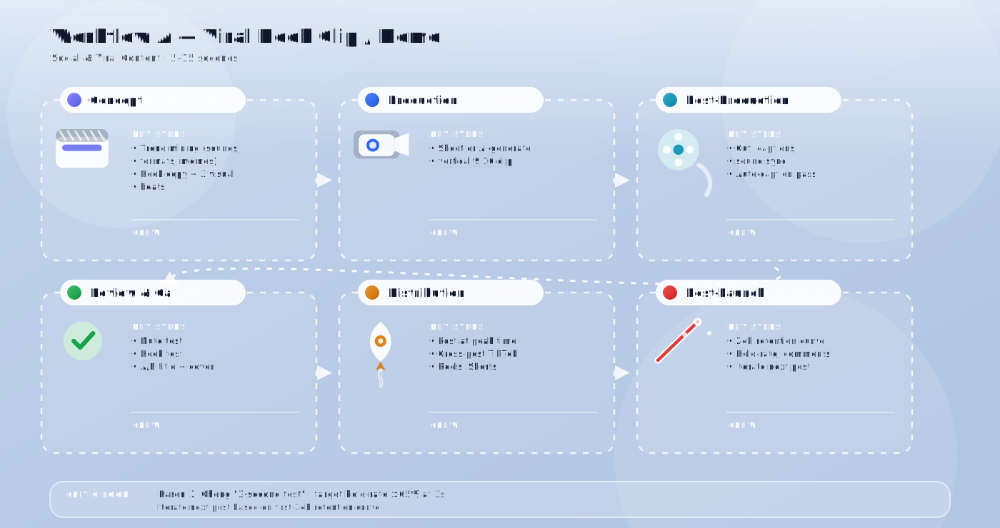
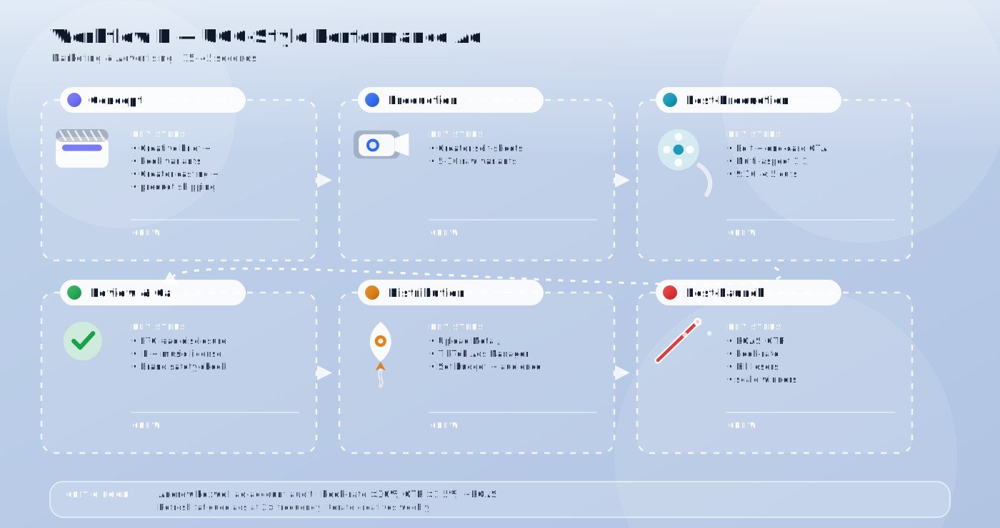
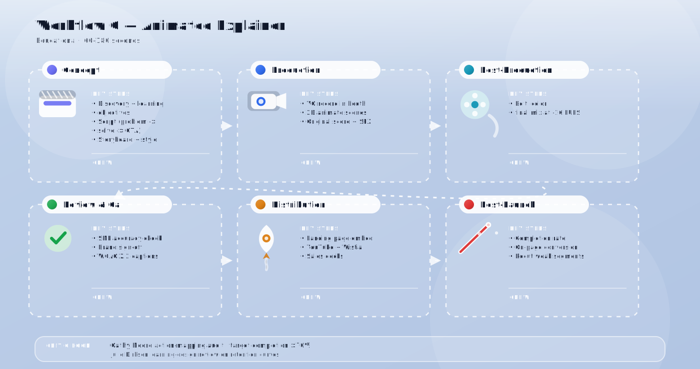
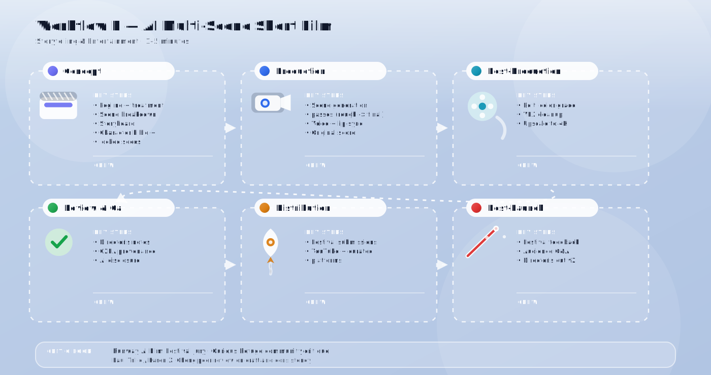
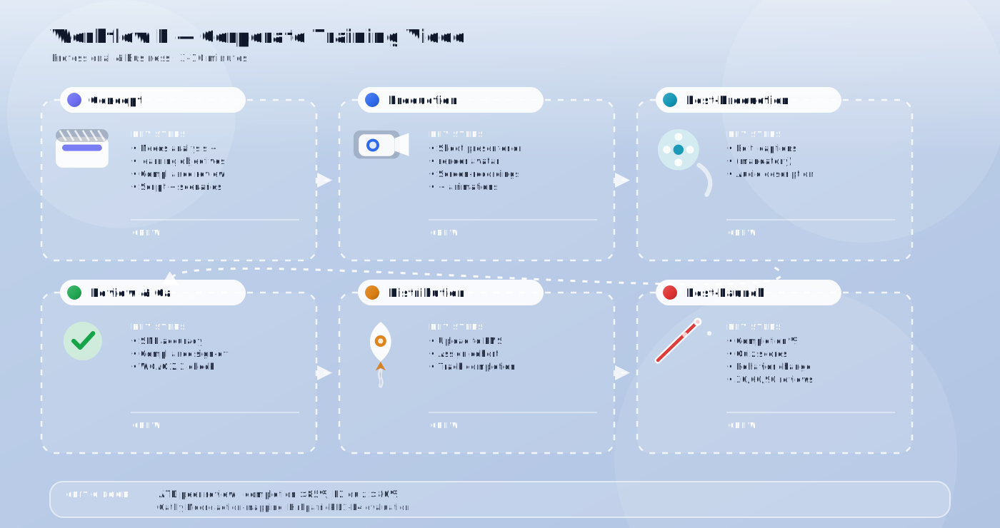
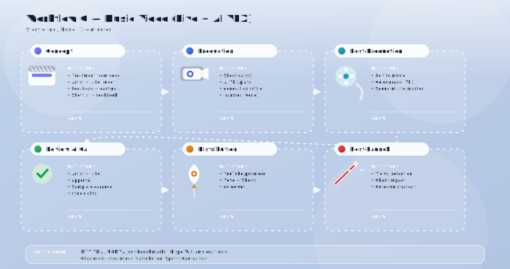
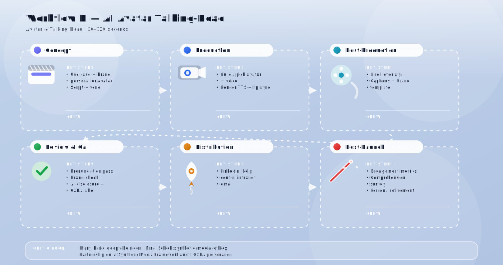
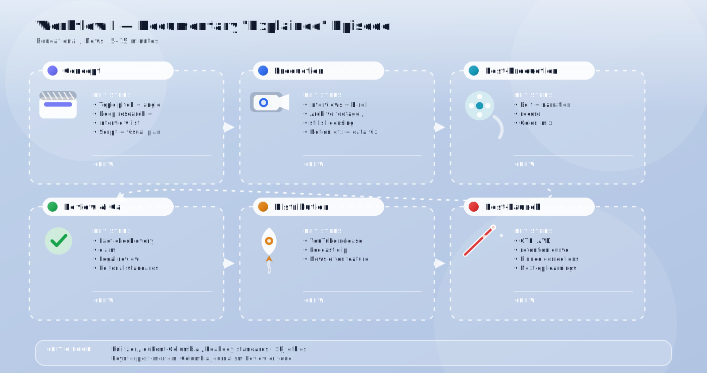
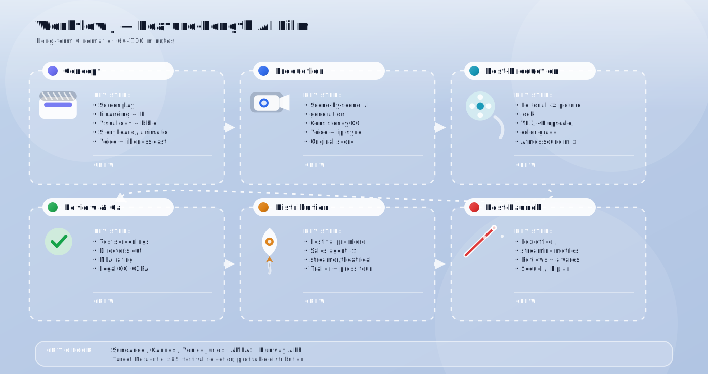

### 影片類型（按時長分類）

| 時長 | 影片類型（示例製作） | 最適合 | 難度 | 變現潛力 | 備註／建議 |
|-----------------------|--------------------------------------------------|-----------------------------------------------|---------------------|------------------------|-------------------------|
| **5 – 15 秒** | 誘餌短片、迷因影片及搞笑短劇、熱門音效／反應影片、快速過場、螢幕文字語錄、循環背景、美學氛圍循環、風格轉換短片、虛擬賀卡、輪播轉影片片段、動態藝術預告 | TikTok、Reels、YouTube Shorts | 非常容易 | 高 | 最容易生成。是你應用程式的最佳起步點。 |
| **15 – 30 秒** | 短劇、產品預告、美學氛圍影片、反應短片、歌詞片段、UGC 風格廣告、前後對比、電商旋轉產品展示、個人化生日短片、激勵影片、AI 虛擬人開場、超現實視覺、AI B-roll 素材 | 社交媒體、廣告、音樂短片 | 非常容易 | 高 | 目前最受歡迎的病毒式內容長度。 |
| **30 – 60 秒** | 簡短廣告、解說型誘餌、人物訪談開場、前後對比影片、迷你故事、產品示範、品牌故事微型廣告、AI 虛擬人推薦、概念預告片、音樂／歌詞影片、「我的一天」短片、常見問題片段、LinkedIn 貼文、動態資訊圖表、兒童故事影片 | Reels、Shorts、廣告活動 | 容易 | 高 | 營銷影片的最佳甜蜜點。 |
| **1 – 3 分鐘** | 解說影片、產品示範、迷你紀錄片、說故事短片、音樂影片、動畫解說、白板動畫、課程導言、簡報提案、會議摘要、房地產導覽、AI 主持人環節、新聞風格更新、語言學習短片、電影級微型電影、睡前故事 | YouTube、教育、營銷 | 中等 | 非常高 | 可一次生成或分段拼接。 |
| **3 – 10 分鐘** | 完整解說、短片、動畫故事、培訓影片、虛擬導覽、企業解說、科學／歷史模擬、多場景 AI 故事、睡前故事劇集、完整歌曲 MV、加長版預告、虛擬人課程、知識庫影片、風格轉換藝術 | YouTube、教育、企業培訓 | 中等 | 非常高 | 建議逐場景生成後拼接。 |
| **10 – 30 分鐘** | 長篇解說、短期課程、紀錄片、系列劇集、網絡研討會剪輯、動畫教育系列、培訓單元、電影級房地產展示、AI 新聞簡報、完整語言課程、多場景 AI 電影、深度提案 | YouTube、線上課程、企業 | 困難 | 高 | 需要強大的場景一致性及章節生成能力。 |
| **30 – 60 分鐘** | 短片、長篇故事、長篇教育內容、虛擬活動、紀錄片劇集、多章節課程、全體大會、動畫故事合集、電影級展示、長篇 AI 主持人節目 | YouTube 長內容、電影、教育 | 非常困難 | 高 | 分段生成。需要強大的剪輯工具。 |
| **1 – 2 小時** | 長片級影片、完整課程、長篇紀錄片、電影、多幕 AI 電影、培訓計劃、虛擬會議、動畫長片、工作室預覽 | YouTube 長內容、電影預覽、課程 | 極度困難 | 中至高 | 最適合分段生成 + 大量後期製作。 |

---

### 製作人員參考圖例

以下列出標準專業角色（按 IMDb 風格製作人員名單，並針對 AI 輔助工作流程進行調整）：

- **主創團隊**：導演、監製、節目總監、編劇／編劇、主要演員／人才
- **攝影及燈光**：攝影指導、攝影機操作員、燈光師、燈光助理、航拍機操作員
- **聲音**：音效設計師、吊桿咪操作員、現場收音師、擬音師、作曲家、配音員
- **美術及設計**：美術指導、藝術總監、場景佈置師、服裝設計師、化妝／髮型師、分鏡師、概念設計師
- **後期製作**：剪接師、調色師、視覺特效指導、動態圖形設計師、2D／3D 動畫師、合成師、音效剪接師、混音師
- **AI 時代專家**：提示工程師、AI 影片生成操作員、AI 語音／唇形同步專家、AI 虛擬人設計師、模型微調師、AI 品質保證／一致性審查員
- **發行及策略**：監製／執行監製、社交媒體策略師、文案撰稿人、SEO/ASO 專家、社群經理、本地化／字幕編輯、法律／版權審查、品牌／營銷經理

> 以下列出的人員為**專業交付所需的最低可行團隊規模**。在短片製作中，單人創作者通常可兼任多個角色；長片製作則需要專門的專家。

---

### 各類別示例製作

#### 1. 社交媒體及病毒式內容 *(目前需求最高)*

| # | 示例製作 | 常見時長 | 平台 | 所需人員／角色 |
|---|-------------------|------------------|----------|----------------------|
| 1 | 垂直短片 (9:16) | 15–60 秒 | TikTok、Reels、Shorts | 創作者／出鏡人才、手機操作員、剪接師、字幕／文案撰稿人、社交策略師 |
| 2 | 熱門音效／反應影片 | 7–30 秒 | TikTok、Reels | 出鏡創作者、剪接師、趨勢研究員、音樂版權審查員 |
| 3 | 迷因影片及搞笑短劇 | 5–30 秒 | TikTok、Reels、Shorts | 編劇／喜劇演員、演員、剪接師、音效設計師、迷因研究員 |
| 4 |「我的一天」風格短片 | 30–60 秒 | TikTok、Reels | 創作者／Vlogger、攝影師（第一人稱視角）、剪接師、音樂指導、字幕撰寫員 |
| 5 | 美學／氛圍影片（低保真、賽博朋克、自然、復古） | 10–60 秒 | Instagram、TikTok | 攝影指導或 AI 生成操作員、調色師、音樂策劃人、剪接師 |
| 6 | 誘餌影片（3 秒吸睛停止滑動） | 3–15 秒 | 所有短片平台 | 文案撰稿人／誘餌撰寫員、導演、剪接師、音效設計師、A/B 測試策略師 |
| 7 | 第一人稱視角短片 | 15–45 秒 | TikTok、Reels | 出鏡創作者、GoPro／手機操作員、剪接師、音效設計師 |
| 8 | 合拍／拼接反應範本 | 10–30 秒 | TikTok | 創作者、編劇、剪接師、趨勢分析師 |
| 9 | 挑戰影片（舞蹈、變身） | 15–30 秒 | TikTok、Reels | 人才／舞者、編舞師、攝影師、剪接師、音樂指導 |
| 10 | 敘事旁白疊加影片 | 30–60 秒 | TikTok、Reels | 說書人／旁白員、編劇、剪接師、B-roll 製片人、字幕員 |
| 11 | 綠幕解說反應影片 | 15–45 秒 | TikTok | 創作者、合成師／視覺特效師、剪接師、研究員 |
| 12 | GRWM（跟我一起準備）短片 | 30–60 秒 | TikTok、Reels | 創作者、化妝師／造型師、攝影師、剪接師、贊助品牌協調員 |
| 13 | 快速貼士／生活竅門影片 | 10–30 秒 | 所有短片平台 | 主題專家、編劇、示範者、剪接師、字幕員 |

#### 2. 營銷及廣告影片

| # | 示例製作 | 常見時長 | 最佳渠道 | 所需人員／角色 |
|---|-------------------|------------------|--------------|----------------------|
| 1 | 產品展示／示範影片 | 15–60 秒 | 社交廣告、電商 | 導演、攝影指導、產品造型師、剪接師、動態圖形設計師、文案撰稿人、品牌經理 |
| 2 | 品牌故事／解說廣告 | 30–90 秒 | YouTube、網頁 | 創意總監、編劇、導演、攝影指導、剪接師、作曲家、配音員 |
| 3 | UGC 風格廣告 | 15–45 秒 | TikTok、Meta 廣告 | UGC 創作者、簡報撰寫員、剪接師、成效廣告策略師、法律版權審查 |
| 4 | 前後對比變身影片 | 10–30 秒 | Reels、TikTok | 導演、攝影指導、人才、剪接師、調色師、合規審查員 |
| 5 | AI 虛擬人推薦影片 | 30–60 秒 | LinkedIn、著陸頁 | 編劇、AI 虛擬人設計師、語音克隆／配音員、唇形同步專家、剪接師 |
| 6 | 輪播轉影片廣告 | 10–20 秒 | Meta、LinkedIn | 設計師、動態設計師、文案撰稿人、剪接師、廣告策略師 |
| 7 | 電商產品影片 | 10–30 秒 | Shopify、Amazon | 產品攝影師、造型師、3D 美術師（旋轉展示）、剪接師、修圖師 |
| 8 | 季節性／節日廣告短片 | 15–60 秒 | 所有付費社交平台 | 創意總監、監製、導演、攝影指導、美術部、剪接師、作曲家、媒體採購員 |
| 9 | 再營銷 A/B 廣告變體 | 6–15 秒 | Meta、Google | 成效營銷師、文案撰稿人、剪接師、數據分析師 |
| 10 | 網紅風格產品開箱 | 30–60 秒 | TikTok、Reels | 網紅、品牌經理、剪接師、資訊披露／法律審查 |
| 11 | 對比／「與競爭對手比較」影片 | 30–60 秒 | YouTube、網頁 | 產品研究員、編劇、主持人、剪接師、法律審查員 |
| 12 | 應用程式安裝推廣影片 | 15–30 秒 | TikTok、Meta | UX 研究員、編劇、動態設計師、剪接師、ASO 專家 |
| 13 | 可購物影片廣告 | 15–30 秒 | TikTok Shop、Reels | 導演、人才、剪接師、電商整合專員、產品標籤專家 |
| 14 | YouTube 前置／中插廣告 | 6–30 秒 | YouTube | 創意總監、編劇、導演、剪接師、作曲家、媒體採購員 |
| 15 | 創辦人故事真實感影片 | 60–120 秒 | LinkedIn、網頁 | 訪談員、攝影指導、現場收音師、剪接師、調色師、品牌策略師 |

#### 3. 教育及解說影片

| # | 示例製作 | 常見時長 | 受眾 | 所需人員／角色 |
|---|-------------------|------------------|----------|----------------------|
| 1 | 動畫解說影片 | 60–180 秒 | 一般學習者 | 教學設計師、編劇、分鏡師、2D 動畫師、配音員、音效設計師、剪接師 |
| 2 | 白板風格動畫 | 60–180 秒 | B2B、培訓 | 編劇、插畫師、白板動畫師、配音員、剪接師 |
| 3 | 科學／歷史模擬影片 | 2–10 分鐘 | 學生、教育娛樂 | 主題專家、編劇、3D 美術師、模擬工程師、配音員、剪接師、事實核查員 |
| 4 | 課程導言及課堂摘要影片 | 30–90 秒 | 線上課程 | 教學設計師、主持人、剪接師、動態圖形設計師、LMS 專家 |
| 5 | 動態資訊圖表影片 | 30–60 秒 | B2B、營銷 | 數據分析師、資訊設計師、動態設計師、文案撰稿人、配音員 |
| 6 | 逐步教學示範 | 1–5 分鐘 | DIY、軟件 | 主題專家、編劇、螢幕錄製員、剪接師、字幕員 |
| 7 | 微學習課程 | 30–60 秒 | 企業學習與發展 | 教學設計師、主題專家、動態設計師、配音員、LMS 專家 |
| 8 | 問答／閃卡影片 | 15–60 秒 | 學生 | 課程設計師、動態設計師、配音員、剪接師 |
| 9 | 兒童教育動畫 | 1–5 分鐘 | 2–7 歲兒童 | 兒童教育專家、編劇、角色設計師、2D 動畫師、配音員、作曲家、安全審查員 |
| 10 | 語言學習詞彙影片 | 30–90 秒 | 語言學習者 | 語言學家、母語配音員、插畫師、動態設計師、剪接師 |
| 11 | 軟件／應用程式教學螢幕錄影 | 1–5 分鐘 | SaaS 用戶 | 產品專家、編劇、螢幕錄製員、配音員、剪接師 |
| 12 | 數據視覺化說故事 | 60–180 秒 | 分析師、高管 | 數據科學家、資訊設計師、動態設計師、配音員、剪接師 |
| 13 | 紀錄片風格「解說」影片 | 5–15 分鐘 | YouTube | 研究員、編劇、導演、剪接師、旁白員、作曲家、資料庫監製、事實核查員 |
| 14 | 破除迷思影片 | 30–60 秒 | 社交平台 | 研究員、編劇、主持人、剪接師、事實核查員 |

#### 4. 個人化及客製影片

| # | 示例製作 | 常見時長 | 場合 | 所需人員／角色 |
|---|-------------------|------------------|----------|----------------------|
| 1 | 生日／週年紀念影片 | 15–60 秒 | 個人活動 | 範本設計師、剪接師、個人化工程師、音樂策劃人 |
| 2 | 個人化激勵影片 | 10–30 秒 | 日常 | 文案撰稿人、配音員或 AI 語音操作員、剪接師、個人化工程師 |
| 3 | 客製兒童故事影片（名字 + 角色） | 2–5 分鐘 | 睡前、禮物 | 兒童作家、插畫師、動畫師、配音員、個人化工程師、兒童安全審查員 |
| 4 | 虛擬賀卡 | 10–30 秒 | 節日 | 設計師、動態設計師、文案撰稿人、音樂策劃人 |
| 5 |「名人」／角色 AI 訊息 | 15–45 秒 | 粉絲禮物 | 聲音授權方、AI 語音克隆師、唇形同步專家、剪接師、法律／權利審查員 |
| 6 | 婚禮邀請／預告卡 | 30–60 秒 | 婚禮 | 設計師、動態設計師、攝影師、剪接師、作曲家 |
| 7 | 個人化客戶感謝影片 | 15–30 秒 | 購買後 | CRM 專員、文案撰稿人、剪接師、個人化工程師 |
| 8 | 寵物生日／紀念影片 | 30–60 秒 | 寵物里程碑 | 剪接師、寵物照片策劃人、音樂策劃人、動態設計師 |
| 9 | 客製健身／教練激勵講話 | 30–90 秒 | 健身客戶 | 教練／培訓師、編劇、配音員、剪接師 |
| 10 | 個人化星座運程／預測影片 | 30–60 秒 | 日常內容 | 占星師／內容作家、配音員、動態設計師、個人化工程師 |
| 11 | 畢業致敬影片 | 60–120 秒 | 畢業 | 剪接師、照片策劃人、音樂策劃人、動態設計師 |
| 12 | 客製求婚／情書影片 | 30–90 秒 | 浪漫 | 編劇、剪接師、音樂策劃人、動態設計師 |
| 13 | 嬰兒公告影片 | 15–45 秒 | 新手父母 | 設計師、動態設計師、剪接師、音樂策劃人 |
| 14 | 個人化道歉／和好影片 | 15–30 秒 | 個人 | 文案撰稿人、剪接師、音樂策劃人 |

#### 5. 敘事及娛樂

| # | 示例製作 | 常見時長 | 風格 | 所需人員／角色 |
|---|-------------------|------------------|-------|----------------------|
| 1 | 電影級短片／微型電影 | 15–60 秒 | 電影級 | 導演、編劇、攝影指導、美術指導、演員、剪接師、調色師、作曲家、音效設計師 |
| 2 | AI 生成多場景短篇故事 | 1–5 分鐘 | 敘事 | 故事作者、分鏡師、AI 生成操作員、一致性審查員、剪接師、作曲家、配音員 |
| 3 | 動畫睡前故事 | 3–10 分鐘 | 兒童 | 作者、插畫師、動畫師、旁白員、作曲家、兒童安全審查員、剪接師 |
| 4 | 音樂影片及歌詞影片 | 1–4 分鐘 | 音樂 | 導演、攝影指導、編舞師、剪接師、調色師、視覺特效師、字型／歌詞設計師 |
| 5 | 概念預告片（電影風格） | 30–90 秒 | 電影級 | 導演、剪接師、作曲家、預告片音效設計師、配音員、調色師、動態圖形設計師 |
| 6 | 同人小說視覺化 | 1–5 分鐘 | 粉絲內容 | 作者／同人作者、分鏡師、AI 生成操作員、剪接師、作曲家、知識產權／法律審查員 |
| 7 | 神話／民間傳說重述 | 2–10 分鐘 | 文化 | 文化顧問、編劇、插畫師、動畫師、旁白員、作曲家、剪接師 |
| 8 | 選集系列劇集 | 5–15 分鐘 | 系列 | 節目總監、編劇室、導演、攝影指導、演員、剪接師、調色師、作曲家、視覺特效師、混音師 |
| 9 | 動態漫畫影片 | 30–90 秒 | 動態漫畫 | 漫畫家、文字排版師、動態設計師、配音演員、音效設計師、剪接師 |
| 10 | 互動式選擇導向短片 | 1–3 分鐘 | 互動 | 分支敘事編劇、遊戲設計師、導演、剪接師、開發者（互動層）、作曲家 |
| 11 | 恐怖／懸疑超短片 | 30–90 秒 | 類型片 | 導演、攝影指導、特效化妝師、音效設計師、作曲家、剪接師、演員 |
| 12 | 科幻世界構建短片 | 30–120 秒 | 類型片 | 概念設計師、美術指導、視覺特效指導、導演、作曲家、剪接師 |
| 13 | 惡搞／戲仿預告片 | 60–120 秒 | 喜劇 | 喜劇編劇、導演、剪接師、配音員、作曲家、演員 |
| 14 | 動畫詩歌／口語藝術視覺 | 60–180 秒 | 藝術 | 詩人、旁白員、插畫師／動態藝術家、作曲家、剪接師 |

#### 6. 專業及商業用途

| # | 示例製作 | 常見時長 | 用途 | 所需人員／角色 |
|---|-------------------|------------------|----------|----------------------|
| 1 | 企業解說影片 | 60–120 秒 | 網頁、銷售 | 品牌策略師、編劇、分鏡師、動態設計師、配音員、剪接師 |
| 2 | 房地產虛擬導覽 | 1–5 分鐘 | 樓盤展示 | 房地產攝影師、3D 掃描操作員（Matterport）、航拍機操作員、剪接師、調色師 |
| 3 | 培訓及入職影片 | 2–10 分鐘 | 人力資源、學習與發展 | 教學設計師、主題專家、編劇、主持人／虛擬人、剪接師、LMS 專家 |
| 4 | 會議摘要／回顧影片 | 1–3 分鐘 | 內部通訊 | 記錄員／AI 轉錄員、剪接師、動態設計師、文案撰稿人 |
| 5 | LinkedIn 思想領袖影片 | 30–90 秒 | 個人品牌 | 代筆作家、個人品牌教練、攝影師、剪接師、字幕員 |
| 6 | 提案簡報影片 | 2–5 分鐘 | 募資 | 創辦人／主持人、提案教練、設計師、動態圖形設計師、剪接師、配音員 |
| 7 | 投資者更新影片 | 2–5 分鐘 | 季度 | 財務總監／投資者關係主管、編劇、設計師、剪接師、合規審查員 |
| 8 | 年報／業績摘要影片 | 1–3 分鐘 | 投資者關係／股東 | 投資者關係經理、數據設計師、動態設計師、配音員、法律審查員 |
| 9 | 人力資源政策及合規培訓 | 3–10 分鐘 | 強制培訓 | 合規主任、法律審查員、教學設計師、主持人、剪接師、無障礙專家 |
| 10 | 銷售支援示範 | 2–5 分鐘 | 銷售團隊 | 產品營銷師、主題專家、螢幕錄製員、剪接師、配音員 |
| 11 | 內部 CEO 公告影片 | 1–3 分鐘 | 全體大會 | CEO／人才、演講撰稿人、提詞器操作員、攝影指導、剪接師、通訊經理 |
| 12 | 會議／活動回顧精華 | 60–120 秒 | 營銷 | 活動攝錄師、剪接師、音樂策劃人、文案撰稿人 |
| 13 | 案例研究影片 | 90–180 秒 | 銷售、營銷 | 客戶故事監製、訪談員、攝影指導、剪接師、調色師、文案撰稿人 |
| 14 | 招聘／僱主品牌影片 | 60–120 秒 | 招聘 | 僱主品牌主管、導演、攝影指導、剪接師、作曲家、演員（員工） |
| 15 | 季度全體大會回顧影片 | 2–5 分鐘 | 內部 | 內部通訊主管、剪接師、動態設計師、字幕員 |

#### 7. 創意及藝術影片

| # | 示例製作 | 常見時長 | 風格 | 所需人員／角色 |
|---|-------------------|------------------|-------|----------------------|
| 1 | 抽象／動態藝術影片 | 10–60 秒 | 生成式 | 生成藝術家、音效設計師、剪接師 |
| 2 | 夢境／超現實影片 | 15–60 秒 | 超現實主義 | 概念設計師、AI 生成操作員、剪接師、作曲家 |
| 3 | 循環背景影片 | 5–15 秒循環 | 氛圍 | 動態設計師、循環／無縫剪接師、調色師 |
| 4 | AI 生成 B-roll 素材 | 5–30 秒 | 庫存風格 | 提示工程師、AI 生成操作員、調色師、庫存庫策劃人 |
| 5 | 風格轉換影片 | 10–60 秒 | 風格化 | AI 風格轉換操作員、調色師、剪接師 |
| 6 | 生成式視覺化（與音樂同步） | 30–180 秒 | 音樂反應 | 生成藝術家、音頻工程師、動態設計師 |
| 7 | 萬花筒／分形動畫 | 15–60 秒 | 幾何 | 生成藝術家、音效設計師 |
| 8 | 故障藝術／VHS 美學影片 | 10–30 秒 | 復古 | 故障藝術家、剪接師、音效設計師 |
| 9 | AI 生成時裝型錄 | 30–90 秒 | 時尚 | 時尚造型師、AI 圖像／影片操作員、剪接師、音樂策劃人 |
| 10 | 建築概念飛行導覽 | 30–120 秒 | 建築可視化 | 建築師、3D 建模師、燈光美術師、作曲家、剪接師 |
| 11 | 自然縮時風格生成 | 15–60 秒 | 電影級 | 攝影指導／AI 生成操作員、調色師、音效設計師、作曲家 |
| 12 | 粒子／流體模擬藝術 | 10–30 秒 | 生成式 | Houdini／模擬美術師、合成師、音效設計師 |
| 13 | AI 生成專輯封面動畫 | 5–15 秒循環 | 音樂品牌 | 封面設計師、動態設計師、AI 生成操作員 |
| 14 | 情緒板／願景板影片 | 30–60 秒 | 個人／品牌 | 創意總監、剪接師、音樂策劃人 |

#### 8. 虛擬人及人物訪談影片 *(非常受歡迎)*

| # | 示例製作 | 常見時長 | 用途 | 所需人員／角色 |
|---|-------------------|------------------|----------|----------------------|
| 1 | AI 主持人／虛擬網紅 | 30–60 秒 | 社交、品牌 | 角色設計師、AI 虛擬人工程師、編劇、語音設計師、社交策略師 |
| 2 | 會說話的虛擬人影片（附唇形同步） | 30–120 秒 | 任何旁白 | 編劇、配音員或語音克隆師、唇形同步專家、虛擬人設計師、剪接師 |
| 3 | 客戶支援／常見問題影片 | 30–90 秒 | 說明中心 | 支援主管、知識庫撰稿人、虛擬人設計師、配音員、剪接師 |
| 4 | 新聞主播風格影片 | 60–180 秒 | 新聞、簡報 | 新聞撰稿人、剪接師／事實核查員、虛擬人設計師、配音員、唇形同步專家、廣播監製 |
| 5 | 語言學習對話影片 | 60–180 秒 | 教育科技 | 語言學家、母語配音員、虛擬人設計師、課程設計師、剪接師 |
| 6 | Podcast 影片版（虛擬人主持） | 10–60 分鐘 | Podcast | 主持人、監製、虛擬人設計師、音頻工程師、剪接師、字幕員 |
| 7 | 多語言配音主持人影片 | 30–180 秒 | 全球營銷 | 翻譯員、母語配音員／語音克隆師、唇形同步專家、本地化品質保證 |
| 8 | 虛擬導師／一對一教練影片 | 2–10 分鐘 | 教育科技、教練 | 學科導師、課程設計師、虛擬人設計師、配音／對話式 AI 工程師 |
| 9 | 手語翻譯虛擬人 | 可變 | 無障礙 | 認證手語翻譯員、動作捕捉專家、虛擬人動畫師、無障礙品質保證 |
| 10 | 歷史人物／角色訪談 | 60–180 秒 | 教育娛樂 | 歷史學家、編劇、虛擬人設計師、配音演員、剪接師、事實核查員 |
| 11 | 內部企業發言人影片 | 60–180 秒 | 內部通訊 | 通訊主管、編劇、虛擬人設計師、配音員、剪接師 |
| 12 | 有聲書旁白附視覺虛擬人 | 10–60 分鐘 | 有聲書 | 作者、旁白員／配音演員、虛擬人設計師、音頻工程師、剪接師 |
| 13 | 虛擬接待員／資訊站影片 | 15–60 秒循環 | 零售、大堂 | UX 設計師、虛擬人設計師、配音員、整合開發者 |
| 14 | AI 主持天氣／體育更新 | 30–90 秒 | 本地新聞 | 數據饋送工程師、體育／天氣撰稿人、虛擬人設計師、配音員、廣播品質保證 |

---

### 9. 新興及利基類別 *(值得探索)*

| # | 利基 | 示例製作 | 所需人員／角色 |
|---|-------|--------------------|----------------------|
| 1 | 遊戲內容 | AI 過場動畫、遊戲預告片、NPC 對話場景、速通精華 | 遊戲設計師、概念設計師、3D 動畫師、配音演員、音效設計師、作曲家、預告片剪接師 |
| 2 | 健身及健康 | 指導鍛煉、瑜伽流程、冥想視覺 | 認證教練／瑜伽導師、編劇、攝影指導、剪接師、作曲家、配音員 |
| 3 | 食物及食譜 | 食譜示範、食物動態照片、餐廳推廣 | 廚師／食物造型師、食物攝影師、攝影指導、剪接師、食譜撰稿人、調色師 |
| 4 | 旅遊及觀光 | 目的地展示、虛擬旅行日記、酒店推廣 | 旅遊監製、航拍機操作員、攝影指導、剪接師、調色師、作曲家、當地協調員 |
| 5 | 時尚及美容 | 虛擬試穿影片、型錄精華、化妝教學 | 時尚造型師、化妝師、模特兒、攝影師／攝影指導、剪接師、修圖師、AR／試穿工程師 |
| 6 | 新聞及傳媒 | AI 新聞簡報、數據驅動故事、解說新聞 | 記者、總編輯、事實核查員、數據記者、動態設計師、配音／主播、法律審查員 |
| 7 | 宗教／靈性 | 靈修影片、經文動畫、祈禱短片 | 神學審查員、編劇、旁白員、動畫師、作曲家、剪接師 |
| 8 | 體育 | 精華片段、戰術分解動畫、夢幻體育回顧 | 體育分析師、剪接師、動態圖形設計師（戰術標註）、評論員／配音、統計員 |
| 9 | 加密貨幣／金融 | 市場回顧、代幣解說、交易教學 | 金融分析師、合規審查員、編劇、動態設計師、配音員、法律審查員 |
| 10 | 醫療保健 | 病人教育、症狀解說、手術動畫 | 醫生／主題專家、醫學插畫師、編劇、3D 動畫師、合規／HIPAA 審查員、配音員 |
| 11 | 法律 | 通俗法律解說、接收影片、合規培訓 | 律師、法律撰稿人、合規主任、動態設計師、配音員、字幕員 |
| 12 | 非牟利／倡導 | 籌款故事、意識短片、捐助者感謝影片 | 故事監製、導演、攝影指導、剪接師、作曲家、籌款策略師、被攝者同意審查員 |
| 13 | 汽車 | 汽車展示、經銷商庫存、試駕第一人稱 | 汽車攝影師、航拍機操作員、攝影師、剪接師、調色師、文案撰稿人 |
| 14 | 寵物及動物 | 寵物護理教學、品種介紹、收容所領養精華 | 獸醫／動物行為學家、動物管理員、攝影師、剪接師、旁白員 |

---

### 團隊規模指南 *(你實際需要多少人)*

| 製作級別 | 示例 | 常見團隊規模 | AI 增強團隊規模 |
|-----------------|---------|-------------------|------------------------|
| **單人創作者短片** | TikTok 迷因、激勵短片 | 1 人（創作者） | 1 人 + AI 工具 |
| **小型團隊社交** | UGC 廣告、品牌 Reel | 2–4 人（創作者、剪接師、策略師） | 1–2 人 + AI |
| **獨立解說／型錄** | 動畫解說、時尚型錄 | 3–6 人（編劇、設計師、動畫師、配音、剪接師） | 1–3 人 + AI |
| **專業商業廣告** | 品牌電視廣告、產品發布 | 15–40 人（完整廣告公司 + 製作團隊） | 5–10 人 + AI |
| **短片／音樂影片** | 日舞風格短片、音樂影片 | 20–60 人 | 8–15 人 + AI |
| **紀錄片／系列劇集** | Netflix 風格解說劇集 | 30–80 人 | 12–25 人 + AI |
| **長片／長篇紀錄片** | IMDb 認證長片 | 150–500+ 人（按 IMDb 完整團隊名單） | 50–150 人 + AI |

> **參考**：獲獎電影（如《奧本海默》、《奇異女俠玩救宇宙》、《沙丘》）的 IMDb 完整製作人員頁面通常列出 1,500–3,000+ 位具名團隊成員。以上各行列出的為以專業質素交付各類製作所需的**最低具名專家數量**——AI 工具可將多個角色（例如攝影指導 + 調色師 + 視覺特效師）整合為操作員 + 審查員配對，但創意、法律及主題專業角色仍需由人類擔任。

---

### 主要製作人員參考表

以下綜合了上述所有類別中的各個獨立角色。每一行列明該角色的職責、所需技能及經驗、通常參與的製作類型，以及**現實世界的專家／方法**——他們的回饋能有效改善作品質素。

| # | 角色 | 核心職責 | 所需專業質素 | 常見專業經驗 | 相關製作類型 | 評審／導師（真實人物及方法） |
|---|------|---------------------|-------------------------------|---------------------------------|--------------------------|-------------------------------------------|
| 1 | **導演** | 掌握創意願景；指導人才、攝影及節奏 | 視覺敘事、領導力、決斷力、品味 | 電影學院 + 長片前 5–15 年助理／短片／廣告經驗 | 電影、音樂影片、廣告、系列、預告片 | Martin Scorsese、Christopher Nolan、Greta Gerwig、Denis Villeneuve；方法：DGA 同行放映、日舞導演實驗室、《電影筆記》評論 |
| 2 | **監製／執行監製** | 預算、排程、招聘、交付 | 項目管理、談判、財務知識 | 監製助理 → 線製片 → 監製（10+ 年）；MBA 或 PGA 培訓常見 | 所有格式 | Kathleen Kennedy、Kevin Feige、Jason Blum；方法：PGA 監製標章審查、片廠綠燈委員會 |
| 3 | **編劇／編劇** | 撰寫劇本、對白、結構 | 故事結構、對白、類型流暢度、改寫韌性 | MFA 或 3–10 年編劇室經驗；WGA 會員 | 電影、廣告、解說、系列、預告片 | Aaron Sorkin、Charlie Kaufman、Phoebe Waller-Bridge；方法：Robert McKee《故事》研討會、John Truby《故事解剖》、Black List 劇本審查 |
| 4 | **節目總監** | 系列的創意及營運主管 | 編劇 + 監製 + 人員管理 | 編劇室 10+ 年，曾任職員編劇／聯合執行監製 | 選集系列、劇集內容 | Vince Gilligan、Shonda Rhimes、Mike Schur；方法：WGA 節目總監培訓、電視台意見流程 |
| 5 | **攝影指導** | 燈光、攝影機、鏡頭、視覺風格 | 燈光科學、攝影機技術、構圖、色彩理論 | 攝影助理 → 操作員 → 攝影指導（8–15 年）；ASC 會員 | 電影、廣告、音樂影片、房地產、時尚 | Roger Deakins、Emmanuel Lubezki、Rachel Morrison；方法：《ASC 雜誌》評論、ASC 大師班點評 |
| 6 | **攝影機操作員** | 按攝影指導指示操作攝影機 | 穩定構圖、對焦、追蹤動作 | 第二攝影助理 → 第一攝影助理 → 操作員（5–10 年）；SOC 會員 | 所有實拍格式 | SOC（攝影機操作員協會）同行、Steadicam 工作坊導師（Garrett Brown 體系） |
| 7 | **航拍機操作員** | 空中攝影 | FAA Part 107（或當地同等資格）、飛行精準度、空間意識 | 100+ 飛行時數、商業執照、保險 | 房地產、旅遊、汽車、音樂影片 | Philip Bloom、Dirk Dallas (@fromwhereidrone)；方法：SkyPixel 比賽評審團、FAA 安全審核 |
| 8 | **剪接師** | 組合素材、控制節奏和韻律 | 節奏感、故事感、軟件精通（Avid/Premiere/Resolve） | 助理剪接 3–7 年；頂級須 ACE 會員 | 所有格式 | Walter Murch（《剪接的眨眼》）、Thelma Schoonmaker、Joe Walker；方法：ACE Eddie 獎同行評審、Murch「六法則」 |
| 9 | **調色師** | 最終色彩調校、風格一致性 | 色彩理論、DaVinci Resolve／Baselight 精通、校準眼光 | 後期公司助理調色師 3–5 年 | 電影、廣告、音樂影片、時尚 | Stefan Sonnenfeld（Company 3）、Dado Valentic；方法：ICA（國際調色師學院）同行評審、HPA 獎 |
| 10 | **視覺特效指導** | 設計及監督視覺效果 | 合成、3D 流程、現場方法論 | 技術指導／合成師 → 視覺特效指導（10+ 年）；VES 會員 | 電影、預告片、科幻、遊戲 | Joe Letteri（Weta）、Paul Franklin（DNEG）；方法：VES 獎評審、SIGGRAPH 論文審查 |
| 11 | **2D／3D 動畫師** | 為角色、物件、動態製作動畫 | 時間掌握、重量感、擠壓與拉伸、綁定流暢度 | 動畫學位 + 3–8 年工作室經驗 | 睡前故事、兒童教育、動態漫畫、遊戲、解說 | Glen Keane、Pete Docter、Aaron Blaise；方法：ASIFA-Hollywood Annie 獎、動畫每日審查／「精選鏡頭」 |
| 12 | **動態圖形設計師** | 動畫字型、資訊圖表、字幕條 | After Effects 精通、設計基礎、動態字型 | 設計工作室 3–7 年 | 解說、廣告、歌詞影片、新聞、預告片 | Erin Sarofsky、Kyle Cooper（Prologue）、Karin Fong；方法：Motionographer 評論、AICP Next 獎 |
| 13 | **分鏡師** | 將劇本轉化為鏡頭畫板 | 繪畫速度、鏡頭語言、場面調度 | 插畫背景 + 3–5 年動畫／電影經驗 | 電影、動畫、廣告、AI 多場景故事 | Sylvain Despretz、Marcos Mateu-Mestre（《Framed Ink》）；方法：導演逐鏡審查、Pixar 故事信託 |
| 14 | **概念設計師** | 在製作前設計世界觀、角色、道具 | 繪畫、設計語言、世界構建 | 藝術學院 + 3–8 年工作室／遊戲公司 | 科幻、奇幻、遊戲、建築可視化、預告片 | Iain McCaig、Ryan Church、Karla Ortiz；方法：ArtStation 同行點評、工作室藝術總監審查 |
| 15 | **美術指導** | 設計場景、地點、整體視覺世界 | 建築、時代研究、藝術指導、預算 | 藝術總監 5–10 年 → 美術指導 | 電影、廣告、音樂影片、系列 | Hannah Beachler、Rick Carter、Sarah Greenwood；方法：ADG（美術指導工會）獎、AMPAS 美術指導同行評審 |
| 16 | **服裝設計師** | 設計及採購服裝 | 時尚歷史、布料、透過服裝塑造角色 | 時尚或戲劇學位 + 5–10 年 | 電影、音樂影片、時尚、系列 | Ruth E. Carter、Jacqueline Durran、Sandy Powell；方法：CDG（服裝設計師工會）獎 |
| 17 | **化妝／髮型／特效化妝師** | 人才化妝；類型片特效化妝 | 皮膚／髮型技藝、雕塑、現場速度 | 美容學校或學徒制 + 5–10 年 | 電影、恐怖片、時尚、廣告 | Kazu Hiro、Vivian Baker；方法：化妝師及髮型師工會獎 |
| 18 | **音效設計師** | 構建聲音世界、效果、氛圍 | 錄音、擬音、DAW 精通、心理聲學 | 聲音公司學徒 3–8 年 | 電影、預告片、恐怖片、廣告、遊戲 | Ben Burtt（星球大戰）、Skip Lievsay（Coens）、Randy Thom；方法：MPSE 金膠捲獎、AES 同行評審 |
| 19 | **作曲家** | 原創音樂配樂 | 音樂理論、編曲、DAW + 現場錄音、戲劇直覺 | 音樂學院 + 5–15 年編曲／助理經驗 | 電影、預告片、廣告、遊戲、紀錄片 | Hans Zimmer、Hildur Guðnadóttir、Ludwig Göransson；方法：《電影配樂月刊》評論、ASCAP/BMI 電影音樂獎 |
| 20 | **配音員** | 旁白、角色聲音、廣告配音 | 聲線範圍、咪高風技巧、稿件演繹 | 聲音教練 + 3–10 年試鏡；SAG-AFTRA | 廣告、解說、有聲書、虛擬人、動畫 | Tara Strong、Nancy Cartwright、Don LaFontaine（傳奇）；方法：SOVAS 聲音藝術獎、教練審查（Nancy Wolfson、Marc Cashman） |
| 21 | **混音師／重錄混音師** | 現場收音；最終混音 | 吊桿咪操作、場地聲學、影院／串流混音 | 吊桿操作員 → 現場混音師／重錄混音（8–15 年） | 電影、紀錄片、廣告、Podcast | CAS（電影音頻協會）同行；方法：CAS 獎、MPSE 金膠捲獎 |
| 22 | **編舞師** | 設計動作／舞蹈 | 舞蹈訓練、音樂感、鏡頭意識的場面調度 | 專業舞者 10+ 年 → 編舞師 | 音樂影片、舞蹈挑戰、廣告 | Parris Goebel、Mandy Moore、Ryan Heffington；方法：艾美獎編舞同行評審團、MTV VMA 審查 |
| 23 | **音樂影片導演** | 為歌曲設計視覺概念 | 剪接節奏、型錄、藝術家協作 | 樣片 + 商業作品 | 音樂影片、歌詞影片、概念預告片 | Hype Williams、Spike Jonze、Dave Meyers、Melina Matsoukas；方法：MTV VMA 評審團、UKMVA 獎 |
| 24 | **選角導演** | 尋找及試鏡人才 | 人際觸覺、人脈、角色與劇本匹配 | 選角助理 3–7 年；CSA 會員 | 電影、廣告、系列、虛擬人（聲優選角） | Avy Kaufman、Francine Maisler；方法：Artios 獎（CSA） |
| 25 | **喜劇編劇／表演者** | 短劇、惡搞、迷因寫作 | 笑話結構、節奏、即興 | UCB/Second City + 編劇室配置 | 短劇、迷因、惡搞預告片、病毒內容 | Tina Fey、Mike Schur、Lorne Michaels；方法：SNL 讀稿會、UCB/Groundlings 點評之夜 |
| 26 | **喜劇演員／出鏡人才** | 表演短劇及反應 | 魅力、節奏、觀眾洞察 | 棟篤笑演出、社交追蹤 | 短劇、反應、GRWM、我的一天 | 開放咪高峰同行觀眾、喜劇節預訂員（Just for Laughs） |
| 27 | **UGC 創作者** | 以創作者聲音製作真實感廣告 | 出鏡自然度、誘餌撰寫、基本燈光／音頻 | TikTok/Reels 6–24 個月，具可衡量 ROAS | UGC 廣告、開箱、推薦 | Alix Earle（基準）、品牌成效團隊；方法：Meta/TikTok 創意報告、ROAS／停留率分析 |
| 28 | **社交媒體策略師** | 平台原生發行、趨勢時機 | 分析、趨勢預測、平台機制 | 廣告公司或內部社交 3–7 年 | 所有短片社交 | Gary Vaynerchuk、Rachel Karten（《Link in Bio》）；方法：TikTok Creator Portal 數據、Tubular/Sensor Tower 基準 |
| 29 | **文案撰稿人** | 稿件、字幕、誘餌、標題 | 簡潔、語調、說服力 | 廣告公司文案 3–8 年；作品集學校（Miami Ad School、VCU Brandcenter） | 廣告、社交貼文、誘餌、創辦人故事 | David Ogilvy（《Ogilvy on Advertising》）、Joanna Wiebe（Copyhackers）；方法：D&AD Pencils、One Show |
| 30 | **創意總監（廣告公司）** | 廣告活動的整體創意概念 | 跨學科品味、客戶管理 | 高級文案／美術 + 8–15 年 | 品牌廣告、廣告活動、預告片 | Lee Clow（傳奇）、David Droga；方法：康城創意獎評審團、D&AD 審查 |
| 31 | **成效營銷師** | 優化廣告以達 ROAS | 廣告平台精通、A/B 測試、歸因 | 付費媒體 3–7 年 | 再營銷、應用程式安裝、電商廣告 | Neil Patel、Mari Smith、Andrew Foxwell；方法：Meta Marketing Science、MMM（媒體組合模型）審查 |
| 32 | **教學設計師** | 學習目標 → 稿件 → 評估 | ADDIE／SAM 模型、Bloom 分類法、學習體驗設計 | 教育學位 + 3–7 年學習與發展經驗 | 課程、微學習、合規培訓 | Cathy Moore（《Action Mapping》）、Julie Dirksen（《Design for How People Learn》）；方法：ADDIE 同行評審、Kirkpatrick 評估 |
| 33 | **主題專家** | 提供領域準確性 | 深厚領域資歷 | 博士／10+ 年從業者 | 教育、科學紀錄片、醫療保健、法律、金融 | 其領域同行評審期刊編輯；方法：雙盲同行評審、專家小組 |
| 34 | **事實核查員／研究員** | 核實每一項陳述 | 來源嚴謹性、一手研究、懷疑精神 | 新聞學位 + 新聞編輯室培訓 | 紀錄片、新聞、「解說」影片、教育 | Peter Canby（《紐約客》事實核查傳統）、Snopes、PolitiFact；方法：SPJ 道德守則、IFCN 驗證 |
| 35 | **醫學插畫師** | 解剖及手術視覺 | 解剖精通、認證（CMI） | 醫學插畫碩士（Johns Hopkins、GSU）+ AMI 認證 | 醫療保健、病人教育、手術動畫 | Frank H. Netter（傳奇基準）；方法：AMI（醫學插畫師協會）同行評審、CMI 認證審核 |
| 36 | **記者／新聞監製** | 報導及倫理框架 | 採訪、倫理、時限寫作 | 新聞學院 + 3–10 年新聞編輯室 | 新聞簡報、解說新聞 | 普立茲獎評審、SPJ 倫理委員會；方法：Poynter 審查、《哥倫比亞新聞評論》點評 |
| 37 | **合規／法律審查員** | 確保監管及版權合規 | 熟悉 FTC、HIPAA、GDPR、知識產權法 | JD + 律師資格；5+ 年媒體／廣告 | 製藥、金融、兒童、AI 肖像、UGC | 律師公會 CLE 同行；方法：FTC 背書指南審查、IAB 法律顧問審查 |
| 38 | **金融分析師（影片用）** | 準確市場／代幣／盈利事實 | CFA 特許資格、SEC/Reg-BI 知識 | CFA + 3–10 年投行或研究部 | 加密貨幣、金融、投資者關係／盈利影片 | CFA 協會同行評審；方法：SEC 營銷規則審查、Bloomberg Intelligence 審核 |
| 39 | **食物造型師／廚師** | 鏡頭前食物美感、食譜真實性 | 烹飪訓練、擺盤、鏡頭前速度 | 烹飪學校 + 5+ 年編輯／電影 | 食譜影片、餐廳推廣、動態照片 | Susan Spungen、Judy Kim；方法：James Beard 媒體獎、IACP 獎 |
| 40 | **旅遊／冒險攝影指導** | 以電影感捕捉目的地 | 機動拍攝、航拍、當地物流 | 5+ 年旅遊／紀錄片作品 | 旅行日記、目的地推廣 | Brandon Li、Chris Burkard；方法：Travel + Leisure 同行獎、X-Dance／Banff 電影節 |
| 41 | **兒童作家／兒童教育專家** | 適齡故事及安全 | 兒童發展、讀寫能力、溫和節奏 | 幼兒教育學位 + 出版作品 | 兒童教育、客製兒童故事、睡前故事 | Mo Willems、Julia Donaldson；方法：Common Sense Media 審查、ALA Caldecott／Geisel 委員會 |
| 42 | **有聲書旁白員** | 數小時持續角色演繹及旁白 | 聲音耐力、角色區分、呼吸控制 | 舞台／配音 5–15 年；SAG-AFTRA | 有聲書、虛擬人旁白 | Jim Dale、Bahni Turpin；方法：Audie 獎（APA）、AudioFile《Earphones》評論 |
| 43 | **手語翻譯員** | 準確 ASL/BSL 翻譯 | 認證（RID NIC／NAD）、文化流暢度 | 翻譯培訓 + 5+ 年認證工作 | 無障礙虛擬人、新聞、教育 | NAD（全國聾人協會）審查員；方法：RID CPC 倫理審查、聾人社群小組回饋 |
| 44 | **語言學家／本地化品質保證** | 翻譯準確性 + 文化契合 | 母語級雙語、創譯技巧 | 語言學位 + 3+ 年本地化 | 多語言廣告、語言學習、配音 | LocWorld 同行、ATA（美國翻譯協會）認證；方法：LISA QA 模型、MQM 錯誤分類法 |
| 45 | **房地產攝影師／3D 掃描操作員** | 廣角室內、Matterport 掃描 | HDR 包圍曝光、垂直線紀律、Matterport 工作流程 | 2–5 年房地產或建築 | 樓盤展示、虛擬導覽 | Mike Kelley（建築攝影）；方法：AIAP／APALA 同行評審 |
| 46 | **AI 提示工程師／生成操作員** | 撰寫提示及引導生成式影片模型 | 模型知識、迭代提示、品味、種子／控制工具 | 1–3 年 Sora/Veo/Runway/Kling 實操 + 視覺背景 | 所有 AI 生成格式 | Karen X. Cheng、Paul Trillo、Don Allen Stevenson III、Nik Kleverov；方法：AI 電影節（Runway）評審團、r/aivideo 社群點評 |
| 47 | **AI 虛擬人設計師** | 設計合成主持人的視覺身份 | 角色設計、綁定、品牌一致性、身份倫理 | 角色美術 + 2–5 年 Synthesia/HeyGen/D-ID | 虛擬人訪談、主持人、資訊站 | Hany Farid（深度偽造檢測研究員）、Nina Schick（合成媒體分析師）；方法：C2PA 來源審核、AI 合作夥伴合成媒體框架 |
| 48 | **AI 語音克隆師／唇形同步專家** | 語音克隆 + 準確唇形同步 | 音素－視位映射、音頻工程、同意工作流程 | 2–4 年 ElevenLabs／Wav2Lip／Sync.so | 配音、虛擬人、名人訊息 | James Baxter（傳奇 2D 動畫師，唇形同步黃金標準）；方法：NAB 語音克隆同意指南、ElevenLabs 安全審查 |
| 49 | **AI 品質保證／一致性審查員** | 捕捉幀漂移、手／臉偽影、身份斷裂 | 對 AI 偽影的敏銳眼光、逐幀審查、品味 | 剪接或品質控制背景 + AI 工具 | 多場景 AI 電影、AI 系列、廣告 | 視覺特效品質控制指導（例如 MPC/Weta 品質控制主管）；方法：逐鏡每日審查、IEEE 深度偽造檢測基準 |
| 50 | **個人化工程師** | 構建變數範本（名字／臉孔／聲音替換） | 範本化、ffmpeg/After Effects 自動化、數據管道 | 3+ 年 MarTech／影片自動化（Idomoo、Vidyard） | 生日、客戶感謝、星座運程、兒童故事 | DMA（數據及營銷協會）同行評審；方法：A/B 提升分析、GDPR/CCPA 隱私審核 |
| 51 | **預告片剪接師** | 構建節奏感強、誘餌驅動的預告片 | 音樂剪接同步、三幕預告片結構、音效設計感 | 預告片公司助理 3–7 年（Mark Woollen、Buddha Jones、AV Squad） | 電影預告片、遊戲預告片、概念預告片 | Mark Woollen、Bill Neil；方法：Golden Trailer 獎、Clio Entertainment 獎 |
| 52 | **體育分析師／戰術標註操作員** | 戰術分解及戰術圖解 | 體育專業知識、螢幕標註工具 | 前運動員／教練或 5+ 年體育新聞 | 精華片段、戰術分解、夢幻體育 | John Madden（傳奇）、Kirk Goldsberry（分析）；方法：體育艾美獎同行評審團、MIT Sloan 體育分析會議審查 |

> **如何使用此表**：在規劃上述類別表中的任何製作時，在此查找每個團隊角色以 (1) 了解需要招聘什麼人，(2) 撰寫現實的職位描述，(3) 知道哪些現實世界的專家或獎項機構能有效點評產出並發現錯誤。在可使用 AI 增強的地方，將 AI 操作員角色與領域評審配對（例如 AI 醫學解說 = 提示工程師 + 醫學插畫師 + AMI 同行評審員）——評審能捕捉模型無法捕捉的問題。

---

## 端到端製作工作流程

以下每個工作流程涵蓋一個代表性原型（時長 × 內容類型）。工作流程遵循電影、廣告及數碼製作中使用的標準六階段模型：

**1. 概念及前期製作 → 2. 製作／生成 → 3. 後期製作 → 4. 審查及品質保證 → 5. 發行／發布 → 6. 發布後審查及迭代**

### 原型索引

| # | 原型 | 時長 | 類別 | 工作流程章節 |
|---|-----------|----------|----------|------------------|
| A | 病毒式誘餌短片／迷因 | 5–15 秒 | 社交及病毒式 | [§ A](#a-病毒式誘餌短片迷因515秒) |
| B | UGC 風格成效廣告 | 15–45 秒 | 營銷 | [§ B](#b-ugc-風格成效廣告1545秒) |
| C | 動畫解說影片 | 60–180 秒 | 教育 | [§ C](#c-動畫解說影片60180秒) |
| D | 個人化生日影片 | 15–60 秒 | 個人化 | [§ D](#d-個人化生日影片1560秒) |
| E | AI 多場景短片 | 1–5 分鐘 | 敘事 | [§ E](#e-ai-多場景短片15-分鐘) |
| F | 企業培訓影片 | 3–10 分鐘 | 專業 | [§ F](#f-企業培訓影片310-分鐘) |
| G | 音樂影片（實拍 + AI 視覺特效） | 1–4 分鐘 | 敘事／音樂 | [§ G](#g-音樂影片實拍--ai-視覺特效14-分鐘) |
| H | AI 虛擬人訪談影片 | 30–120 秒 | 虛擬人 | [§ H](#h-ai-虛擬人訪談影片30120秒) |
| I | 紀錄片風格「解說」劇集 | 5–15 分鐘 | 教育 | [§ I](#i-紀錄片風格解說劇集515-分鐘) |
| J | 長片級 AI 電影 | 60–120 分鐘 | 長片／電影級 | [§ J](#j-長片級-ai-電影60120-分鐘) |

---

### A. 病毒式誘餌短片／迷因（5–15 秒）

| 階段 | 步驟 | 人員 | 工具／方法 | 交付物 | 常見時間 |
|-------|------|------|----------------|-------------|--------------|
| 1. 概念 | 趨勢挖掘（音效、格式、迷因） | 趨勢研究員、社交策略師 | TikTok Creative Center、Trendpop | 趨勢簡報 + 參考連結 | 1–2 小時 |
| 1. 概念 | 誘餌文案 + 3 秒開場 | 文案撰稿人／誘餌撰寫員 | CapCut 稿件範本 | 1 行誘餌 + 3 個視覺節奏 | 30 分鐘 |
| 2. 製作 | 拍攝／生成短片 | 創作者、手機操作員（或 AI 生成操作員） | 手機 + 環形燈，或 Sora/Veo/Runway | 原始垂直 9:16 短片 | 30 分鐘 – 2 小時 |
| 3. 後期 | 剪接、字幕、音效同步 | 剪接師、字幕員 | CapCut、Premiere、自動字幕 | 最終 MP4 + SRT | 30–60 分鐘 |
| 4. 審查 | 誘餌測試、靜音測試、字幕檢查 | 社交策略師、創作者 | 手機靜音觀看；A/B 標題 | 核准 | 15 分鐘 |
| 5. 發行 | 高峰時段發布、跨平台發布 | 社交策略師 | TikTok／Reels／Shorts 原生上傳 | 已發布貼文 | 15 分鐘 |
| 6. 發布後 | 24 小時留存率、停留率、留言 | 數據分析師、社群經理 | TikTok Analytics、Meta Insights | 下一則貼文的迭代筆記 | 每日持續 7 天 |

**評審／改進循環**：Karen X. Cheng 風格「3 秒測試」+ 基準停留率（3 秒時 >65% = 強勁）。

---

### B. UGC 風格成效廣告（15–45 秒）

| 階段 | 步驟 | 人員 | 工具／方法 | 交付物 | 常見時間 |
|-------|------|------|----------------|-------------|--------------|
| 1. 概念 | 創意簡報、誘餌角度、A/B 變體計劃 | 成效營銷師、品牌經理、文案撰稿人 | 簡報文件、競爭對手參考檔案 | 簡報 + 3–5 個誘餌變體 | 1–2 天 |
| 1. 概念 | 創作者選角 + 產品寄送 | UGC 選角／代理商 | Insense、Billo、JoinBrands | 已簽署創作者簡報 + 產品到手 | 3–7 天 |
| 2. 製作 | 創作者自行拍攝變體 | UGC 創作者 | 手機、自然光、領夾咪 | 5–10 個原始變體 | 2–5 天 |
| 3. 後期 | 剪接、字幕、結尾行動呼籲 | 剪接師、動態設計師 | CapCut、Premiere | 5–10 個廣告剪接版（1:1、9:16、4:5） | 1–2 天 |
| 4. 審查 | 法律／FTC 資訊披露、品牌安全、知識產權 | 法律／版權審查、品牌經理 | FTC #ad 指南、音樂授權檢查 | 已核准母帶檔案 | 1 天 |
| 5. 發行 | 上傳至 Meta／TikTok 廣告管理員、設定預算 | 成效營銷師、媒體採購員 | Meta Ads、TikTok Ads、Triple Whammy | 已啟動廣告群組 | 0.5 天 |
| 6. 發布後 | ROAS／點擊率／誘餌率分析、加碼或停投 | 成效營銷師、數據分析師 | Meta Reports、Northbeam、Triple Whale | 勝出者 → 加碼；失敗者 → 迭代 | 7–14 天 |

**評審循環**：Andrew Foxwell／Mari Smith 廣告帳戶審核模式；基準誘餌率 >30%、點擊率 >1.5%、ROAS > 損益平衡。

---

### C. 動畫解說影片（60–180 秒）

| 階段 | 步驟 | 人員 | 工具／方法 | 交付物 | 常見時間 |
|-------|------|------|----------------|-------------|--------------|
| 1. 概念 | 探索會議、學習目標、受眾 | 教學設計師、品牌策略師、主題專家 | 持份者訪談、ADDIE 分析 | 創意簡報 + 目標 | 3–5 天 |
| 1. 概念 | 稿件（問題 → 加劇 → 解決 → 行動呼籲） | 編劇、主題專家 | Google Docs、Hemingway 編輯器 | 已核准稿件（約 150 字／分鐘） | 5–7 天 |
| 1. 概念 | 分鏡 + 風格幀 | 分鏡師、藝術總監 | Storyboarder、Figma、Procreate | 已核准分鏡 + 風格幀 | 5–7 天 |
| 2. 製作 | 配音錄製 | 配音員、音效工程師 | Pro Tools、隔音錄音室 | 最終配音 WAV | 1 天 |
| 2. 製作 | 動畫場景製作 | 2D 動畫師、動態設計師 | After Effects、Rive、Lottie | 動畫場景 | 7–14 天 |
| 2. 製作 | 原創配樂 + 音效 | 作曲家、音效設計師 | Logic／Cubase + 樣本庫 | 音樂分軌 + 音效層 | 3–5 天 |
| 3. 後期 | 剪接、調色、最終混音 | 剪接師、重錄混音師 | Premiere／Resolve | 母帶 -16 LUFS（網絡用） | 2–3 天 |
| 4. 審查 | 主題專家準確性、品牌檢查、無障礙 | 主題專家、品牌經理、無障礙專家 | WCAG 2.2 對比度／字幕審查 | 已核准母帶 + SRT + 口述影像 | 2 天 |
| 5. 發行 | 嵌入著陸頁、YouTube、銷售簡報 | 營銷經理、SEO 專家 | YouTube、Wistia、Vimeo | 各渠道已發布 | 1 天 |
| 6. 發布後 | 完成率、頁面轉換提升 | 營銷分析師、教學設計師 | Wistia 熱力圖、GA4 | 重新剪接弱段落（完成率 <50%） | 持續 |

**評審循環**：Cathy Moore《Action Mapping》審查 + Julie Dirksen 學習設計審核；目標完成率 >70%。

---

### D. 個人化生日影片（15–60 秒）

| 階段 | 步驟 | 人員 | 工具／方法 | 交付物 | 常見時間 |
|-------|------|------|----------------|-------------|--------------|
| 1. 概念 | 範本設計（變數：名字、年齡、照片、聲音） | 範本設計師、動態設計師、文案撰稿人 | After Effects + Bodymovin／Idomoo | 含變數插槽的可重用範本 | 5–10 天（一次性） |
| 1. 概念 | 個人化數據模式 + 輸入表單 | 個人化工程師、UX 設計師 | Typeform、JSON 模式 | 表單 + 數據合約 | 2 天 |
| 2. 製作 | 用戶提交名字／照片／歌曲選擇 | （自助終端用戶） | 網頁表單／應用程式 | 已提交素材組合 | <5 分鐘／用戶 |
| 2. 製作 | 渲染個人化變體 | 個人化工程師、AI 語音操作員 | ffmpeg、Bannerbear、ElevenLabs 語音 | 每位用戶的已渲染 MP4 | 30 秒 – 5 分鐘／用戶 |
| 3. 後期 | 自動化品質控制（臉孔／名字檢測、音頻水平） | AI 品質保證審查員（自動 + 人工抽檢） | OpenCV 檢查、響度掃描 | 通過／失敗標記 | 自動化 |
| 4. 審查 | 抽檢 1/50、濫用／同意檢查 | 個人化工程師、信任與安全 | 人工審查隊列 | 已核准批次 | 持續 |
| 5. 發行 | 電郵／WhatsApp／應用程式內發送 | CRM 專員、後端工程師 | Klaviyo、Twilio、WhatsApp Business API | 已發送影片 | 即時 |
| 6. 發布後 | 開啟／分享／轉贈率、NPS | 產品分析師、CRM 專員 | Mixpanel、Amplitude | 範本優化（哪個範本勝出） | 每週 |

**評審循環**：DMA 同行審核 + GDPR/CCPA 隱私審查；目標分享率 >25%（轉贈影片具病毒傳播力）。

---

### E. AI 多場景短片（1–5 分鐘）

| 階段 | 步驟 | 人員 | 工具／方法 | 交付物 | 常見時間 |
|-------|------|------|----------------|-------------|--------------|
| 1. 概念 | 故事大綱 + 處理方案 | 編劇／導演 | Notion、Final Draft | 1 頁處理方案 | 2–3 天 |
| 1. 概念 | 場景分解 + 分鏡 | 分鏡師、導演 | Storyboarder、Midjourney 參考 | 逐節拍分鏡板（10–30 場景） | 3–5 天 |
| 1. 概念 | 角色表 + 風格聖經（一致性） | 概念設計師、AI 虛擬人設計師 | Midjourney、Flux、角色 LoRA | 鎖定角色參考 + 種子 | 3–5 天 |
| 2. 製作 | 場景生成第一輪（粗略） | AI 提示工程師、AI 生成操作員 | Sora、Veo 3、Runway Gen-4、Kling | 每個場景的粗略短片 | 3–7 天 |
| 2. 製作 | 一致性／重生成輪次 | AI 品質保證／一致性審查員 | 逐幀審查、重新提示 | 已清理短片 | 3–5 天 |
| 2. 製作 | 語音 + 對白 + 唇形同步 | 配音員（或 AI 語音克隆師）、唇形同步專家 | ElevenLabs、Sync.so、Hedra | 已唇形同步對白 | 2–3 天 |
| 2. 製作 | 原創配樂 + 音效設計 | 作曲家、音效設計師 | DAW + 樣本庫 | 音樂 + 音效層 | 3–5 天 |
| 3. 後期 | 剪接、調色、視覺特效清理 | 剪接師、調色師、視覺特效合成師 | Resolve、Nuke、Topaz Video AI（升頻） | 畫面鎖定母帶 | 5–7 天 |
| 4. 審查 | 影展剪接版審查、導演筆記 | 導演、剪接師、同行電影人 | 私人 Vimeo 放映 + 筆記回合 | 最終剪接版 | 3–5 天 |
| 4. 審查 | 來源證明 + AI 披露 | 法律審查員、AI 虛擬人設計師 | C2PA 內容憑證 | 附來源證明的已簽署母帶 | 1 天 |
| 5. 發行 | 影展投稿 + YouTube + 策展平台 | 監製、影展策略師 | FilmFreeway、Runway AI Film Fest、Curious Refuge | 投稿已提交 | 1 天（持續） |
| 6. 發布後 | 影展回饋、觀眾反應 | 導演、監製 | 問答筆記、觀看時長分析 | 導演剪接版 v2、續集計劃 | 持續 |

**評審循環**：Runway AI 電影節評審團、Curious Refuge 社群點評、Paul Trillo／Karen X. Cheng 同行評審（工藝 + 一致性）。

---

### F. 企業培訓影片（3–10 分鐘）

| 階段 | 步驟 | 人員 | 工具／方法 | 交付物 | 常見時間 |
|-------|------|------|----------------|-------------|--------------|
| 1. 概念 | 培訓需求分析 + 學習目標 | 教學設計師、學習與發展主管、主題專家 | ADDIE、Kirkpatrick 模型 | 學習設計文件 | 5–7 天 |
| 1. 概念 | 內容合規／法律審查 | 合規主任、法律審查員 | 內部政策庫 | 已核准內容大綱 | 3–5 天 |
| 1. 概念 | 稿件 + 情境設計 | 編劇、教學設計師 | Articulate Storyline 分鏡板 | 已核准稿件 | 5–7 天 |
| 2. 製作 | 拍攝主持人／錄製虛擬人 | 主持人（或虛擬人）、攝影指導、現場收音師 | 攝影機 + 領夾咪 + 提詞器，或 Synthesia/HeyGen | 原始素材／虛擬人渲染 | 1–3 天 |
| 2. 製作 | 螢幕錄影、動畫、資訊圖表 | 螢幕錄製員、動態設計師 | Camtasia、After Effects | B-roll 素材 | 3–5 天 |
| 3. 後期 | 剪接、字幕（必需）、口述影像 | 剪接師、字幕員、無障礙專家 | Premiere + Rev 字幕 | 母帶 + SRT + WebVTT | 3–5 天 |
| 4. 審查 | 主題專家準確性 + 合規簽署 + 無障礙（WCAG 2.2） | 主題專家、合規主任、無障礙專家 | 簽署清單 | 已核准最終版 | 2–3 天 |
| 5. 發行 | 上載至 LMS + 指派 + 追蹤完成 | LMS 專家、學習與發展主管 | Cornerstone、Workday Learning、Docebo | 課程已指派給學員群組 | 1 天 |
| 6. 發布後 | 完成率、測驗分數、行為改變 | 學習與發展分析師、教學設計師 | LMS 分析、Kirkpatrick L1–L4 | 單元修訂 v2 | 30／60／90 天審查 |

**評審循環**：Cathy Moore 行動映射審核 + ATD（人才發展協會）同行評審；目標完成率 >85%、L2 測驗 >80%。

---

### G. 音樂影片（實拍 + AI 視覺特效，1–4 分鐘）

| 階段 | 步驟 | 人員 | 工具／方法 | 交付物 | 常見時間 |
|-------|------|------|----------------|-------------|--------------|
| 1. 概念 | 從歌曲出發的處理方案 + 藝人會議 | 音樂影片導演、藝人、唱片公司 A&R | 處理方案簡報 + 參考 | 已核准處理方案 | 3–7 天 |
| 1. 概念 | 場地、選角、編舞 | 監製、選角導演、編舞師 | 場地勘察、選角招募 | 鎖定場地 + 演員 | 7–14 天 |
| 1. 概念 | 鏡頭清單 + 型錄 | 導演、攝影指導、分鏡師 | Shot Lister、型錄 PDF | 鏡頭清單 | 3–5 天 |
| 2. 製作 | 拍攝日 | 導演、攝影指導、攝影機操作員、燈光師、燈光助理、編舞師、人才、化妝師、服裝 | 電影級攝影機、燈光套裝 | 原始素材 + 聲音 | 1–3 天 |
| 2. 製作 | AI 視覺特效素材生成（風格轉換、世界擴展） | AI 生成操作員、視覺特效指導 | Runway、Wonder Studio、Kaiber | AI 視覺特效素材 | 3–7 天 |
| 3. 後期 | 對音樂剪接、調色、視覺特效合成 | 剪接師、調色師、視覺特效合成師 | Premiere／Resolve、Nuke | 畫面鎖定 | 5–10 天 |
| 3. 後期 | 聲音混音（音樂母帶 + 音效） | 重錄混音師 | Pro Tools | 與歌曲母帶的最終混音 | 1–2 天 |
| 4. 審查 | 藝人 + 唱片公司核准、版權審查 | 唱片公司 A&R、音樂指導、法律 | 樣本審查、同步權利 | 已審查母帶 | 3–5 天 |
| 5. 發行 | YouTube 首播 + Vevo + Shorts 剪輯版 | 唱片公司數碼團隊、社交策略師 | YouTube CMS、Vevo、TikTok | 首播已發布 | 1 天 |
| 6. 發布後 | 觀看次數、留存率、榜單影響、Shorts 病毒傳播 | 唱片公司分析師、社交策略師 | YouTube Analytics、Chartmetric | 剪輯策略、混音影片 | 14–30 天 |

**評審循環**：MTV VMA／UKMVA 評審團基準；Hype Williams／Dave Meyers 工藝參考；Chartmetric 串流提升歸因。

---

### H. AI 虛擬人訪談影片（30–120 秒）

| 階段 | 步驟 | 人員 | 工具／方法 | 交付物 | 常見時間 |
|-------|------|------|----------------|-------------|--------------|
| 1. 概念 | 虛擬人用途 + 品牌人格 | 品牌策略師、虛擬人設計師 | 人格文件 | 已核准虛擬人人格 | 2–3 天 |
| 1. 概念 | 稿件 + 語調 | 編劇、品牌經理 | Google Docs | 已核准稿件 | 1–2 天 |
| 2. 製作 | 構建／選擇虛擬人 + 語音 | AI 虛擬人設計師、語音設計師 | Synthesia、HeyGen、D-ID、ElevenLabs | 虛擬人 + 語音鎖定 | 1 天（或客製克隆 3–5 天，附同意書） |
| 2. 製作 | 生成影片（TTS + 唇形同步） | AI 生成操作員、唇形同步專家 | Synthesia／HeyGen 渲染 | 原始虛擬人渲染 | <1 小時 |
| 3. 後期 | B-roll 疊加、字幕、品牌範本 | 動態設計師、剪接師 | After Effects、CapCut | 最終 MP4 + SRT | 0.5–1 天 |
| 4. 審查 | 發音檢查、品牌檢查、AI 披露 | 品牌經理、法律審查員 | C2PA 憑證、AI 內容標籤 | 已核准母帶 | 0.5 天 |
| 5. 發行 | LinkedIn、說明中心、內部網、電郵 | 營銷／通訊 | LinkedIn、Zendesk、Loom | 已發布 | 0.5 天 |
| 6. 發布後 | 參與度 + 理解度調查 | 通訊分析師 | LinkedIn 分析、調查 | 人格／稿件優化 | 每週 |

**評審循環**：Hany Farid（深度偽造檢測嚴謹度）、Nina Schick（合成媒體倫理）；AI 合作夥伴合成媒體框架審核。

---

### I. 紀錄片風格「解說」劇集（5–15 分鐘）

| 階段 | 步驟 | 人員 | 工具／方法 | 交付物 | 常見時間 |
|-------|------|------|----------------|-------------|--------------|
| 1. 概念 | 主題提案 + 角度 | 節目總監、研究員 | 提案文件 | 已開綠燈劇集 | 7–14 天 |
| 1. 概念 | 深度研究 + 訪談名單 | 研究員、監製、事實核查員 | 學術數據庫、資訊自由法、訪談 | 研究聖經 + 來源 | 14–21 天 |
| 1. 概念 | 稿件 + 視覺計劃 | 編劇、導演、監製 | Final Draft、鏡頭計劃 | 已核准稿件 | 7–10 天 |
| 2. 製作 | 訪談 + B-roll 拍攝 | 導演、攝影指導、現場收音師、監製 | 電影級設備、領夾咪、資料庫授權 | 原始訪談 + B-roll | 3–10 天 |
| 2. 製作 | 資料庫影片／照片授權 | 資料庫監製、法律 | Getty、AP Archive | 已審查資料庫素材 | 5–10 天 |
| 2. 製作 | 動態圖形 + 數據可視化 | 動態設計師、數據可視化設計師 | After Effects、D3.js 渲染 | 動畫解說 | 5–10 天 |
| 3. 後期 | 剪接、旁白錄製、調色、混音 | 剪接師、旁白員、調色師、重錄混音師 | Premiere／Resolve、Pro Tools | 畫面 + 聲音鎖定 | 14–21 天 |
| 4. 審查 | 逐項事實核查 + 法律審查 | 事實核查員、法律審查員 | 逐來源清單 | 已審查母帶 | 5–7 天 |
| 4. 審查 | 編輯標準審查（按 SPJ） | 總編輯、標準編輯 | 新聞編輯室標準文件 | 已核准 | 2 天 |
| 5. 發行 | YouTube 發布 + Podcast 短片 + 電子報 | 頻道經理、社交策略師、SEO | YouTube CMS、Thumbsmith 縮圖 | 已發布劇集 + 短片 | 1 天 |
| 6. 發布後 | 點擊率、平均觀看時長、觀眾留存曲線、更正 | 頻道分析師、標準編輯 | YouTube Studio、勘誤頁面 | 置頂更正 + 下一集學習 | 持續 |

**評審循環**：普立茲／duPont-Columbia／Peabody 標準；《哥倫比亞新聞評論》事後分析；Poynter 倫理審查。

---

### J. 長片級 AI 電影（60–120 分鐘）

| 階段 | 步驟 | 人員 | 工具／方法 | 交付物 | 常見時間 |
|-------|------|------|----------------|-------------|--------------|
| 1. 開發 | 故事大綱 → 處理方案 → 劇本 | 編劇、劇本編輯、監製 | Final Draft、Black List 回饋 | 已核准劇本 | 3–6 個月 |
| 1. 開發 | 融資 + 知識產權／權利 | 監製、執行監製、法律 | 提案簡報、LLC、權利鏈 | 已開綠燈預算 | 2–6 個月 |
| 1. 前期製作 | 視覺開發（概念藝術、風格聖經） | 導演、美術指導、概念設計師、AI 虛擬人設計師 | Midjourney、Flux、角色 LoRA | 鎖定視覺聖經 | 2–3 個月 |
| 1. 前期製作 | 分鏡／動態分鏡 | 分鏡師、剪接師 | Storyboarder + 暫代配音 | 完整動態分鏡 | 1–2 個月 |
| 1. 前期製作 | 語音及肖像選角（附同意文件） | 選角導演、法律 | SAG-AFTRA AI 附加條款、同意表格 | 已簽約人才 + 語音模型 | 1–2 個月 |
| 2. 製作 | 逐場景 AI 生成 + 需要時的傳統素材 | AI 生成操作員（團隊）、視覺特效指導、攝影指導（混合用） | Sora、Veo、Runway、Kling、Unreal Engine、虛擬製作 | 粗略場景庫 | 3–6 個月 |
| 2. 製作 | 一致性／連續性品質控制 | AI 品質保證審查員團隊、場記 | 逐幀審核、角色種子登錄 | 已核准場景鏡次 | 並行 |
| 2. 製作 | 語音表演 + 唇形同步 | 配音演員、唇形同步專家 | ElevenLabs、Sync.so、Hedra | 已同步對白軌 | 1–2 個月 |
| 2. 製作 | 原創配樂（管弦 + 電子） | 作曲家、編曲師、樂手 | DAW + 錄音樂團 | 最終配樂 | 2–3 個月 |
| 3. 後期 | 剪接（剪至長片長度） | 剪接師 + 助理剪接師 | Avid、Premiere | 畫面鎖定 | 2–3 個月 |
| 3. 後期 | 視覺特效清理、升頻至 4K、調色 | 視覺特效合成師、調色師 | Nuke、Topaz、Resolve | DCP 就緒畫面 | 1–2 個月 |
| 3. 後期 | 音效設計 + 5.1／Atmos 混音 | 音效設計師、重錄混音師 | Pro Tools + 混音舞台 | 最終 Atmos 混音 | 1 個月 |
| 4. 審查 | 試映 + 導演剪接調整 | 導演、剪接師、試映觀眾 | NRG 風格試映、評分卡 | 最終剪接版 | 1–2 個月 |
| 4. 審查 | MPA 分級、AI 來源證明、法律品質控制 | 法律審查員、合規、MPA 提交 | C2PA 憑證、MPA 分級 | 已分級 + 已審查交付物 | 1–2 個月 |
| 5. 發行 | 影展首映（Sundance／康城／威尼斯）→ 銷售代理 → 串流／院線 | 銷售代理、影展策略師、發行商 | FilmFreeway、AFM、康城電影市場 | 發行合約 | 6–12 個月 |
| 5. 發行 | 營銷活動（預告片、海報、媒體巡迴） | 營銷主管、預告片公司、公關公司 | Mark Woollen 風格預告片、Rotten Tomatoes 媒體放映 | 發布已啟動 | 發行前 3–6 個月 |
| 6. 發布後 | 票房／串流數據、評論、獎項競選 | 發行商、獎項策略師 | Variety／Deadline 追蹤、Gold Derby | 獎項競選、續集／IP 計劃 | 12+ 個月 |

**評審循環**：Sundance／康城／威尼斯評審團、Roger Ebert 風格影評媒體、AMPAS 會員獎項資格、AI 電影節巡迴（Runway、AIFF）；基準：Metacritic ≥85、影展入選、可盈利發行合約。

---

### 工作流程通用事項（適用於每個原型）

| 通用步驟 | 何時 | 負責人 | 為何重要 |
|----------------|------|----------|----------------|
| **簡報／單頁簽署** | 任何製作前 | 監製 + 客戶 | 防止範圍蔓延 |
| **音樂及素材授權** | 發布前 | 監製／法律 | 避免下架及訴訟 |
| **AI 來源證明（C2PA）** | 母帶輸出時 | 法律／AI 操作員 | 歐盟 AI 法案及多個平台要求 |
| **無障礙檢查（字幕、口述影像、對比度）** | 發布前 | 無障礙專家 | WCAG 2.2 + ADA 合規 |
| **備份 + 歸檔（LTO／雲端）** | 製作結束時 | 後期監製 | 為知識產權及重新剪接提供未來保障 |
| **發布後回顧** | 發布後 7–30 天 | 監製 | 將學習累積至下一個製作 |
