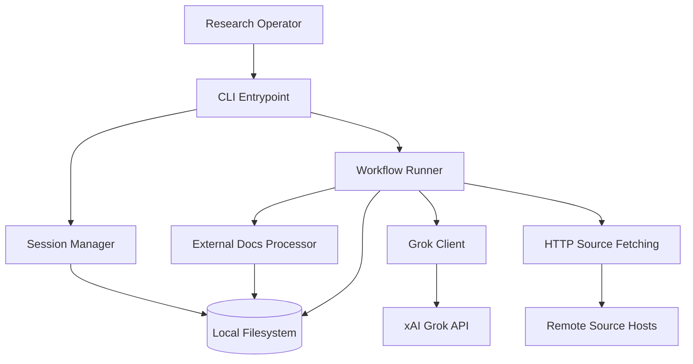
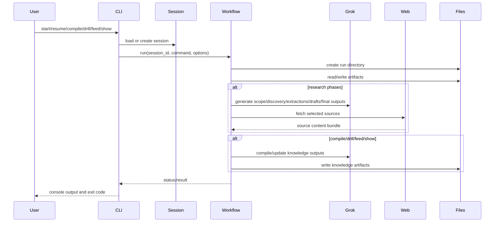

# Research Agent Technical Specification for Redevelopment

## 1. Document Purpose

This document is the redevelopment handoff specification for `grok-research-agent`. It is intended for a coding agent that must rebuild the project without needing additional clarifications. It defines:

- the project context and intended outcomes;
- the required technical stack and exact implementation parameters;
- the architecture and module boundaries;
- the feature-level functional behavior and acceptance criteria;
- the UX, accessibility, quality, testing, performance, and security standards;
- the milestone and submission requirements that must be satisfied before redevelopment is considered complete.

This specification is based on the current repository implementation and is written as a target-state redevelopment contract. Where the current code is ambiguous or under-specified, this document resolves that ambiguity and sets the redevelopment expectation explicitly.

## 2. Project Context

### 2.1 Product Summary

`grok-research-agent` is a local-first Python CLI that automates an eight-phase research workflow using Grok through the xAI OpenAI-compatible API. The system starts from a topic and optional focus area, performs structured scope refinement and source analysis, extracts evidence-preserving notes from curated sources, builds a master notebook, synthesizes a detailed research report, and optionally produces:

- a structured knowledge base;
- a drill pack for study;
- image prompts for Grok Imagine;
- a YouTube narration script;
- full offline copies of selected sources.

### 2.2 Core Product Principles

The redevelopment must preserve these product principles:

- `Local-first`: all session state and artifacts live on the local filesystem.
- `Human-governed`: the workflow pauses at key checkpoints so the operator remains in control.
- `Artifact-transparent`: every meaningful phase writes inspectable files, not just final outputs.
- `Resumable`: sessions can be resumed across multiple command executions without losing state.
- `LLM-assisted, not opaque`: LLM outputs are persisted as intermediate and final artifacts so the user can inspect, review, and reuse them.

### 2.3 Primary User

- `Research Operator`: A technical user running the CLI locally to produce high-depth research outputs.

### 2.4 Secondary Users

- `Reviewer`: Consumes reports and structured outputs.
- `Study User`: Uses drill packs and hypergraph outputs for learning.

## 3. Redevelopment Objectives

The coding agent must redevelop a production-quality equivalent of the current system with the following objectives:

- preserve all implemented workflow commands and output contracts;
- preserve the session-based local storage model;
- preserve the current eight-phase research lifecycle and auxiliary commands;
- preserve support for external documentation preprocessing;
- preserve knowledge-base, drill-pack, image-prompt, and YouTube-script generation;
- harden the codebase for maintainability, testing, and deterministic file outputs;
- document and validate all edge-case behavior defined in this specification.

## 4. In-Scope and Out-of-Scope

### 4.1 In Scope

- Python CLI application
- Session creation, persistence, listing, and resume flow
- Eight-phase workflow engine
- Optional unattended execution mode
- External local-doc preprocessing
- Web source fetching and text extraction
- LLM prompt orchestration
- Knowledge compilation and hypergraph maintenance
- Drill-pack generation
- Mermaid export
- Image-prompt generation
- YouTube-script generation
- Unit, integration, and end-to-end automated tests
- Packaging for local install via `pip install -e .`

### 4.2 Out of Scope

- Browser-based application as a required deliverable
- User accounts and authentication
- Team collaboration features
- Remote database persistence
- Background queue processing
- Cloud deployment infrastructure
- Vector databases or retrieval indexes
- GUI dashboards unless explicitly approved later

## 5. Delivery Model

- Application type: local command-line application
- Runtime model: single-process, synchronous orchestration with bounded thread-pool concurrency
- Persistence model: filesystem only
- Packaging model: installable Python package with CLI entrypoint
- Supported OS target for redevelopment acceptance: Windows PowerShell first, with code written to remain portable across macOS and Linux where practical

## 6. Canonical Technical Stack

The redevelopment must use the following baseline stack unless a deviation is explicitly approved. Versions below are redevelopment targets and must be pinned in project metadata or lock-equivalent artifacts.

### 6.1 Language and Runtime

| Layer | Required Version |
| --- | --- |
| Python | `3.11.9` |
| setuptools | `69.5.1` |
| wheel | `0.43.0` |

### 6.2 Runtime Libraries

| Package | Required Version | Purpose |
| --- | --- | --- |
| `openai` | `1.30.0` | xAI OpenAI-compatible chat completions client |
| `python-dotenv` | `1.0.1` | `.env` loading |
| `rich` | `13.7.1` | CLI rendering and tables |
| `pydantic` | `2.7.1` | session schema validation |
| `tiktoken` | `0.7.0` | reserved for token-aware future work; include to preserve compatibility |
| `pypdf` | `4.2.0` | PDF text extraction |
| `python-docx` | `1.1.2` | DOCX text extraction |
| `requests` | `2.31.0` | web fetching |
| `beautifulsoup4` | `4.12.3` | HTML cleaning |
| `readability-lxml` | `0.8.1` | readable article extraction |
| `chardet` | `5.2.0` | encoding compatibility; must remain `<6` |

### 6.3 Development and QA Tooling

| Tool | Required Version | Purpose |
| --- | --- | --- |
| `pytest` | `8.2.0` | unit, integration, and E2E tests |
| `pytest-cov` | `5.0.0` | coverage reporting |
| `ruff` | `0.6.4` | linting and import hygiene |
| `mypy` | `1.11.1` | static type checking |

### 6.4 Packaging and Entry Points

- Package name: `grok-research-agent`
- CLI script: `grok-research-agent = grok_research_agent.cli:main`
- Python package directory: `grok_research_agent/`
- Prompt assets must be shipped as package data under `grok_research_agent/prompts/*.txt`

## 7. Required Repository Structure

The redevelopment must preserve or improve the following logical layout:

```text
project-root/
  grok_research_agent/
    __init__.py
    cli.py
    grok_client.py
    session_manager.py
    workflow_phases.py
    external_docs.py
    prompts/
      *.txt
  tests/
    test_cli.py
    test_session_manager.py
    test_external_docs.py
    test_workflow_happy_path.py
  pyproject.toml
  README.md
  requirements.txt
```

The coding agent may add:

- `tests/test_compile.py`
- `tests/test_drill.py`
- `tests/test_feed.py`
- `tests/test_show.py`
- `tests/test_youtube_script.py`
- `tests/test_images.py`
- `tests/test_error_handling.py`

Additional modules are allowed if they improve separation of concerns, provided the public behavior remains consistent with this specification.

## 8. Architecture Overview

### 8.1 High-Level Architecture



### 8.2 Core Components

#### 8.2.1 CLI Layer

Responsibilities:

- parse arguments;
- validate required flags;
- instantiate `SessionManager`;
- instantiate `WorkflowRunner`;
- translate handled domain errors into exit codes.

#### 8.2.2 Session Manager

Responsibilities:

- create unique session IDs;
- create session directory structure;
- read and write `session.json`;
- create unique run directories;
- provide canonical session and knowledge-base paths.

#### 8.2.3 Workflow Runner

Responsibilities:

- orchestrate the research state machine;
- construct prompts;
- call the Grok client;
- fetch and preprocess source content;
- write run-scoped and session-scoped artifacts;
- manage interactive and auto-mode behavior.

#### 8.2.4 Grok Client

Responsibilities:

- load API configuration from `.env` and environment variables;
- configure the OpenAI-compatible client using xAI base URL;
- execute chat completions;
- classify and map API failures to domain errors;
- support request/response tracing.

#### 8.2.5 External Docs Processor

Responsibilities:

- recursively discover supported local documents;
- extract text from `.pdf`, `.docx`, `.txt`, and `.md`;
- classify documents;
- generate steering summaries, constraints, requirements, and relevance signals;
- write aggregated external context artifacts.

### 8.3 Data Flow



### 8.4 Third-Party Integrations

| Integration | Protocol | Purpose | Mandatory |
| --- | --- | --- | --- |
| xAI Grok API | HTTPS | all LLM generation | Yes |
| Arbitrary source hosts | HTTP/HTTPS | fetch curated sources | Yes |
| Local filesystem | OS file I/O | persistence and output artifacts | Yes |

No other integration is required for redevelopment.

## 9. Session and Persistence Model

### 9.1 Session Directory Layout

```text
<sessions-dir>/
  <session-id>/
    session.json
    00_scope_confirmed.md
    01_discovery_table.md
    02_curated_sources.json
    03_extracted/
    03_source_snapshots/
    03_extracted_chunks/
    03_extracted_index.txt
    04_master_notebook.md
    05_section_evidence/
    05_section_drafts/
    05_draft_v*.md
    06_full_sources/
    FINAL_REPORT.md
    images_to_generate.md
    Youtube_Script.md
    external_docs/
      manifest.json
      extracted.json
      context.md
    knowledge_base/
      hypergraph.json
      core_concepts.json
      drill_pack.md
      drill_questions.json
      hypergraph.mmd
      auto_types/
        auto_hypergraph.json
      feed_docs/
    runs/
      <run-id>/
        ...run-scoped copies...
```

### 9.2 Session State Schema

The session state must include the following persisted fields:

- `session_id: str`
- `topic: str`
- `focus: str | None`
- `mode: str`
- `external_docs_dir: str | None`
- `external_docs_status: str`
- `external_docs_summary: str | None`
- `external_docs_manifest_path: str | None`
- `external_docs_context_path: str | None`
- `external_docs_processed_files: int`
- `external_docs_total_files: int`
- `external_docs_completion_rate: float | None`
- `external_docs_relevance_score: float | None`
- `external_docs_last_error: str | None`
- `created_at: str`
- `grok_model: str`
- `current_phase: int`
- `run_history: list[str]`
- `updated_at: str`

### 9.3 Session ID Rules

- Session ID is based on a slugified topic and current date.
- Slug format:
  - lowercase;
  - replace non-alphanumeric runs with `-`;
  - collapse repeated hyphens;
  - trim leading/trailing hyphens.
- If the slugified topic prefix exceeds the configured threshold, append an 8-character SHA-1 digest suffix.
- If a session directory already exists, append `-2`, `-3`, etc. until unique.

### 9.4 Run Directory Rules

- Each command execution that invokes `WorkflowRunner.run()` must create a new run directory.
- Run ID format: `YYYYMMDD_HHMMSS_microseconds`
- On collision, retry until unique or fail after 1000 attempts.

## 10. Configuration Requirements

### 10.1 Mandatory Environment Variables

- `GROK_API_KEY`
  - required;
  - must be non-empty after trim.

### 10.2 Optional Environment Variables

- `GROK_MODEL`
  - default: `grok-3`
- `GROK_MAX_OUTPUT_TOKENS`
  - default: `50000`
  - invalid values fall back to `50000`
  - clamp minimum to `1`
- `GROK_REQUEST_TIMEOUT_SECONDS`
  - default: `300`
  - invalid values fall back to `300`
  - clamp minimum to `1`
- `EDITOR`
  - used during Phase 0 manual edit flow only

### 10.3 `.env` Resolution

- The workflow must attempt to load `.env` from the project root via the current relative resolution strategy.
- If `.env` does not exist, environment variables remain the fallback.
- Missing `GROK_API_KEY` must produce an actionable error message.

## 11. CLI Command Specification

### 11.1 Supported Commands

- `start`
- `resume`
- `list-sessions`
- `list-types`
- `update`
- `synthesize`
- `compile`
- `drill`
- `feed`
- `show`
- `generate-images`
- `youtube-script`

### 11.2 Shared Flags

The following flags must remain available where currently implemented:

- `--sessions-dir`
- `--auto`
- `--auto-full-collection`
- `--trace-llm`
- `--trace-llm-max-chars`

### 11.3 Required Command Contracts

#### `start`

Inputs:

- `--topic` required
- `--focus` optional
- `--external-docs-dir` optional
- `--mode` optional; values:
  - `report`
  - `compiler`
  - `drill`

Outputs:

- creates session;
- prints session ID;
- enters workflow at Phase 0.

#### `resume`

Inputs:

- `--session-id` required

Outputs:

- executes from saved `current_phase`.

#### `list-sessions`

Outputs:

- prints valid session IDs found under `--sessions-dir`;
- prints `No sessions found.` when empty.

#### `list-types`

Outputs:

- prints `auto-hypergraph`.

#### `update`

Behavior:

- reruns discovery with `since_last_run=yes`;
- sets `current_phase = 2`.

#### `synthesize`

Behavior:

- forces Phase 5 synthesis from current notebook if available.

#### `compile`

Inputs:

- `--session-id`
- `--type auto-hypergraph`

Outputs:

- `knowledge_base/hypergraph.json`
- `knowledge_base/auto_types/auto_hypergraph.json`
- `knowledge_base/core_concepts.json`

#### `drill`

Inputs:

- `--session-id`
- `--mode backward`

Outputs:

- `knowledge_base/drill_pack.md`
- `knowledge_base/drill_questions.json`

#### `feed`

Inputs:

- `--session-id`
- `--new-doc`

Outputs:

- timestamped copy under `knowledge_base/feed_docs/`
- updated or initialized hypergraph artifacts

#### `show`

Outputs:

- `knowledge_base/hypergraph.mmd`

#### `generate-images`

Outputs:

- `images_to_generate.md`

#### `youtube-script`

Outputs:

- `Youtube_Script.md`

## 12. Workflow State Machine

### 12.1 Phase List

| Phase | Name | Human Interaction |
| --- | --- | --- |
| `0` | Scope Confirmation | Yes |
| `1` | Discovery | No |
| `2` | Curation and Gap Analysis | Yes |
| `3` | Extraction | No |
| `4` | Notebook Assembly | No |
| `5` | Synthesis and Review | Yes |
| `6` | Full Offline Collection | Yes |
| `7` | Final Polish | No |
| `8` | Complete | No |

### 12.2 Runtime Constants

These values must remain configurable in code and must default to:

| Constant | Value |
| --- | --- |
| `SOURCE_CHUNK_CHARS` | `45000` |
| `SOURCE_CHUNK_OVERLAP` | `5000` |
| `NOTEBOOK_CHUNK_CHARS` | `70000` |
| `FETCH_WORKERS` | `4` |
| `EXTRACTION_WORKERS` | `2` |
| `EVIDENCE_WORKERS` | `2` |
| `FINAL_REPORT_MIN_WORDS` | `9000` |
| `FINAL_REPORT_MAX_WORDS` | `10000` |
| `FINAL_REPORT_TARGET_WORDS` | `9500` |

### 12.3 Standard Report Sections

The redeveloped system must preserve these section names exactly:

- `Core Definitions and Scope`
- `Architecture and Technical Mechanisms`
- `Workflows, Processes, and Operational Patterns`
- `Evidence, Examples, and Case Studies`
- `Limitations, Trade-offs, and Failure Modes`
- `Open Questions and Future Directions`

## 13. Functional Requirements by Feature

### 13.1 Phase 0: Scope Confirmation

Requirements:

- generate a concise Markdown scope summary from topic and effective focus;
- save run-local `00_scope.md`;
- print scope to console;
- support user responses:
  - `yes`
  - `edit`
  - `cancel`
- on `yes`, save `00_scope_confirmed.md` and move to Phase 1;
- on `edit`, create `00_scope_edit.md`, optionally open `$EDITOR`, reload edited content, and continue prompting;
- on `cancel`, leave phase unchanged;
- in auto mode, auto-confirm without prompting.

Acceptance criteria:

- starting a new session produces Phase 0 output;
- auto mode advances immediately to Phase 1;
- missing Grok credentials yields a clear, actionable error and does not corrupt state.

Edge cases:

- blank or malformed focus content must not crash the phase;
- missing `EDITOR` must not block the `edit` flow.

### 13.2 Phase 1: Discovery

Requirements:

- render `discovery_prompt.txt` with topic, effective focus, and `since_last_run`;
- save discovery output to run and session scope;
- do not block on format validation before save;
- set `current_phase = 2` after successful run.

Acceptance criteria:

- `01_discovery_table.md` exists after discovery;
- `update` command reruns discovery with `since_last_run=yes`;
- the system instructs the user to resume for curation.

Edge cases:

- discovery output may be imperfect Markdown; the system still saves it;
- timeouts or Grok fatal errors must surface cleanly.

### 13.3 Phase 2: Curation and Gap Analysis

Requirements:

- require `01_discovery_table.md`;
- print a preview of discovered sources;
- accept user selection as free-form instruction;
- attempt up to 3 times to get valid curated JSON;
- canonicalize curated source objects to:
  - `title`
  - `url`
  - `type`
  - `why_relevant`
  - `credibility`
  - `priority`
- recover URLs heuristically from discovery Markdown if structured JSON cannot be parsed;
- save curated sources to run and session scope;
- generate and save a gap report;
- require exact `approve` to advance to Phase 3.

Acceptance criteria:

- `02_curated_sources.json` is always produced if discovery contains URLs;
- malformed JSON is recovered or normalized;
- gap report exists even after timeout through fallback content;
- non-`approve` response leaves the session in Phase 2.

Edge cases:

- fenced JSON responses must be parsed correctly;
- URLs wrapped in punctuation or backticks must be normalized;
- empty discovery files must not crash the system.

### 13.4 Phase 3: Extraction

Requirements:

- require valid curated sources;
- create run/session extraction directories;
- request and save an extraction plan;
- fetch source bundles concurrently;
- preserve raw snapshots plus normalized source-text snapshots;
- split source text into overlapping chunks;
- extract evidence-preserving chunk notes in parallel;
- save individual chunk outputs;
- assemble chunk outputs into source dossiers;
- skip failed sources without aborting the phase;
- write `03_extracted_index.txt` on completion.

Acceptance criteria:

- extraction creates:
  - `03_source_snapshots/`
  - `03_extracted_chunks/`
  - `03_extracted/`
- fetched source metadata is preserved in dossier headers;
- chunk timeouts skip only the failed chunk or source, not the entire run.

Edge cases:

- invalid URLs are skipped safely;
- PDF sources are extracted and stored;
- timeout during fetch or chunk extraction does not kill the entire phase.

### 13.5 Phase 4: Notebook Assembly

Requirements:

- require extracted source dossiers;
- build a master notebook with:
  - title
  - topic
  - notebook purpose
  - optional external-doc context
  - source catalog
  - optional knowledge-base outline
  - source dossiers
- write notebook to run and session scope.

Acceptance criteria:

- `04_master_notebook.md` exists;
- notebook contains source catalog and source dossiers;
- session moves to Phase 5 in normal workflow progression.

### 13.6 Phase 5: Synthesis and Review

Requirements:

- require notebook;
- split notebook into chunks;
- generate section-specific evidence packets in parallel;
- generate section drafts from evidence packets and source catalog;
- save evidence packets and drafts to run and session scope;
- assemble full draft `05_draft_vN.md`;
- accept review feedback;
- exact `approve` moves to Phase 6;
- any other feedback is treated as revision input;
- save revised draft as next version.

Acceptance criteria:

- draft output includes source catalog and references;
- drafted sections use the exact canonical section names;
- revision flow preserves previous drafts and creates a new version;
- timeouts in section generation degrade gracefully.

Edge cases:

- sections with no evidence packets are skipped with warning;
- notebook chunks may be empty and should produce a clear message;
- review strings such as `add-section "Title"` pass through to revision prompt without local parser errors.

### 13.7 Phase 6: Full Offline Collection

Requirements:

- display available curated sources;
- accept `all`, `none`, or comma-separated source numbers;
- prefetch selected sources;
- save full offline copies as Markdown;
- if no curated sources are available, attempt recovery from discovery;
- if recovery fails, skip to Phase 7;
- if full collection occurs, finalize immediately after saving selected content.

Acceptance criteria:

- `06_full_sources/` contains numbered Markdown files for selected sources;
- selection `none` skips collection and leaves finalization for next resume;
- selection `all` saves offline copies for all fetchable sources.

Edge cases:

- invalid numeric tokens are ignored;
- out-of-range indices are ignored;
- fetch failures skip individual sources only.

### 13.8 Phase 7: Final Polish

Requirements:

- require notebook and at least one draft;
- use latest draft version;
- generate executive summary and glossary;
- build TOC from level-2 headings;
- enforce target word counts using retargeting prompt logic;
- save `FINAL_REPORT.md`;
- generate image prompts;
- generate YouTube script.

Acceptance criteria:

- final report contains:
  - title
  - table of contents
  - executive summary
  - report body
  - source catalog
  - optional knowledge-base overview
  - glossary
- final report meets target word-count constraints unless retargeting times out, in which case the best available report is still saved;
- image prompts and YouTube script are produced when corresponding LLM calls succeed.

Edge cases:

- executive summary timeout inserts fallback text;
- glossary timeout inserts fallback bullet;
- report body starting with `# ` removes duplicated title before final assembly.

### 13.9 Compile

Requirements:

- compile from notebook if present, else extracted dossiers if present;
- generate hypergraph JSON using the auto-hypergraph prompt;
- save hypergraph to both canonical knowledge-base locations;
- generate core concepts and save them.

Acceptance criteria:

- `knowledge_base/hypergraph.json` exists;
- `knowledge_base/core_concepts.json` exists;
- `knowledge_base/auto_types/auto_hypergraph.json` exists.

Edge cases:

- invalid JSON response is still saved in wrapped fallback form instead of failing;
- missing notebook/extractions prints a clear instruction and exits cleanly.

### 13.10 Drill

Requirements:

- support only `backward` mode;
- auto-run compile if core concepts do not exist;
- generate drill-pack Markdown and structured questions JSON.

Acceptance criteria:

- `drill_pack.md` and `drill_questions.json` exist after success.

Edge cases:

- if core concepts still do not exist after compile, the command must exit with a clear message.

### 13.11 Feed

Requirements:

- validate file existence and regular-file status;
- copy supplied document into timestamped feed folder;
- initialize hypergraph via compile if missing;
- otherwise update the existing hypergraph using the update prompt.

Acceptance criteria:

- timestamped copy exists under `knowledge_base/feed_docs/`;
- hypergraph output is present after command completion.

Edge cases:

- unreadable file contents must be loaded with replacement characters rather than crash where possible;
- non-existent file prints a clear error and exits.

### 13.12 Show

Requirements:

- require `knowledge_base/hypergraph.json`;
- render Mermaid graph output to `hypergraph.mmd`.

Acceptance criteria:

- file begins with `graph TD`;
- nodes and edges are rendered from available JSON.

Edge cases:

- if hypergraph is missing, print an instructional message and exit.

### 13.13 External Documentation Preprocessing

Requirements:

- discover supported files recursively;
- process `.pdf`, `.docx`, `.txt`, `.md`;
- classify docs into `guideline`, `background`, `steering`, or `general`;
- extract key concepts, constraints, requirements, and algorithm insights;
- aggregate into manifest, extracted summary, and context Markdown;
- store processing metrics in session state;
- inject external context into applicable prompts.

Acceptance criteria:

- `external_docs/manifest.json`, `extracted.json`, and `context.md` exist;
- session state is updated with status and counts;
- partial file failures do not abort the whole workflow.

### 13.14 Image Prompt Generation

Requirements:

- require `FINAL_REPORT.md`;
- generate 5 to 10 image prompts emphasizing concrete mechanisms, workflows, architectures, and evidence.

Acceptance criteria:

- `images_to_generate.md` exists after success.

### 13.15 YouTube Script Generation

Requirements:

- require `FINAL_REPORT.md`;
- prefer section drafts as source material when available;
- exclude table of contents, source catalog, glossary, references, knowledge-base overview, and executive summary sections from narration inputs;
- generate:
  - `# YouTube Script`
  - `## Introduction`
  - section-level headings
  - `## Conclusion`
- expand short outputs to minimum length thresholds.

Acceptance criteria:

- `Youtube_Script.md` exists;
- required headings are present even if the model omits them initially.

## 14. Output Contracts

### 14.1 Curated Sources JSON Contract

```json
[
  {
    "title": "Example Source",
    "url": "https://example.com",
    "type": "blog",
    "why_relevant": "Explains architecture clearly",
    "credibility": 4,
    "priority": "High"
  }
]
```

### 14.2 Hypergraph JSON Contract

```json
{
  "nodes": [
    { "id": "N1", "label": "Concept A" }
  ],
  "hyperedges": [
    {
      "id": "E1",
      "nodes": ["N1", "N2", "N3"],
      "relation": "supports",
      "evidence": "Quoted or summarized evidence"
    }
  ]
}
```

Fallback rule:

- if valid JSON cannot be produced, save a wrapped fallback:

```json
{
  "raw": "original model output"
}
```

### 14.3 Core Concepts JSON Contract

```json
{
  "core_concepts": [
    {
      "name": "Concept A",
      "definition": "Short definition",
      "why_load_bearing": "Why the concept is foundational"
    }
  ]
}
```

### 14.4 Drill Pack JSON Contract

```json
{
  "drill_pack_markdown": "# Drill Pack",
  "drill_questions": [
    {
      "concept": "Concept A",
      "questions": [
        {
          "question": "What is Concept A?",
          "answer": "Detailed answer",
          "pitfalls": ["Common mistake"]
        }
      ]
    }
  ]
}
```

## 15. Error Handling Specification

### 15.1 Error Classes

The Grok integration layer must expose:

- `GrokError`
- `GrokTimeoutError`
- `GrokQuotaError`

### 15.2 Error Mapping Rules

- quota-like errors map to `GrokQuotaError`;
- timeout-like errors map to `GrokTimeoutError`;
- all other failures map to `GrokError`.

### 15.3 Retry Rules

- non-timeout, non-quota API failures retry up to 5 times;
- exponential backoff must be used with cap at 30 seconds.

### 15.4 Non-Fatal Degradation Rules

The system must continue where feasible when these fail:

- gap analysis;
- extraction plan;
- extraction chunks;
- section evidence packets;
- section drafts;
- revision generation;
- executive summary;
- glossary;
- image prompts;
- YouTube intro/section/outro expansion;
- word-count retargeting.

### 15.5 Fatal Conditions

The command must stop cleanly with a clear error or message when:

- `GROK_API_KEY` is missing for a required LLM path;
- required session or phase prerequisite files are missing;
- invalid command-line arguments are supplied;
- an existing session cannot be loaded.

## 16. Performance Benchmarks

The redevelopment must satisfy the following performance and operational standards on a standard developer workstation with broadband internet:

### 16.1 General Benchmarks

- session creation and `session.json` write: `< 1 second`
- `list-sessions`: `< 1 second` for up to 500 session directories
- run directory creation: `< 250 ms`
- compile/show/feed metadata writes: `< 1 second` excluding LLM/network latency

### 16.2 Concurrency Benchmarks

- web fetch fan-out must support up to 4 parallel source requests;
- extraction chunk fan-out must support up to 2 parallel LLM extractions;
- evidence-packet generation must support up to 2 parallel LLM calls per report section.

### 16.3 Scalability Targets

- curated-source list size: at least 20 sources unless topic is niche;
- notebook assembly must tolerate at least 20 extracted source dossiers;
- external-doc preprocessing must handle at least 40 supported files without failure;
- Mermaid rendering must tolerate at least 200 nodes and 400 edges/hyperedges.

### 16.4 Degradation Expectations

- performance degradation due to LLM latency is acceptable;
- correctness and resilience must be prioritized over aggressive parallelism;
- timeouts must degrade gracefully and preserve progress already written.

## 17. Security Standards

The coding agent must implement the following security requirements:

- never write API keys into tracked files or session artifacts;
- load secrets only from `.env` or environment variables;
- treat fetched page content and processed external docs as potentially sensitive local data;
- use HTTPS for xAI API access;
- validate URL schemes before fetch;
- reject non-HTTP(S) URLs during source fetch;
- sanitize traced LLM output to strip control characters before console rendering;
- avoid executing remote content;
- avoid shelling out except the optional editor launch in Phase 0;
- ensure failure paths do not dump secrets into logs or console output.

## 18. UI/UX and Accessibility Requirements

### 18.1 UI Scope Clarification

The required deliverable is CLI-first. A browser UI is not required and must not replace the CLI workflow. The redevelopment must therefore focus on:

- terminal UX;
- Markdown artifact readability;
- accessibility and usability of text-based outputs.

### 18.2 CLI UX Requirements

- use `rich` for readable, structured terminal output;
- keep prompts short, explicit, and action-oriented;
- always tell the user the next action after each workflow pause;
- display tabular previews for discovery and full-collection selection;
- ensure all interactive prompts can be understood without reading source code or docs;
- avoid ambiguous status messages.

### 18.3 Accessibility Requirements

Minimum accessibility target: `WCAG 2.1 AA` principles adapted to CLI and generated documentation.

Mandatory standards:

- color must never be the only carrier of meaning;
- prompts and errors must remain understandable in plain text;
- generated Markdown headings must be semantically ordered;
- tables must include clear headers;
- text outputs must avoid unnecessary ASCII art that breaks screen-reader flow;
- errors must be descriptive and remediation-oriented.

### 18.4 Responsive Design Standards

Because the mandatory product is CLI-only, responsive browser layout is not a required implementation artifact. However:

- generated Markdown reports must remain readable in narrow terminal and editor panes;
- tables should degrade gracefully when line wrapping occurs;
- no output should assume extremely wide displays;
- if the coding agent adds any optional HTML-rendered preview or UI helper, it must:
  - be mobile responsive at widths `320px`, `768px`, `1024px`, and `1440px`;
  - satisfy WCAG `2.1 AA`;
  - preserve feature parity with the CLI rather than replace it.

### 18.5 Visual Design Guidelines

For CLI and documentation outputs:

- headings must be consistent and hierarchical;
- filenames and commands must be rendered in monospace contexts where applicable;
- Markdown outputs must favor clean structural sections over decorative styling;
- final report and drill pack must be readable in GitHub-style Markdown renderers and plain editors;
- prompt and report formatting must be deterministic enough for downstream automation.

## 19. Testing Requirements

### 19.1 Required Test Categories

The coding agent must implement:

- unit tests;
- integration tests;
- end-to-end workflow tests.

### 19.2 Unit Test Coverage Requirements

At minimum, unit tests must cover:

- session ID generation and uniqueness;
- state load/save round-trip;
- `.env` and configuration parsing;
- Grok error mapping;
- URL normalization;
- relaxed JSON parsing;
- curated-source canonicalization;
- discovery recovery from raw Markdown URLs;
- text chunking behavior;
- HTML cleaning;
- Mermaid generation;
- external-doc categorization and aggregation.

### 19.3 Integration Test Requirements

Integration tests must cover:

- CLI command dispatch and return codes;
- start/resume flow using fake or injected LLM client;
- compile and drill workflows;
- feed and show flows;
- external-doc preprocessing path;
- timeout degradation behavior.

### 19.4 End-to-End Test Requirements

At least one full happy-path E2E test must verify:

- session creation;
- sequential phase progression from 0 through 8;
- generation of final report, images file, and YouTube script;
- knowledge-base compile and drill outputs;
- Mermaid output generation.

At least one auto-mode E2E test must verify:

- no `input()` calls occur;
- workflow completes to Phase 8;
- full offline copies are saved when auto full-collection is enabled.

### 19.5 Edge-Case Tests

Required edge-case coverage:

- missing `GROK_API_KEY`
- missing discovery table
- missing curated sources
- fenced JSON curated-source input
- extraction chunk timeout
- fetch timeout
- missing final report for image generation
- missing final report for YouTube generation
- invalid feed document path
- missing hypergraph for `show`

### 19.6 Coverage Thresholds

- minimum line coverage: `85%`
- minimum branch coverage for core orchestration modules: `75%`
- test suite must pass on Windows PowerShell execution

## 20. Quality Requirements

### 20.1 Code Quality Standards

- no untyped public functions in core modules unless justified;
- avoid duplicated orchestration logic;
- use dependency injection for HTTP and LLM clients in testable paths;
- preserve ASCII-only source text unless an existing file requires Unicode;
- add comments only where behavior is genuinely non-obvious.

### 20.2 Lint and Type Gates

The coding agent must run and pass:

- `ruff check .`
- `mypy grok_research_agent`
- `pytest -q`

### 20.3 Diagnostics Gate

- modified files must be free of IDE diagnostics before final handoff.

## 21. Acceptance Criteria by Deliverable

### 21.1 Core CLI Deliverable

Accepted when:

- all documented commands exist;
- command help text is accurate;
- exit codes follow this specification;
- local installation via `pip install -e .` works.

### 21.2 Workflow Deliverable

Accepted when:

- interactive workflow reaches Phase 8 through repeated resume calls;
- auto mode completes without user input;
- all phase outputs are generated in the correct directories.

### 21.3 Knowledge Deliverable

Accepted when:

- compile writes hypergraph and core concepts;
- drill writes Markdown and JSON drill artifacts;
- feed updates or initializes hypergraph;
- show writes Mermaid output.

### 21.4 External Docs Deliverable

Accepted when:

- external docs are recursively discovered;
- at least `.pdf`, `.docx`, `.txt`, `.md` are processed;
- manifest, extracted summary, and context Markdown are produced;
- workflow continues through partial file failures.

### 21.5 Final Content Deliverable

Accepted when:

- final report exists and contains required sections;
- image prompts exist if generation succeeds;
- YouTube script exists and contains required headings;
- file naming is deterministic and matches this specification.

## 22. Deliverable Milestones

The coding agent must complete redevelopment in the following milestone order.

### Milestone 1: Project Skeleton and Packaging

Must deliver:

- package structure;
- `pyproject.toml`;
- CLI entrypoint;
- dependency installation success;
- basic `list-types` and `list-sessions` behavior.

Exit criteria:

- installable in editable mode;
- lint and basic tests pass.

### Milestone 2: Session and State Foundation

Must deliver:

- session creation;
- state persistence;
- unique run directories;
- knowledge-base directory bootstrapping.

Exit criteria:

- session manager tests pass;
- state round-trip verified.

### Milestone 3: Workflow Core Phases

Must deliver:

- Phases 0 through 5;
- interactive and auto-mode progression;
- source fetch, extraction, and notebook assembly.

Exit criteria:

- happy-path workflow tests pass through draft generation.

### Milestone 4: Finalization and Output Expansion

Must deliver:

- Phase 6 and Phase 7;
- final report generation;
- image prompts;
- YouTube script.

Exit criteria:

- full workflow can reach Phase 8;
- final artifacts exist.

### Milestone 5: Knowledge Features

Must deliver:

- compile;
- drill;
- feed;
- show.

Exit criteria:

- knowledge artifact tests pass.

### Milestone 6: External Docs and Hardening

Must deliver:

- external-doc preprocessing;
- error recovery hardening;
- timeout degradation handling;
- coverage, lint, type, and diagnostics cleanup.

Exit criteria:

- all tests pass;
- quality gates pass;
- final QA checklist is complete.

## 23. Submission Requirements

Before handing redevelopment back, the coding agent must provide:

- updated source code;
- updated tests;
- updated `README.md` if CLI behavior changed;
- updated installation instructions if dependencies changed;
- exact list of commands run for validation;
- short change summary;
- explicit statement that all acceptance criteria were checked.

If any criterion is not met, the coding agent must:

- identify the unmet criterion;
- explain the blocker;
- provide the exact remaining work.

## 24. Required Validation Commands

The coding agent must run, at minimum:

```bash
python -m pip install -e ".[dev]"
ruff check .
mypy grok_research_agent
pytest -q
```

If coverage tooling is included:

```bash
pytest --cov=grok_research_agent --cov-report=term-missing
```

## 25. Quality Assurance Checklist

The coding agent must verify all items below before finalization.

### 25.1 Functional QA

- [ ] All documented commands exist and parse correctly
- [ ] Session creation works
- [ ] Resume works across multiple phases
- [ ] Auto mode completes without prompts
- [ ] External docs preprocessing works
- [ ] Extraction writes snapshots, chunks, and dossiers
- [ ] Notebook generation works
- [ ] Draft generation and revision work
- [ ] Final report generation works
- [ ] Image prompt generation works
- [ ] YouTube script generation works
- [ ] Compile works
- [ ] Drill works
- [ ] Feed works
- [ ] Show works

### 25.2 Reliability QA

- [ ] Missing API key handled correctly
- [ ] Missing prerequisite files handled with clear messages
- [ ] Invalid URLs do not crash the run
- [ ] Timeouts degrade gracefully where specified
- [ ] Invalid JSON responses are recovered or safely wrapped
- [ ] Partial failures do not delete successful artifacts

### 25.3 Code Quality QA

- [ ] Lint passes
- [ ] Type checks pass
- [ ] Tests pass
- [ ] No new diagnostics in edited files
- [ ] File outputs follow naming contracts
- [ ] No secrets written to repository files

### 25.4 Documentation QA

- [ ] README usage examples are valid
- [ ] Installation steps are current
- [ ] Command help matches implemented behavior
- [ ] Prompt assets required by runtime are included in package data

## 26. Definition of Done

Redevelopment is complete only when all of the following are true:

- the project can be installed and run locally;
- the full feature set described here is implemented;
- all required artifacts are produced with the correct names and structures;
- all acceptance criteria are satisfied;
- all mandatory test, lint, and type gates pass;
- no unresolved diagnostics remain in modified files;
- the coding agent can hand off the work without requiring follow-up clarification.

## 27. Non-Negotiable Implementation Constraints

The coding agent must not violate the following:

- do not replace the CLI-first interaction model with a GUI-only approach;
- do not move persistence to a database;
- do not remove the human-in-the-loop checkpoints;
- do not remove local run-scoped artifact generation;
- do not require third-party services other than xAI Grok and normal source hosting;
- do not silently swallow fatal state/precondition errors;
- do not break output file names or core JSON contracts.

## 28. Recommended Implementation Sequence

To minimize redevelopment risk, implement in this order:

1. package and CLI parser
2. session manager and path model
3. Grok client and error mapping
4. workflow engine skeleton
5. Phases 0 to 2
6. source fetch and extraction
7. notebook and synthesis
8. final polish, image prompts, YouTube script
9. compile, drill, feed, show
10. external docs processor
11. hardening, diagnostics cleanup, full test pass

## 29. Handoff Note for the Coding Agent

If a behavior in code conflicts with this document, this document governs the redevelopment target unless the repository owner provides an explicit override. The goal is not a loose approximation of the current project; the goal is a faithful, testable redevelopment with stronger engineering discipline and zero ambiguity in expected outcomes.
