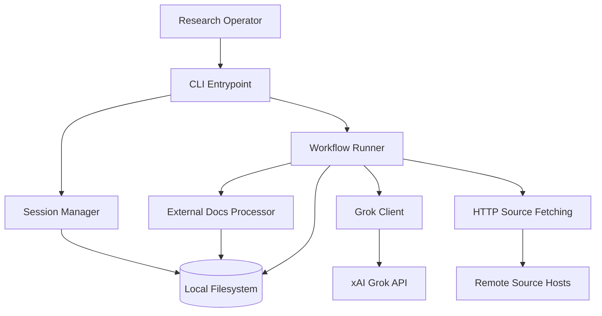
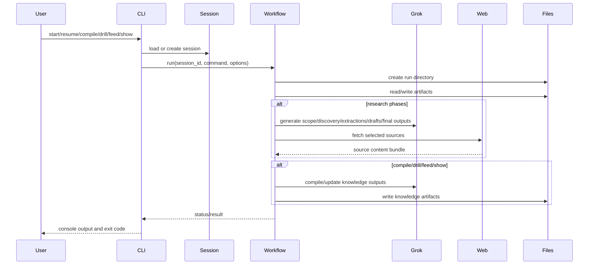

# 研究代理重建技術規範

## 1. 文件目的

本文檔是`grok-research-agent`的再開發交接規範。它適用於必須重建項目而無需額外説明的編碼代理。它定義：

- 專案背景及預期成果；
- 所需的技術堆疊和確切的實作參數；
- 架構和模組邊界；
- 特徵級功能行為和驗收標準；
- 使用者體驗、可訪問性、品質、測試、效能和安全標準；
- 在重建被視為完成之前必須滿足的里程碑和提交要求。

該規範基於當前存儲庫實現，並被編寫為目標狀態重新開發合約。如果目前程式碼不明確或未指定，本文檔將解決該不明確之處並明確設定重新開發期望。

## 2. 專案背景

### 2.1 產品概要

`grok-research-agent` 是本地優先的 Python CLI，它透過 xAI OpenAI 相容 API 使用 Grok 自動執行八階段研究工作流程。該系統從主題和可選的焦點領域開始，執行結構化範圍細化和源分析，從精選源中提取證據保存筆記，構建主筆記本，綜合詳細的研究報告，並選擇性地生成：

- 結構化的知識庫；
- 用於學習的練習包；
- Grok Imagine 的圖像提示；
- YouTube 旁白腳本；
- 所選來源的完整離線副本。

### 2.2 核心產品原理

重建必須保留這些產品原則：

- `Local-first`：所有會話狀態和工件都位於本機檔案系統上。
- `Human-governed`：工作流程在關鍵檢查點暫停，以便操作員保持控制。
- `Artifact-transparent`：每個有意義的階段都會寫入可檢查的文件，而不僅僅是最終輸出。
- `Resumable`：會話可以在多個命令執行之間恢復，而不會遺失狀態。
- `LLM-assisted, not opaque`：LLM 輸出作為中間和最終工件保留，以便使用者可以檢查、審查和重複使用它們。

### 2.3 主要用户

- `Research Operator`：在本地運行 CLI 以產生深度研究成果的技術使用者。

### 2.4 二級用户

- `Reviewer`：使用報告和結構化輸出。
- `Study User`：使用練習包和超圖輸出進行學習。

## 3. 重建目標

編碼代理必須重新開發目前系統的生產品質等效項，目標如下：

- 保留所有已實施的工作流程命令和輸出合約；
- 保留基於會話的本機儲存模型；
- 保留目前的八階段研究生命週期和輔助命令；
- 保留對外部文件預處理的支援；
- 保留知識庫、練習包、圖像提示和 YouTube 腳本生成；
- 強化程式碼庫的可維護性、測試和確定性文件輸出；
- 記錄並驗證本規範中定義的所有邊緣情況行為。

## 4. 範圍內和範圍外

### 4.1 範圍

- Python CLI 應用程式
- 會話建立、持久化、列出和復原流程
- 八階段工作流引擎
- 可選無人值守執行模式
- 外部本機文件預處理
- Web 來源取得與文字擷取
- LLM提示編排
- 知識編譯和超圖維護
- 鑽包生成
- 美人魚出口
- 圖像提示生成
- YouTube 腳本生成
- 單元、整合和端到端自動化測試
- 透過 `pip install -e .` 進行本地安裝打包

### 4.2 超出範圍

- 基於瀏覽器的應用程式作為必需的可交付成果
- 使用者帳户和身份驗證
- 團隊協作功能
- 遠端資料庫持久化
- 後台隊列處理
- 雲端部署基礎架構
- 向量資料庫或檢索索引
- GUI 儀表板，除非稍後明確批准

## 5. 交付模式

- 應用程式類型：本機命令列應用程式
- 運行時模型：具有有限執行緒池並發性的單一進程、同步編排
- 持久化模型：僅檔案系統
- 打包模型：具有 CLI 入口點的可安裝 Python 套件
- 重新開發驗收支援的作業系統目標：首先是 Windows PowerShell，編寫的程式碼在可行的情況下可在 macOS 和 Linux 上保持可攜性

## 6. 規範技術棧

除非明確批准偏差，否則重新開發必須使用以下基線堆疊。以下版本是重新開發目標，必須固定在專案元資料或鎖等效工件中。

### 6.1 語言和運行時

| Layer | 所需版本 |
| --- | --- |
| Python | `3.11.9` |
| setuptools | `69.5.1` |
| wheel | `0.43.0` |

### 6.2 運行時庫

| Package | 所需版本 | Purpose |
| --- | --- | --- |
| `openai` | `1.30.0` | xAI OpenAI 相容的聊天完成客户端 |
| `python-dotenv` | `1.0.1` | `.env`加載中 |
| `rich` | `13.7.1` | CLI 渲染和表格 |
| `pydantic` | `2.7.1` | 會話模式驗證 |
| `tiktoken` | `0.7.0` | 保留用於令牌感知的未來工作；包含以保持相容性 |
| `pypdf` | `4.2.0` | PDF文字擷取 |
| `python-docx` | `1.1.2` | DOCX 文字擷取 |
| `requests` | `2.31.0` | 網頁抓取 |
| `beautifulsoup4` | `4.12.3` | HTML 清理 |
| `readability-lxml` | `0.8.1` | 可讀文章擷取 |
| `chardet` | `5.2.0` | 編碼相容性；必須保持`<6` |

### 6.3 開發和 QA 工具

| Tool | 所需版本 | Purpose |
| --- | --- | --- |
| `pytest` | `8.2.0` | 單元、整合和端到端測試 |
| `pytest-cov` | `5.0.0` | 覆蓋率報告 |
| `ruff` | `0.6.4` | 掉毛和進口衞生 |
| `mypy` | `1.11.1` | 靜態型別檢查 |

### 6.4 打包和入口點

- 包名：`grok-research-agent`
- CLI 腳本：`grok-research-agent = grok_research_agent.cli:main`
- Python包目錄：`grok_research_agent/`
- 提示資產必須以 `grok_research_agent/prompts/*.txt` 下的包資料運輸

## 7. 所需的儲存庫結構

重建必須保留或改善以下邏輯佈局：

```text
project-root/
  grok_research_agent/
    __init__.py
    cli.py
    grok_client.py
    session_manager.py
    workflow_phases.py
    external_docs.py
    prompts/
      *.txt
  tests/
    test_cli.py
    test_session_manager.py
    test_external_docs.py
    test_workflow_happy_path.py
  pyproject.toml
  README.md
  requirements.txt
```

編碼代理可以新增：

- `tests/test_compile.py`
- `tests/test_drill.py`
- `tests/test_feed.py`
- `tests/test_show.py`
- `tests/test_youtube_script.py`
- `tests/test_images.py`
- `tests/test_error_handling.py`

如果附加模組可以改善關注點分離，且公共行為與本規範保持一致，則允許使用附加模組。

## 8. 架構概述

### 8.1 高層架構



### 8.2 核心組件

#### 8.2.1 CLI 層

Responsibilities:

- 解析參數；
- 驗證所需的標誌；
- 實例化`SessionManager`；
- 實例化`WorkflowRunner`；
- 將處理的域錯誤轉換為退出代碼。

#### 8.2.2 會話管理器

Responsibilities:

- 建立唯一的會話 ID；
- 建立會話目錄結構；
- 讀寫`session.json`；
- 建立獨特的運行目錄；
- 提供規範的會話和知識庫路徑。

#### 8.2.3 工作流程運行器

Responsibilities:

- 協調研究狀態機；
- 建構提示；
- 調用 Grok 客户端；
- 取得並預處理來源內容；
- 編寫運行範圍和會話範圍的工件；
- 管理互動和自動模式行為。

#### 8.2.4 Grok 客户端

Responsibilities:

- 從`.env`和環境變數載入API配置；
- 使用 xAI 基本 URL 設定 OpenAI 相容客户端；
- 執行聊天完成；
- 對 API 故障進行分類並將其對應到域錯誤；
- 支援請求/響應追蹤。

#### 8.2.5 外部文件處理器

Responsibilities:

- 遞歸地發現支援的本地文件；
- 從`.pdf`、`.docx`、`.txt` 和`.md` 擷取文字；
- 將文件進行分類；
- 產生指導摘要、約束、要求和相關訊號；
- 編寫聚合的外部上下文工件。

### 8.3 資料流



### 8.4 第三方集成

| Integration | Protocol | Purpose | Mandatory |
| --- | --- | --- | --- |
| xAI Grok API | HTTPS | 所有LLM一代 | Yes |
| 任意來源主機 | HTTP/HTTPS | 取得精選資源 | Yes |
| 本機檔案系統 | 作業系統檔案I/O | 持久性和輸出工件 | Yes |

重建不需要其他整合。

## 9. 會話和持久化模型

### 9.1 會話目錄佈局

```text
<sessions-dir>/
  <session-id>/
    session.json
    00_scope_confirmed.md
    01_discovery_table.md
    02_curated_sources.json
    03_extracted/
    03_source_snapshots/
    03_extracted_chunks/
    03_extracted_index.txt
    04_master_notebook.md
    05_section_evidence/
    05_section_drafts/
    05_draft_v*.md
    06_full_sources/
    FINAL_REPORT.md
    images_to_generate.md
    Youtube_Script.md
    external_docs/
      manifest.json
      extracted.json
      context.md
    knowledge_base/
      hypergraph.json
      core_concepts.json
      drill_pack.md
      drill_questions.json
      hypergraph.mmd
      auto_types/
        auto_hypergraph.json
      feed_docs/
    runs/
      <run-id>/
        ...run-scoped copies...
```

### 9.2 會話狀態模式

會話狀態必須包含以下持久性欄位：

- `session_id: str`
- `topic: str`
- `focus: str | None`
- `mode: str`
- `external_docs_dir: str | None`
- `external_docs_status: str`
- `external_docs_summary: str | None`
- `external_docs_manifest_path: str | None`
- `external_docs_context_path: str | None`
- `external_docs_processed_files: int`
- `external_docs_total_files: int`
- `external_docs_completion_rate: float | None`
- `external_docs_relevance_score: float | None`
- `external_docs_last_error: str | None`
- `created_at: str`
- `grok_model: str`
- `current_phase: int`
- `run_history: list[str]`
- `updated_at: str`

### 9.3 會話ID規則

- 會話 ID 是基於 slugified 主題和當前日期。
- 資料塊格式：
  - 小寫；
  - 將非字母數字替換為 `-`；
  - 折疊重複的連字符；
  - 修剪前導/尾隨連字符。
- 如果 slugified 主題前綴超過配置的閾值，請附加 8 個字元的 SHA-1 摘要後綴。
- 如果會話目錄已存在，請附加 `-2`、`-3` 等，直到唯一。

### 9.4 運行目錄規則

- 每個呼叫 `WorkflowRunner.run()` 的命令執行都必須建立一個新的運行目錄。
- 運行ID格式：`YYYYMMDD_HHMMSS_microseconds`
- 發生碰撞時，重試至唯一，否則在 1000 次嘗試後失敗。

## 10. 配置要求

### 10.1 強制環境變數

- `GROK_API_KEY`
  - 必需；
  - 修剪後必須非空。

### 10.2 可選環境變數

- `GROK_MODEL`
  - 預設值：`grok-3`
- `GROK_MAX_OUTPUT_TOKENS`
  - 預設值：`50000`
  - 無效值回退到`50000`
  - 將最小值箝位至`1`
- `GROK_REQUEST_TIMEOUT_SECONDS`
  - 預設值：`300`
  - 無效值回退到`300`
  - 將最小值箝位至`1`
- `EDITOR`
  - 僅在階段 0 手動編輯流程中使用

### 10.3`.env`分辨率

- 工作流程必須嘗試透過目前相對解析策略從專案根載入`.env`。
- 如果 `.env` 不存在，環境變數仍然是備用變數。
- 缺少 `GROK_API_KEY` 必須產生可操作的錯誤訊息。

## 11. CLI 命令規範

### 11.1 支持的命令

- `start`
- `resume`
- `list-sessions`
- `list-types`
- `update`
- `synthesize`
- `compile`
- `drill`
- `feed`
- `show`
- `generate-images`
- `youtube-script`

### 11.2 共享標誌

目前實施的以下標誌必須保持可用：

- `--sessions-dir`
- `--auto`
- `--auto-full-collection`
- `--trace-llm`
- `--trace-llm-max-chars`

### 11.3 所需的指揮合約

#### `start`

Inputs:

- `--topic` 需要
- `--focus` 可選
- `--external-docs-dir` 可選
- `--mode` 可選；價值觀：
  - `report`
  - `compiler`
  - `drill`

Outputs:

- 創建會話；
- 列印會話 ID；
- 在階段 0 進入工作流程。

#### `resume`

Inputs:

- `--session-id` 需要

Outputs:

- 從已儲存的`current_phase` 執行。

#### `list-sessions`

Outputs:

- 列印`--sessions-dir`下方找到的有效會話ID；
- 當空時列印`No sessions found.`。

#### `list-types`

Outputs:

- 列印`auto-hypergraph`。

#### `update`

Behavior:

- 使用 `since_last_run=yes` 重新運行發現；
- 設定`current_phase = 2`。

#### `synthesize`

Behavior:

- 如果可用的話，強制從當前筆記本進行第 5 階段綜合。

#### `compile`

Inputs:

- `--session-id`
- `--type auto-hypergraph`

Outputs:

- `knowledge_base/hypergraph.json`
- `knowledge_base/auto_types/auto_hypergraph.json`
- `knowledge_base/core_concepts.json`

#### `drill`

Inputs:

- `--session-id`
- `--mode backward`

Outputs:

- `knowledge_base/drill_pack.md`
- `knowledge_base/drill_questions.json`

#### `feed`

Inputs:

- `--session-id`
- `--new-doc`

Outputs:

- `knowledge_base/feed_docs/`下的帶時間戳記的副本
- 更新或初始化的超圖工件

#### `show`

Outputs:

- `knowledge_base/hypergraph.mmd`

#### `generate-images`

Outputs:

- `images_to_generate.md`

#### `youtube-script`

Outputs:

- `Youtube_Script.md`

## 12. 工作流程狀態機

### 12.1 階段列表

| Phase | Name | 人際互動 |
| --- | --- | --- |
| `0` | 範圍確認 | Yes |
| `1` | Discovery | No |
| `2` | 管理和差距分析 | Yes |
| `3` | Extraction | No |
| `4` | 筆記本組裝 | No |
| `5` | 綜合與回顧 | Yes |
| `6` | 完整離線收藏 | Yes |
| `7` | 最後拋光 | No |
| `8` | Complete | No |

### 12.2 運轉時常量

這些值必須在程式碼中保持可配置，並且必須預設為：

| Constant | Value |
| --- | --- |
| `SOURCE_CHUNK_CHARS` | `45000` |
| `SOURCE_CHUNK_OVERLAP` | `5000` |
| `NOTEBOOK_CHUNK_CHARS` | `70000` |
| `FETCH_WORKERS` | `4` |
| `EXTRACTION_WORKERS` | `2` |
| `EVIDENCE_WORKERS` | `2` |
| `FINAL_REPORT_MIN_WORDS` | `9000` |
| `FINAL_REPORT_MAX_WORDS` | `10000` |
| `FINAL_REPORT_TARGET_WORDS` | `9500` |

### 12.3 標準報告部分

重新開發的系統必須準確保留這些部分名稱：

- `Core Definitions and Scope`
- `Architecture and Technical Mechanisms`
- `Workflows, Processes, and Operational Patterns`
- `Evidence, Examples, and Case Studies`
- `Limitations, Trade-offs, and Failure Modes`
- `Open Questions and Future Directions`

## 13. 按特性劃分的功能要求

### 13.1 第 0 階段：範圍確認

Requirements:

- 根據主題和有效焦點產生簡明的 Markdown 範圍摘要；
- 保存運行本地`00_scope.md`；
- 將範圍列印到控制台；
- 支援用户回覆：
  - `yes`
  - `edit`
  - `cancel`
- 在`yes`上，儲存`00_scope_confirmed.md`並移至階段1；
- 在`edit`上，建立`00_scope_edit.md`，可選擇開啟`$EDITOR`，重新載入編輯的內容，並繼續提示；
- 在`cancel`上，保持相位不變；
- 自動模式下，自動確認，不提示。

驗收標準：

- 開始一個新會話會產生階段 0 輸出；
- 自動模式立即進入第一階段；
- 遺失 Grok 憑證會產生一個明確的、可操作的錯誤，並且不會破壞狀態。

邊緣情況：

- 空白或格式錯誤的焦點內容不得破壞該階段；
- 缺少`EDITOR` 不得阻塞`edit` 流。

### 13.2 第一階段：發現

Requirements:

- 用主題、有效焦點和`since_last_run`渲染`discovery_prompt.txt`；
- 將發現輸出保存到運行和會話範圍；
- 儲存前不要封鎖格式驗證；
- 運行成功後設定`current_phase = 2`。

驗收標準：

- `01_discovery_table.md`發現後就存在；
- `update` 指令使用 `since_last_run=yes` 重新運行發現；
- 系統指示使用者繼續進行管理。

邊緣情況：

- 發現 Markdown 輸出可能不完美；系統仍然保存；
- 超時或 Grok 致命錯誤必須清晰地浮現。

### 13.3 第二階段：管理與差距分析

Requirements:

- 需要`01_discovery_table.md`；
- 列印已發現來源的預覽；
- 接受使用者選擇作為自由形式的指令；
- 嘗試最多 3 次以獲得有效的策劃 JSON；
- 將策劃的來源物件規範化為：
  - `title`
  - `url`
  - `type`
  - `why_relevant`
  - `credibility`
  - `priority`
- 如果無法解析結構化 JSON，則從發現 Markdown 中啟發式還原 URL；
- 儲存要運行和會話範圍的精選來源；
- 產生並保存差距報告；
- 需要精確的 `approve` 才能進入第 3 階段。

驗收標準：

- 如果發現包含 URL，則始終產生 `02_curated_sources.json`；
- 恢復或標準化格式錯誤的 JSON；
- 即使在通過後備內容逾時後，差距報告仍然存在；
- 非`approve` 回應在階段 2 中離開會話。

邊緣情況：

- 必須正確解析受防護的 JSON 響應；
- 用標點符號或反引號括起來的 URL 必須標準化；
- 空的發現檔案不得使系統崩潰。

### 13.4 第三階段：提取

Requirements:

- 需要有效的規劃來源；
- 建立運行/會話提取目錄；
- 請求並保存提取計劃；
- 同時取得來源包；
- 保留原始快照加上規範化的來源文字快照；
- 將來源文字分割成重疊的區塊；
- 並行提取保留證據的區塊筆記；
- 保存各個區塊的輸出；
- 將區塊輸出組裝成來源檔案；
- 跳過失敗的來源而不中止該階段；
- 完成後寫入`03_extracted_index.txt`。

驗收標準：

- 提取創建：
  - `03_source_snapshots/`
  - `03_extracted_chunks/`
  - `03_extracted/`
- 取得的來源元資料保存在達析報告標題中；
- 區塊超時僅跳過失敗的區塊或來源，而不是整個運行。

邊緣情況：

- 安全地跳過無效 URL；
- 提取並儲存 PDF 來源；
- 獲取或區塊提取期間的逾時不會終止整個階段。

### 13.5 第四階段：筆記本組裝

Requirements:

- 需要擷取的來源檔案；
- 使用以下內容建立主筆記本：
  - title
  - topic
  - 筆記本用途
  - 可選的外部文檔上下文
  - 來源目錄
  - 可選的知識庫大綱
  - 來源檔案
- 編寫要運行的筆記本和會話範圍。

驗收標準：

- `04_master_notebook.md` 存在；
- 筆記本包含來源目錄和來源檔案；
- 會話在正常工作流程中進入第 5 階段。

### 13.6 第五階段：綜合與審查

Requirements:

- 需要筆記本；
- 將筆記本分成塊；
- 並行產生特定於部分的證據包；
- 從證據包和來源目錄產生章節草稿；
- 保存證據包和草稿以運行和會話範圍；
- 組裝完整草稿`05_draft_vN.md`；
- 接受評審回饋；
- 精確`approve` 移至第 6 階段；
- 任何其他回饋均被視為修訂輸入；
- 將修改後的草稿儲存為下一個版本。

驗收標準：

- 輸出草案包括源目錄和參考文獻；
- 起草的章節使用準確的規範章節名稱；
- 修訂流程保留先前的草稿並建立新版本；
- 節生成中的超時會優雅地降低。

邊緣情況：

- 沒有證據包的部分將被跳過並帶有警告；
- 筆記本塊可能是空的，並且應該產生清晰的訊息；
- 審閲字串（例如 `add-section "Title"`）會傳遞到修訂提示，而不會出現本機解析器錯誤。

### 13.7 第六階段：全線下收集

Requirements:

- 顯示可用的精選資源；
- 接受 `all`、`none` 或逗號分隔的來源編號；
- 預取選定的來源；
- 將完整的離線副本儲存為 Markdown；
- 如果沒有可用的精選來源，請嘗試從發現中恢復；
- 如果恢復失敗，則跳至第7階段；
- 如果發生完整收集，則在儲存所選內容後立即完成。

驗收標準：

- `06_full_sources/` 包含選定來源的編號 Markdown 文件；
- 選擇`none` 會跳過收集並將最終確定留給下一份簡歷；
- 選擇`all` 儲存所有可取得來源的離線副本。

邊緣情況：

- 無效的數字標記將被忽略；
- 超出範圍的索引將被忽略；
- 取得失敗僅跳過單一來源。

### 13.8 第 7 階段：最終拋光

Requirements:

- 需要筆記本和至少一份草稿；
- 使用最新的草稿版本；
- 產生執行摘要和術語表；
- 從 2 級標題建立 TOC；
- 使用重定向提示邏輯強制執行目標字數統計；
- 保存`FINAL_REPORT.md`；
- 產生圖像提示；
- 產生 YouTube 腳本。

驗收標準：

- 最終報告包含：
  - title
  - 目錄
  - 執行摘要
  - 報告體
  - 來源目錄
  - 可選知識庫概述
  - glossary
- 最終報告滿足目標字數限制，除非重定向逾時，在這種情況下，仍會保存最佳可用報告；
- 當對應的 LLM 呼叫成功時，會產生圖像提示和 YouTube 腳本。

邊緣情況：

- 執行摘要逾時插入後備文字；
- 術語表超時插入後備項目符號；
- 以 `# ` 開頭的報告正文會在最終組裝之前刪除重複的標題。

### 13.9 編譯

Requirements:

- 從筆記本進行編譯（如果存在），否則提取檔案（如果存在）；
- 使用自動超圖提示產生超圖 JSON；
- 將超圖保存到兩個規範知識庫位置；
- 產生核心概念並保存它們。

驗收標準：

- `knowledge_base/hypergraph.json` 存在；
- `knowledge_base/core_concepts.json` 存在；
- `knowledge_base/auto_types/auto_hypergraph.json` 存在。

邊緣情況：

- 無效的 JSON 回應仍以包裝後備形式保存，而非失敗；
- 缺少筆記本/摘錄會列印清晰的説明並乾淨地退出。

### 13.10 演練

Requirements:

- 僅支援`backward`模式；
- 如果核心概念不存在，則自動執行編譯；
- 產生drill-pack Markdown 和結構化問題JSON。

驗收標準：

- 成功後存在`drill_pack.md`和`drill_questions.json`。

邊緣情況：

- 如果編譯後核心概念仍然不存在，則該命令必須退出並帶有明確的訊息。

### 13.11 飼料

Requirements:

- 驗證文件存在和常規文件狀態；
- 將提供的文件複製到帶有時間戳記的 feed 資料夾中；
- 如果遺失則透過編譯初始化超圖；
- 否則使用更新提示更新現有的超圖。

驗收標準：

- 帶有時間戳記的副本存在於 `knowledge_base/feed_docs/` 下；
- 指令完成後出現超圖輸出。

邊緣情況：

- 無法讀取的文件內容必須用替換字元加載，而不是盡可能崩潰；
- 不存在的文件會列印明確的錯誤並退出。

### 13.12 演出

Requirements:

- 需要`knowledge_base/hypergraph.json`；
- 將 Mermaid 圖形輸出渲染到`hypergraph.mmd`。

驗收標準：

- 文件以`graph TD`開頭；
- 節點和邊是從可用的 JSON 中呈現的。

邊緣情況：

- 如果超圖遺失，則列印指導訊息並退出。

### 13.13 外部文件預處理

Requirements:

- 遞歸地發現支援的文件；
- 處理`.pdf`、`.docx`、`.txt`、`.md`；
- 將文件分類為`guideline`、`background`、`steering` 或`general`；
- 提取關鍵概念、限制、要求和演算法見解；
- 聚合為清單、提取的摘要和上下文 Markdown；
- 將處理指標儲存在會話狀態中；
- 將外部上下文注入適用的提示。

驗收標準：

- `external_docs/manifest.json`、`extracted.json` 和 `context.md` 存在；
- 會話狀態更新為狀態和計數；
- 部分文件失敗不會中止整個工作流程。

### 13.14 影像提示生成

Requirements:

- 需要`FINAL_REPORT.md`；
- 產生 5 到 10 個影像提示，強調具體機制、工作流程、架構和證據。

驗收標準：

- `images_to_generate.md`成功後存在。

### 13.15 YouTube 腳本生成

Requirements:

- 需要`FINAL_REPORT.md`；
- 首選章節草稿作為來源材料（如果有）；
- 從敍述輸入中排除目錄、來源目錄、術語表、參考文獻、知識庫概述和執行摘要部分；
- generate:
  - `# YouTube Script`
  - `## Introduction`
  - 節級標題
  - `## Conclusion`
- 將短輸出擴展到最小長度閾值。

驗收標準：

- `Youtube_Script.md` 存在；
- 即使模型最初省略了所需的標題，它們也會存在。

## 14. 產出合約

### 14.1 精選源 JSON 合約

```json
[
  {
    "title": "Example Source",
    "url": "https://example.com",
    "type": "blog",
    "why_relevant": "Explains architecture clearly",
    "credibility": 4,
    "priority": "High"
  }
]
```

### 14.2 超圖 JSON 合約

```json
{
  "nodes": [
    { "id": "N1", "label": "Concept A" }
  ],
  "hyperedges": [
    {
      "id": "E1",
      "nodes": ["N1", "N2", "N3"],
      "relation": "supports",
      "evidence": "Quoted or summarized evidence"
    }
  ]
}
```

後備規則：

- 如果無法產生有效的 JSON，請儲存包裝後備：

```json
{
  "raw": "original model output"
}
```

### 14.3 核心概念 JSON 合約

```json
{
  "core_concepts": [
    {
      "name": "Concept A",
      "definition": "Short definition",
      "why_load_bearing": "Why the concept is foundational"
    }
  ]
}
```

### 14.4 Drill Pack JSON合約

```json
{
  "drill_pack_markdown": "# Drill Pack",
  "drill_questions": [
    {
      "concept": "Concept A",
      "questions": [
        {
          "question": "What is Concept A?",
          "answer": "Detailed answer",
          "pitfalls": ["Common mistake"]
        }
      ]
    }
  ]
}
```

## 15. 錯誤處理規範

### 15.1 錯誤類別

Grok 整合層必須公開：

- `GrokError`
- `GrokTimeoutError`
- `GrokQuotaError`

### 15.2 錯誤映射規則

- 類似配額的錯誤對應到`GrokQuotaError`；
- 類似超時的錯誤映射到`GrokTimeoutError`；
- 所有其他故障都對應到`GrokError`。

### 15.3 重試規則

- 非超時、非配額 API 失敗重試最多 5 次；
- 指數退避必須與 30 秒上限一起使用。

### 15.4 非致命降級規則

當這些失敗時，系統必須在可行的情況下繼續運作：

- 差距分析；
- 開採計劃；
- 提取塊；
- 部分證據包；
- 部分草稿；
- 修訂版生成；
- 執行摘要；
- 詞彙表；
- 圖像提示；
- YouTube 介紹/部分/結尾擴充；
- 字數重定向。

### 15.5 致命情況

在以下情況下，該命令必須完全停止並顯示明確的錯誤或訊息：

- 所需的 LLM 路徑缺少 `GROK_API_KEY`；
- 缺少所需的會話或階段必備文件；
- 提供了無效的命令列參數；
- 無法載入現有會話。

## 16. 性能基準

重新開發必須在具有寬頻網路的標準開發人員工作站上滿足以下性能和操作標準：

### 16.1 一般基準

- 會話創建和`session.json`寫入：`< 1 second`
- `list-sessions`：`< 1 second` 最多 500 個會話目錄
- 運行目錄建立：`< 250 ms`
- 編譯/顯示/提要元資料寫入：`< 1 second` 不包含 LLM/網路延遲

### 16.2 並發基準

- web fetch fan-out 必須支援最多 4 個並行來源請求；
- 提取區塊扇出必須支援最多 2 個並行 LLM 提取；
- 證據包產生必須支援每個報告部分最多 2 個並行 LLM 呼叫。

### 16.3 可擴展性目標

- 精選來源清單大小：至少 20 個來源，除非主題是利基市場；
- 筆記本組裝必須容忍至少 20 個提取的來源檔案；
- external-doc 預處理必須處理至少 40 個支援的檔案且不會失敗；
- 美人魚渲染必須容忍至少 200 個節點和 400 個邊/超邊。

### 16.4 退化預期

- 由於 LLM 延遲導致的效能下降是可以接受的；
- 正確性和彈性必須優先於激進的並行性；
- 超時必須優雅地降級並保留已寫入的進度。

## 17. 安全標準

編碼代理必須實現以下安全要求：

- 切勿將 API 金鑰寫入追蹤檔案或會話工件；
- 僅從 `.env` 或環境變數載入機密；
- 將取得的頁面內容和處理的外部文件視為潛在敏感的本機資料；
- 使用 HTTPS 進行 xAI API 存取；
- 在取得之前驗證 URL 方案；
- 在來源取得期間拒絕非 HTTP(S) URL；
- 在控制台渲染之前清理追蹤的 LLM 輸出以移除控製字元；
- 避免執行遠端內容；
- 避免在第 0 階段啟動選用編輯器以外的其他情況；
- 確保故障路徑不會將機密轉儲到日誌或控制台輸出中。

## 18. UI/UX 和可訪問性要求

### 18.1 UI 範圍澄清

所需的可交付成果是 CLI 優先。瀏覽器 UI 不是必需的，也不能取代 CLI 工作流程。因此，重建必須重點關注：

- 終端使用者體驗；
- Markdown 工件的可讀性；
- 基於文字的輸出的可存取性和可用性。

### 18.2 CLI 使用者體驗要求

- 使用 `rich` 進行可讀、結構化的終端輸出；
- 保持提示簡短、明確且以行動為導向；
- 每次工作流程暫停後始終告訴使用者下一步操作；
- 顯示表格預覽以供發現和完整集合選擇；
- 確保無需閲讀原始程式碼或文件即可理解所有互動式提示；
- 避免模稜兩可的狀態訊息。

### 18.3 輔助功能要求

最低可訪問性目標：適應 CLI 和生成文件的 `WCAG 2.1 AA` 原則。

強制性標準：

- 顏色絕不能成為意義的唯一載體；
- 提示和錯誤必須以純文字形式保持易於理解；
- 產生的 Markdown 標題必須依語意排序；
- 表格必須包含清晰的標題；
- 文字輸出必須避免不必要的 ASCII 藝術，這會破壞螢幕閲讀器的流程；
- 錯誤必須是描述性的並且以補救為導向。

### 18.4 響應式設計標準

由於強制產品僅支援 CLI，因此響應式瀏覽器佈局不是必要的實作工件。然而：

- 產生的 Markdown 報告必須在狹窄的終端和編輯器窗格中保持可讀性；
- 當發生換行時，表應該正常降級；
- 任何輸出都不應採用極寬的顯示；
- 如果編碼代理程式新增任何可選的 HTML 渲染預覽或 UI 幫助程序，則它必須：
  - 在寬度 `320px`、`768px`、`1024px` 和 `1440px` 上實現移動響應；
  - 滿足 WCAG `2.1 AA`；
  - 保留與 CLI 相同的功能而不是替換它。

### 18.5 視覺設計指南

對於 CLI 和文件輸出：

- 標題必須一致且層次分明；
- 文件名和命令必須在適用的等寬字體上下文中呈現；
- Markdown 輸出必須支援乾淨的結構部分而不是裝飾風格；
- 最終報表和鑽取包必須在 GitHub 風格的 Markdown 渲染器和普通編輯器中可讀；
- 提示和報告格式必須足夠確定以實現下游自動化。

## 19. 測試要求

### 19.1 所需的測試類別

編碼代理必須實施：

- 單元測試；
- 整合測試；
- 端到端工作流程測試。

### 19.2 單元測試覆蓋率要求

單元測試至少必須涵蓋：

- 會話ID的生成和唯一性；
- 狀態載入/儲存往返；
- `.env`和配置解析；
- Grok 錯誤對應；
- URL規範化；
- 輕鬆的 JSON 解析；
- 精選源規範化；
- 從原始 Markdown URL 中發現恢復；
- 文字分塊行為；
- HTML 清理；
- 人魚世代；
- 外部文件分類和聚合。

### 19.3 集成測試要求

整合測試必須涵蓋：

- CLI 命令調度和返回代碼；
- 使用假的或註入的 LLM 用户端啟動/恢復流程；
- 編譯和演練工作流程；
- 饋送和顯示流程；
- 外部文件預處理路徑；
- 超時退化行為。

### 19.4 端對端測試要求

至少一項完整的快樂路徑 E2E 測試必須驗證：

- 會話創建；
- 從 0 到 8 的連續階段進展；
- 產生最終報告、圖像檔案和 YouTube 腳本；
- 知識庫編譯和演練輸出；
- 美人魚輸出生成。

至少一項自動模式 E2E 測試必須驗證：

- 沒有發生 `input()` 調用；
- 工作流程完成至第 8 階段；
- 啟用自動完整收集時，將儲存完整的離線副本。

### 19.5 邊緣情況測試

所需的邊緣情況覆蓋範圍：

- 缺少`GROK_API_KEY`
- 缺少發現表
- 缺少精選資源
- 受防護的 JSON 精選來源輸入
- 提取區塊超時
- 取得超時
- 缺少圖像生成的最終報告
- 缺少 YouTube 產生的最終報告
- 無效的 Feed 文件路徑
- 缺少 `show` 的超圖

### 19.6 覆蓋閾值

- 最小線路覆蓋範圍：`85%`
- 核心編排模組的最小分支覆蓋率：`75%`
- 測試套件必須透過 Windows PowerShell 執行

## 20. 品質要求

### 20.1 代碼品質標準

- 除非有正當理由，否則核心模組中沒有無類型的公共函數；
- 避免重複的編排邏輯；
- 在可測試路徑中對 HTTP 和 LLM 用户端使用依賴項注入；
- 保留純 ASCII 來源文本，除非現有文件需要 Unicode；
- 僅在行為確實不明顯的情況下添加評論。

### 20.2 Lint 和類型門

編碼代理必須運行並通過：

- `ruff check .`
- `mypy grok_research_agent`
- `pytest -q`

### 20.3 診斷門

- 在最終移交之前，修改的檔案必須不受 IDE 診斷的影響。

## 21. 可交付成果的驗收標準

### 21.1 核心 CLI 可交付成果

接受時間：

- 所有記錄的命令都存在；
- 命令幫助文本準確；
- 退出代碼遵循此規範；
- 透過 `pip install -e .` 進行本機安裝有效。

### 21.2 工作流程交付成果

接受時間：

- 互動式工作流程透過重複的恢復呼叫到達階段 8；
- 自動模式無需使用者輸入即可完成；
- 所有階段輸出均在正確的目錄中產生。

### 21.3 知識交付

接受時間：

- 編譯編寫超圖和核心概念；
- rill 寫出 Markdown 和 JSON 鑽取工件；
- feed 更新或初始化超圖；
- show 寫入 Mermaid 輸出。

### 21.4 外部文檔交付

接受時間：

- 外部文檔是遞歸發現的；
- 至少處理`.pdf`、`.docx`、`.txt`、`.md`；
- 產生清單、擷取的摘要和上下文 Markdown；
- 工作流程在部分文件失敗後繼續。

### 21.5 最終內容交付

接受時間：

- 最終報告已存在並包含所需部分；
- 生成成功有圖像提示；
- YouTube 腳本存在並包含必需的標題；
- 文件命名是確定性的並且符合此規範。

## 22. 可交付的里程碑

編碼代理必須按照以下里程碑順序完成重新開發。

### 里程碑 1：專案框架與包裝

必須交付：

- 封裝結構；
- `pyproject.toml`；
- CLI 入口點；
- 依賴安裝成功；
- 基本`list-types` 和`list-sessions` 行為。

退出標準：

- 可以以可編輯模式安裝；
- lint 和基本測試通過。

### 里程碑 2：會議和國家基金會

必須交付：

- 會話創建；
- 狀態持久性；
- 獨特的運行目錄；
- 知識庫目錄引導。

退出標準：

- 會話管理器測試通過；
- 狀態往返已驗證。

### 里程碑 3：工作流程核心階段

必須交付：

- 階段 0 到 5；
- 互動式和自動模式進展；
- 來源取得、擷取和筆記本組裝。

退出標準：

- 快樂路徑工作流程測試透過草稿產生。

### 里程碑 4：最終確定和產出擴展

必須交付：

- 第六階段和第七階段；
- 最終報告生成；
- 圖像提示；
- YouTube 腳本。

退出標準：

- 完整工作流程可達到階段8；
- 最終的工件存在。

### 里程碑 5：知識特徵

必須交付：

- 編譯；
- 鑽；
- 飼料；
- show.

退出標準：

- 知識工件測試通過。

### 里程碑 6：外部文檔和強化

必須交付：

- 外部文件預處理；
- 錯誤恢復強化；
- 超時降級處理；
- 覆蓋率、lint、類型和診斷清理。

退出標準：

- 所有測試均通過；
- 品質關卡通過；
- 最終 QA 檢查清單已完成。

## 23. 提交要求

在交回重建之前，編碼代理必須提供：

- 更新了原始碼；
- 更新的測試；
- 如果 CLI 行為發生變化，則更新`README.md`；
- 如果依賴關係發生更改，則更新安裝説明；
- 為驗證而運行的命令的確切清單；
- 簡短的變更摘要；
- 明確聲明已檢查所有驗收標準。

如果不符合任何標準，編碼代理必須：

- 確定未滿足的標準；
- 解釋攔截器；
- 提供準確的剩餘工作。

## 24. 所需的驗證命令

編碼代理必須至少運行：

```bash
python -m pip install -e ".[dev]"
ruff check .
mypy grok_research_agent
pytest -q
```

如果包含覆蓋工具：

```bash
pytest --cov=grok_research_agent --cov-report=term-missing
```

## 25. 品質保證清單

編碼代理必須在最終確定之前驗證以下所有項目。

### 25.1 功能品質保證

- [ ] 所有記錄的命令均存在並正確解析
- [ ] 會話創建工作
- [ ] 跨多個階段復原工作
- [ ] 自動模式完成且無提示
- [ ] 外部文件預處理工作
- [ ] 提取寫入快照、區塊和文檔
- [ ] 筆記本世代作品
- [ ] 草案生成及修訂工作
- [ ] 最終報告產生工作
- [ ] 圖片提示生成作品
- [ ] YouTube 腳本生成作品
- [ ] 編譯作品
- [ ] 鑽探工程
- [ ] 飼料工程
- [ ] 作品展示

### 25.2 可靠性品質保證

- [ ] 正確處理缺少的 API 金鑰
- [ ] 缺少以明確訊息處理的必備文件
- [ ] 無效 URL 不會導致運行崩潰
- [ ] 超時在指定的地方正常降級
- [ ] 無效的 JSON 回應已恢復或安全包裝
- [ ] 部分失敗不會刪除成功的工件

### 25.3 代碼品質QA

- [ ] Lint 透過
- [ ] 類型檢查通過
- [ ] 測試通過
- [ ] 編輯的文件中沒有新的診斷訊息
- [ ] 文件輸出遵循命名約定
- [ ] 沒有秘密寫入儲存庫文件

### 25.4 文檔品質檢查

- [ ] README 使用範例有效
- [ ] 安裝步驟是最新的
- [ ] 指令可幫助匹配已實現的行為
- [ ] 運行時所需的提示資源包含在套件資料中

## 26. 完成的定義

只有在滿足以下所有條件時，重建才算完成：

- 該項目可以在本地安裝並運行；
- 此處描述的完整功能集已實現；
- 所有必需的工件均以正確的名稱和結構產生；
- 滿足所有驗收標準；
- 所有強制性測試、lint 和類型門均通過；
- 修改後的文件中不存在未解決的診斷；
- 編碼代理可以移交工作，無需後續澄清。

## 27. 不可協商的實施限制

編碼代理人不得違反下列規定：

- 不要用僅 GUI 的方法取代 CLI 優先的交互模型；
- 不要將持久性轉移到資料庫；
- 不要刪除人機互動檢查點；
- 不要刪除本地運行範圍的工件生成；
- 除了 xAI Grok 和普通來源託管之外，不需要第三方服務；
- 不要默默地吞下致命的狀態/前提錯誤；
- 不要破壞輸出檔名或核心 JSON 契約。

## 28. 建議的實施順序

為了最大限度地降低重建風險，請依照以下順序實施：

1. 套件和 CLI 解析器
2. 會話管理器和路徑模型
3. Grok 客户端和錯誤映射
4. 工作流程引擎骨架
5. 階段 0 至 2
6. 來源獲取和提取
7. 筆記本和綜合
8. 最終潤飾、圖像提示、YouTube 腳本
9. 編譯、鑽取、饋送、顯示
10. 外部文件處理器
11. 強化、診斷清理、完整測試通過

## 29. 編碼代理的移交説明

如果程式碼中的行為與本文檔衝突，則本文檔將控制重新開發目標，除非儲存庫擁有者提供明確覆寫。該目標不是當前專案的鬆散近似；而是目標。目標是忠實、可測試的重建，具有更嚴格的工程紀律和預期結果的零模糊性。
